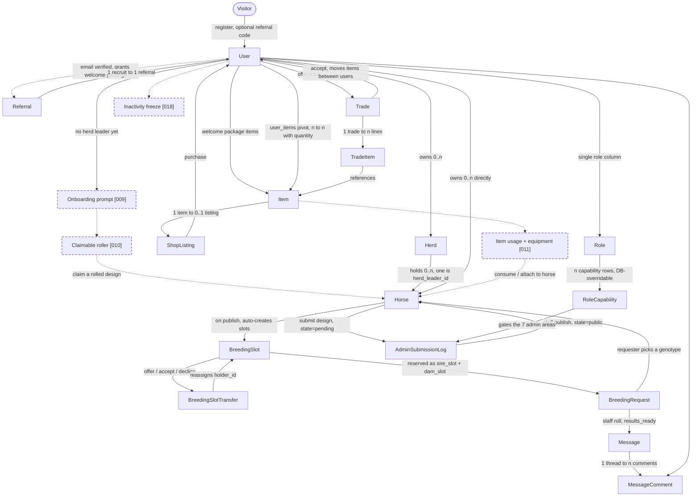
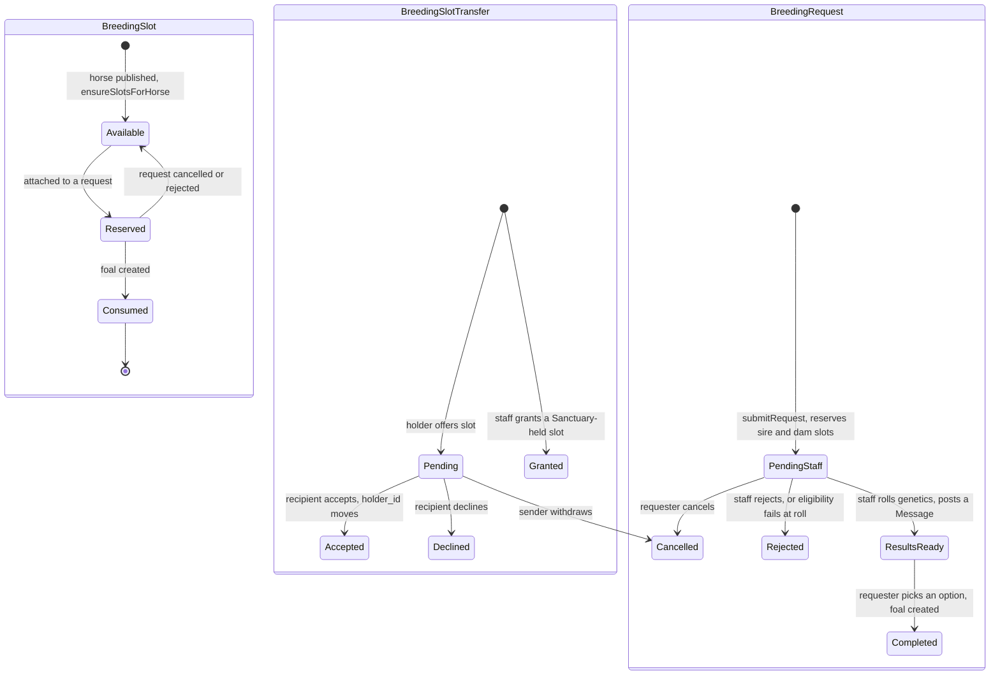
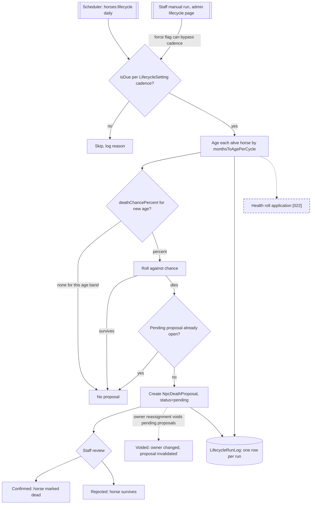
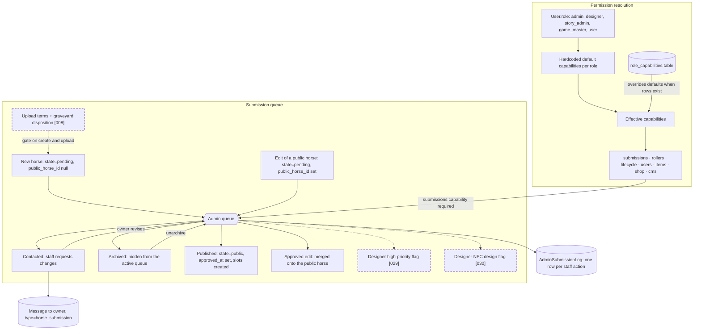

# Rattlesnake Mountain — Architecture Map

**Snapshot: 2026-09-07.** Point-in-time reacquaintance aid, not a maintained contract. Diagrams describe shipped code; dashed nodes tagged `[NNN]` are roadmap items that are **not built yet**.

Stack: Laravel 12 + Inertia + Vue 3 + Tailwind, MySQL. Herd locally, Forge in production.

---

## 1. Overview — entities and the actions that move them

Nodes are entities. Edges are the player or staff actions that create or change them. Cardinality is noted where it matters.

**Not drawn** (site furniture, no gameplay edges): `CmsPage`, `MenuItem`, `Announcement`. Lifecycle models (`LifecycleSetting`, `LifecycleRunLog`, `NpcDeathProposal`) appear in §3.

**Economy in one paragraph.** Items live in a `user_items` pivot carrying quantity, so nothing is a distinct row per copy. `ShopListing` puts an item up for purchase. `Trade` is a pending offer between two users with `TradeItem` lines, and accepting moves quantities. Vouchers are items redeemed through a choice pool for another item. Welcome packages and referral rewards are the two automatic item sources. Items currently have no gameplay effect, which is `[011]`.

---

## 2. Breeding

Two horses, two slots, one staff roll, one foal. The slot economy is the constraint: a public horse gets breeding slots on publish, slots are transferable between players, and a completed breeding consumes them.

**Eligibility, enforced at submit and again at roll:** both horses public, both alive, both have a sex, both at least 2 years old, sire is a stallion, dam is a mare, not the same horse, both genotypes parseable. A genetics provider failure leaves the request `pending_staff` for retry rather than failing it.

**Transfers only apply to `Available` slots.** A slot with a pending offer cannot be offered again. Staff can grant slots held by the Sanctuary user, which is how ownerless NPC horses' slots reach players.

Roadmap gaps in this subsystem:

| Item | Status | Effect on this diagram |
| --- | --- | --- |
| `[023]` Advanced breeding lifecycle and stone modifiers | freezer | Adds modifier inputs to the roll step |
| `[024]` Shared genotype-to-phenotype reader | freezer | Replaces duplicated geno parsing on both sides of the roll |

---

## 3. Lifecycle

One scheduled command, `horses:lifecycle`, running daily. It ages living horses and rolls for death, but **it never kills anything directly**. It files an `NpcDeathProposal` that staff must confirm.

**`--dry-run`** computes the whole run and reports proposals without writing them. **`--force`** ignores the cadence check. Both are how you exercise this safely.

`LifecycleSetting` is a single settings record holding the cadence, months aged per cycle, and the age-band-to-death-chance table. It is editable by staff with the `lifecycle` capability.

Roadmap gap: `[022]` applies a health roll on top of aging, which currently does nothing.

---

## 4. Moderation and permissions

Every player-authored horse enters as `state=pending` and needs staff to publish it. Permissions are a role plus a capability set, where the set has DB-backed overrides on top of hardcoded defaults.

**Two different pending shapes, easy to confuse.** A pending horse with `public_horse_id = null` is a brand-new submission and gets *published*. A pending horse with `public_horse_id` set is a pending *edit* of an existing public horse and gets *approved*, merging onto the parent. `activePending` means the pending row that has not yet been approved.

**`AdminAction`** is the audit vocabulary: `contacted`, `approved`, `archived`, `unarchived`. Every one writes an `AdminSubmissionLog` row against the horse.

**Other staff surfaces** behind the same capability system: roller (generate designs), lifecycle (settings and manual runs), users (freeze, ban, role assignment), items, shop listings, CMS pages, announcements.

---

## 5. MVP gap index

Every dashed node above, in one place.

| Item | Status | Subsystem |
| --- | --- | --- |
| `[008]` Design upload terms and graveyard option | next | Moderation |
| `[009]` New-player onboarding flow | next | Overview |
| `[010]` Randomized claimable horses | next | Overview, roller |
| `[011]` Item usage and equipment workflows | next | Economy |
| `[018]` Automatic inactivity freeze | next | Overview, users |
| `[022]` Lifecycle health roll application | next | Lifecycle |
| `[029]` Designer high-priority submission flag | next | Moderation |
| `[014]` Client spec gathering | next | Blocks `[015]` and `[016]` |
| `[031]` Repo-wide lint and format compliance | next | No diagram surface |
| `[015]` `[016]` `[017]` `[019]` `[020]` `[023]` `[024]` `[030]` | freezer | Post-MVP |
