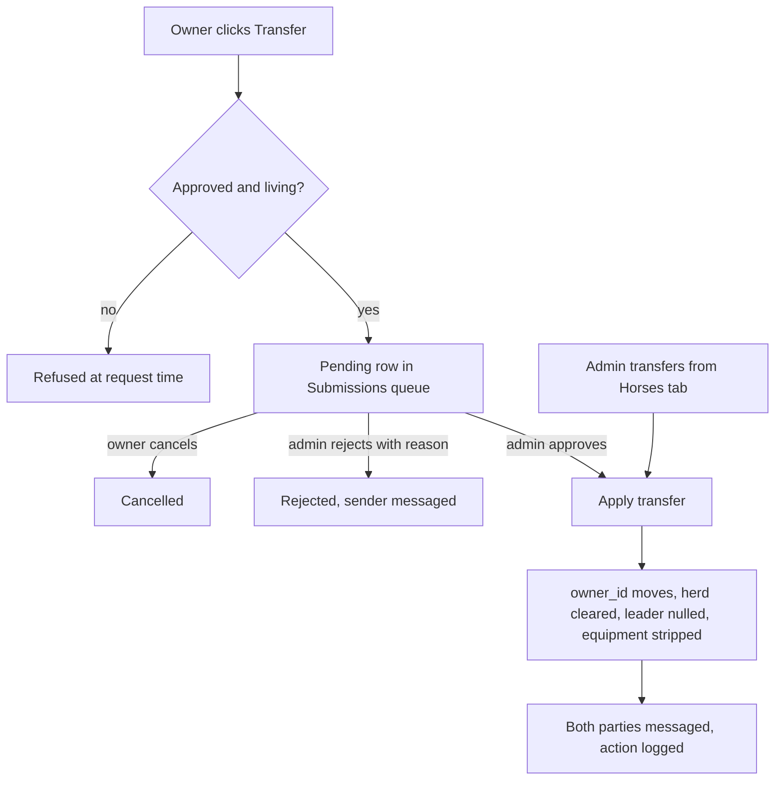
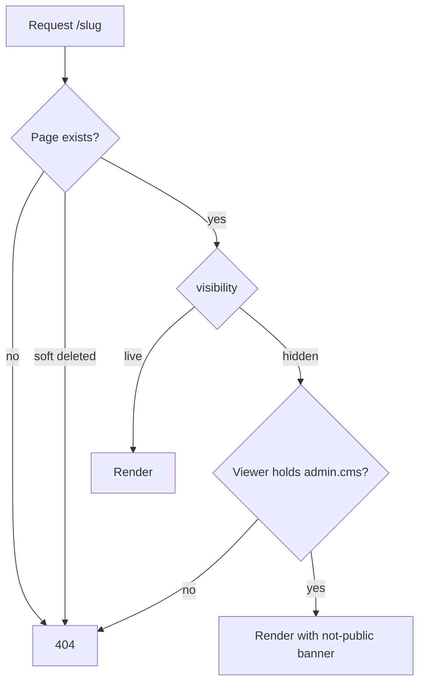

# Roadmap

<!-- Next task number: [040] -->

## [008] Design Upload Terms and Graveyard Option

**Status:** `next`
**Depends On:** none

### Goal

Horse design create/upload requires agreement to upload terms, and herd-leader designs capture leave-game disposition (free for others vs graveyard).

### Scope

- Required terms checkbox on horse create/upload
- Disposition field for herd-leader designs only (not NPC designs)
- Persist choice on horse (or related) record for later account-deletion / leave flows
- **Spec-flag:** exact graveyard rules and admin tooling for reclaim — confirm with client
- NOT in scope: full account-deletion automation that reassigns designs (can stub hook)

### Technical Notes

- Create UI: [`resources/js/pages/Horses/Create.vue`](resources/js/pages/Horses/Create.vue)
- Upload: `HorseController::uploadImage`
- Approval queue already exists; this adds consent + metadata only

### Acceptance Criteria

- [ ] Create/upload rejected without terms agreement
- [ ] Herd-leader designs require disposition choice; NPC path skips or hides it
- [ ] Choice stored and visible to admin on submission review
- [ ] Pest validation tests for required fields

### Tests

- [ ] `tests/Feature/HorseDesignTermsTest.php::it_rejects_creation_without_terms_agreement`
- [ ] `tests/Feature/HorseDesignTermsTest.php::it_requires_disposition_for_herd_leader_designs`
- [ ] `tests/Feature/HorseDesignTermsTest.php::it_skips_disposition_for_npc_designs`
- [ ] `tests/Feature/HorseDesignTermsTest.php::it_exposes_the_stored_choice_on_admin_review`

---

## [009] New-Player Onboarding Flow

**Status:** `freezer`
**Depends On:** none
**Spec:** none

### Goal

A logged-in player whose herd has no leader sees a dismissible banner in the app layout pointing them at Getting Started, horse creation, and herd creation, so a new account has an obvious next step instead of an empty dashboard.

### Scope

- `needsOnboarding` shared Inertia prop, true when the user's role is `user` and no herd they own has `herd_leader_id` set
- Banner in `AppLayout`, shown on every authenticated page, linking to `/getting-started`, `/horses/create`, and `/herds/create`
- Per-browser dismissal in `localStorage`, no server state
- Staff roles exempt
- NOT in scope: a multi-step wizard; the claimable roller ([010]); dashboard-specific UI; splitting the dashboard from the public profile
- NOT in scope: fixing the `herd_leader_id` validation hole (see Details)

### Technical Notes

**Blocked:** the Goal originally promised stats guidance and a horse-lines download alongside character creation and the claimable path. The banner as specified links to neither, on the grounds that `/getting-started` already carries both. Awaiting client confirmation that three links are enough. Asked 2026-09-10.

**User flows:**

- **Player, no leader:** banner at the top of every authenticated page. Three links, plus a close button that hides it for that browser.
- **Player, leader set:** no banner, on any page.
- **Staff:** no banner, regardless of herd state.

**Details:**

- The dashboard is not a distinct page. `routes/web.php:38` and `:199` both render `Users/Index`, so the dashboard and every public profile share one component. A banner in `AppLayout` sidesteps that entanglement rather than untangling it, and reaches the player wherever they land.
- The flag is shared data, added to `HandleInertiaRequests::share` (`app/Http/Middleware/HandleInertiaRequests.php:41`) beside `auth` and `unreadMessageCount`. That is a herd lookup on every authenticated request: an `exists` on `herds` where `owner_id` matches and `herd_leader_id` is not null. Keep it to that one query.
- Done state is `herd_leader_id` populated, whatever the leader horse's approval status. A design sitting in the queue counts, so a player who has done the work is not nagged while waiting on staff. A rejected design leaves them looking onboarded; accepted by decision of 2026-09-10.
- `StoreHerdRequest.php:27` validates `herd_leader_id` as `exists:horses,id` only, so a crafted request can name another player's horse as leader and clear the banner. Known and deliberately ignored here, since the UI does not offer it. Worth its own item.
- Both empty states, no herd at all and a herd with a null leader, get the same banner and the same copy. One condition, one thing to test.
- Staff exemption is `role !== Role::User` against the enum at `app/Models/Role.php:8`. Not a capability check, since no area in `Role::areas()` describes it.
- Dismissal is `localStorage`, so it survives logout on that browser. Per-browser, not truly per-session. No column, no route.
- Every link target is a real route carrying no `coming_soon` flag: `/getting-started` (`routes/web.php:218`), `/horses/create` and `/herds/create` (resource routes at `:152` and `:153`). `claiming-npcs` sits in `CmsPageSeeder::COMING_SOON_SLUGS` (`:26`), which is why [010]'s claimable path is not linked yet.

### Acceptance Criteria

- [ ] A `user` with no herd, or with a herd whose `herd_leader_id` is null, receives the onboarding flag as true
      `tests/Feature/OnboardingPromptTest.php::it_flags_a_user_with_no_herd`
      `tests/Feature/OnboardingPromptTest.php::it_flags_a_user_whose_herd_has_no_leader`
- [ ] Setting `herd_leader_id` clears the flag, whether or not that horse is approved
      `tests/Feature/OnboardingPromptTest.php::it_clears_the_flag_once_a_herd_leader_is_set`
      `tests/Feature/OnboardingPromptTest.php::it_clears_the_flag_for_an_unapproved_leader`
- [ ] Staff roles never receive the flag, even with no herd leader
      `tests/Feature/OnboardingPromptTest.php::it_never_flags_staff_roles`
- [ ] The flag is present on every authenticated page, not only the dashboard
      `tests/Feature/OnboardingPromptTest.php::it_shares_the_flag_across_authenticated_routes`
- [ ] Every banner link resolves to a routable, non-coming-soon page
      `tests/Feature/OnboardingPromptTest.php::it_links_only_to_resolvable_routes`
- [ ] Banner renders for a fresh player and the close button hides it for that browser, confirmed by hand

---

## [010] Randomized Claimable Horses

**Status:** `next`
**Depends On:** none

### Goal

In-app roller offers unclaimed/claimable designs (bachelor stallions / herd mares) so new players can adopt a Randomized Claimable without Discord forms.

### Scope

- Pool of claimable horses (flag or Sanctuary-owned unclaimed designs)
- Roll N options per gender (match Getting Started: three of each gender) and claim one
- Claim assigns ownership and sets as herd leader candidate
- NOT in scope: “Ask a Designer” phenotype commission workflow; DeviantArt gallery sync

### Technical Notes

- Distinct from admin `HorseRandomizerService` (NPC stats) — this picks existing designed horses
- CMS Getting Started documents current Discord process — update copy when in-app ships
- May need `is_claimable` (or equivalent) on `horses`

### Acceptance Criteria

- [ ] Eligible user can request a claimable roll and receive options from the pool
- [ ] Claiming transfers ownership exactly once; horse leaves pool
- [ ] Empty pool / ineligible user handled with clear errors
- [ ] Pest tests for roll + claim concurrency (no double-claim)

### Tests

- [ ] `tests/Feature/ClaimableHorseTest.php::it_rolls_options_from_the_claimable_pool_per_gender`
- [ ] `tests/Feature/ClaimableHorseTest.php::it_transfers_ownership_and_removes_the_horse_from_the_pool`
- [ ] `tests/Feature/ClaimableHorseTest.php::it_prevents_double_claiming_the_same_horse`
- [ ] `tests/Feature/ClaimableHorseTest.php::it_errors_clearly_on_empty_pool_or_ineligible_user`

---

## [014] Client Spec Gathering (Activities and Seasonal)

**Status:** `next`
**Depends On:** none

### Goal

Extract roll tables and rules for activities, seasonal affixes, weather, and story logs from the client’s Sheets/Discord into `reference/` specs so post-MVP build can start without ambiguity.

### Scope

- Produce `reference/*-SPEC.md` (or similar) covering: traveling/checkpoints, art/lit submission hooks, encounter/drop tables, weather, GM tailored responses, per-horse story log, seasonal Wildlife Report / quests / affixes
- Call out open questions for client sign-off
- NOT in scope: implementation of those systems

### Technical Notes

- Existing hints: Google Sheets roller links in CMS / `useLinkDictionary`; admin horse randomizer already ported as a pattern
- Deliverable unblocks [015] and [016]

### Acceptance Criteria

- [ ] Spec documents committed under `reference/`
- [ ] Each major subsystem has enough detail to implement without rediscovering Discord tribal knowledge
- [ ] Open questions explicitly listed
- [ ] Roadmap [015]/[016] Dependencies updated to this item when specs land

### Tests

- [ ] No automated tests. Deliverable is documentation. Verified by client sign-off on `reference/*-SPEC.md`.

---

## [015] Activities and Competitions System

**Status:** `freezer`
**Depends On:** [014]

### Goal

In-app traveling progression, art/lit submissions, admin/GM rolls, results, relationships/drops/encounters, and per-horse story logs — replacing Discord/Sheets play loop.

### Scope

- Full play loop per client spec from [014]
- Site-wide weather if specified
- NOT in scope until spec signed off

### Technical Notes

- **Blocked:** awaiting [014] client spec
- Ref doc Site Plan → Activities/Competitions

### Acceptance Criteria

- [ ] Spec from [014] accepted
- [ ] End-to-end submit → approve → roll → results → story log
- [ ] Pest coverage for core state transitions

### Tests

- [ ] `tests/Feature/ActivitySubmissionTest.php::it_moves_a_submission_through_submit_approve_roll_results`
- [ ] `tests/Feature/ActivitySubmissionTest.php::it_forbids_non_staff_from_approving_or_rolling`
- [ ] `tests/Feature/ActivityStoryLogTest.php::it_appends_results_to_the_per_horse_story_log`
- [ ] `tests/Feature/ActivityEncounterTest.php::it_applies_encounter_and_drop_tables_from_spec`

---

## [016] Seasonal Events In-App

**Status:** `freezer`
**Depends On:** [014]

### Goal

Move Wildlife Report, quests, and seasonal affixes from Discord-only into platform features that affect rolls/rewards.

### Scope

- Per [014] seasonal spec
- NOT in scope: Discord bot integration unless requested later

### Technical Notes

- **Blocked:** awaiting [014]
- Post-MVP per launch grill decisions

### Acceptance Criteria

- [ ] Staff can configure a season’s affixes/quests
- [ ] Affixes affect eligible rolls/rewards as specified
- [ ] Tests for affix application

### Tests

- [ ] `tests/Feature/SeasonalEventTest.php::it_lets_staff_configure_a_seasons_affixes_and_quests`
- [ ] `tests/Feature/SeasonalEventTest.php::it_applies_active_affixes_to_eligible_rolls`
- [ ] `tests/Feature/SeasonalEventTest.php::it_ignores_affixes_outside_the_season_window`

---

## [017] Opt-In PvP

**Status:** `freezer`
**Depends On:** [015]

### Goal

Opt-in player-vs-player gameplay after core activity systems exist (ref doc: implement once everything else is done).

### Scope

- Opt-in flag; challenge/steal/spar rules per future spec
- NOT in scope for MVP launch

### Technical Notes

- CMS `player-vs-player` page is documentation only today
- Feathers in welcome package are PvP-oriented — economy exists before PvP

### Acceptance Criteria

- [ ] Opt-in required before PvP participation
- [ ] Core PvP actions implemented per agreed rules
- [ ] Tests for opt-in enforcement

### Tests

- [ ] `tests/Feature/PvpTest.php::it_blocks_pvp_actions_for_users_who_have_not_opted_in`
- [ ] `tests/Feature/PvpTest.php::it_allows_core_pvp_actions_between_opted_in_users`
- [ ] `tests/Feature/PvpTest.php::it_lets_a_user_opt_back_out`

---

## [018] Automatic Inactivity Freeze

**Status:** `next`
**Depends On:** [015]

### Goal

Freeze accounts after 4 months without art/lit submissions; frozen accounts skip aging/events/PvP until unfrozen.

### Scope

- Scheduler using submission activity (not login proxy)
- Enforce frozen state in aging/events/PvP
- Keep existing admin freeze + self-unfreeze
- NOT in scope: inventing a login-based proxy; full activities system ([015])

### Technical Notes

- Manual freeze already: `frozen_at`, Admin Users tab, profile self-unfreeze
- Unfrozen from post-MVP (2026-07-16); still gated on submission activity from [015]
- Can ship freeze _enforcement_ + scheduler skeleton before [015] if activity source is stubbed — confirm trigger strategy before coding

### Acceptance Criteria

- [ ] Accounts with no submissions for 4 months auto-freeze
- [ ] Frozen users excluded from aging/events/PvP
- [ ] Unfreeze restores eligibility
- [ ] Pest tests for scheduler and enforcement

### Tests

- [ ] `tests/Feature/InactivityFreezeTest.php::it_freezes_accounts_with_no_submissions_for_four_months`
- [ ] `tests/Feature/InactivityFreezeTest.php::it_leaves_recently_active_accounts_unfrozen`
- [ ] `tests/Feature/InactivityFreezeTest.php::it_excludes_frozen_users_from_aging_events_and_pvp`
- [ ] `tests/Feature/InactivityFreezeTest.php::it_restores_eligibility_after_unfreeze`

---

## [019] CMS Rich Text / WYSIWYG and Home Editability

**Status:** `freezer`
**Depends On:** none

### Goal

Replace multi-box JSON CMS editing with a simpler rich-text (or in-page WYSIWYG) experience, and make Home editable once that direction is chosen.

### Scope

- Product decision: rich-text body vs on-page WYSIWYG
- Home (`Welcome.vue`) becomes CMS-managed or section-editable
- NOT in scope until decision made (burndown blocked items)

### Technical Notes

- Admin: [`resources/js/pages/admin/CmsTab.vue`](resources/js/pages/admin/CmsTab.vue) — `contentJson` multi-box
- Home intentionally excluded from `CmsPageSeeder` historically

### Acceptance Criteria

- [ ] Editing direction decided and documented
- [ ] CMS pages editable via chosen editor
- [ ] Home content editable without deploy
- [ ] Tests for update + public render

### Tests

- [ ] `tests/Feature/AdminCmsPageTest.php::it_saves_rich_text_bodies_from_the_chosen_editor`
- [ ] `tests/Feature/AdminCmsPageTest.php::it_updates_home_content_without_a_deploy`
- [ ] `tests/Feature/CmsStaticPageTest.php::it_renders_edited_content_publicly`

---

## [020] Fix Local vs CI Test Discrepancies

**Status:** `freezer`
**Depends On:** none

### Goal

Tests behave the same locally and in CI so failures are trustworthy.

### Scope

- Identify environment-specific failures (filesystem, case sensitivity, mail, vite, DB)
- Align phpunit/pest config, env, and path assumptions
- NOT in scope: expanding coverage for unrelated features

### Technical Notes

- Noted in [`.cursor/burndown.md`](.cursor/burndown.md)
- Windows vs Linux path/case issues have bitten production before (Inertia path case)

### Acceptance Criteria

- [ ] Documented list of previously divergent tests now passing in both environments
- [ ] CI green on main with same suite run locally
- [ ] No skipped/commented tests left as silent CI workarounds without tickets

### Tests

- [ ] Full suite green locally and in CI on the same commit. No new test file. Verified by comparing both runs.

---

## [022] Lifecycle Health Roll Application

**Status:** `next`
**Depends On:** [004]

### Goal

On each lifecycle aging cycle, health rolls from `lifecycle_settings` add or subtract horse health based on injury state (once HP/injury exists), instead of settings-only deferred behavior left by [004].

### Scope

- Apply min/max health roll from Lifecycle settings during `horses:lifecycle` / Run now
- Direction of change depends on whether the horse is injured
- Persist current health (or equivalent) on the horse; log outcomes for support
- NOT in scope: full story-progression roller UI; PvP injury; redesigning lifespan modifiers beyond what’s needed for the roll

### Technical Notes

- Deferred from [004]: settings + UI already exist; runner intentionally skips apply
- Needs injury / HP model (likely with story progression) before coding
- Service: [`app/Services/LifecycleAgingService.php`](app/Services/LifecycleAgingService.php)
- Settings: `horse_auto_health_roll_min` / `horse_auto_health_roll_max` on `LifecycleSetting`

### Acceptance Criteria

- [ ] Lifecycle run updates living horses’ health within configured min/max using injury-aware +/- rules
- [ ] Uninjured / injured paths covered by Pest tests
- [ ] Outcomes logged for support
- [ ] Lifecycle UI no longer labels health rolls as deferred-only

### Tests

- [ ] `tests/Feature/LifecycleHealthRollTest.php::it_applies_a_health_roll_within_configured_min_and_max`
- [ ] `tests/Feature/LifecycleHealthRollTest.php::it_subtracts_health_for_injured_horses`
- [ ] `tests/Feature/LifecycleHealthRollTest.php::it_adds_health_for_uninjured_horses`
- [ ] `tests/Feature/LifecycleHealthRollTest.php::it_skips_dead_horses`
- [ ] `tests/Feature/LifecycleHealthRollTest.php::it_logs_each_health_outcome`

---

## [023] Advanced Breeding Lifecycle and Stone Modifiers

**Status:** `freezer`
**Depends On:** [005]

### Goal

Enforce full breeding season/estrus/checkpoint/attempt rules and allow Stones to modify breeding outcomes atomically.

### Scope

- Estrus, breeding season, checkpoint requirements, attempt limits, conception/failure odds
- Twins/rerolls and fuller foal outcome rolls (health/stats/traits) as specified
- Atomic Stone consumption during breeding for rare-gene modifiers
- NOT in scope until [005] MVP is live and client confirms remaining rules

### Technical Notes

- Builds on breeding requests/slots from [005]
- Item consumption overlaps [011]; coordinate before coding

### Acceptance Criteria

- [ ] Season/estrus/checkpoint/attempt rules enforced in-app
- [ ] Stones consume atomically when applied to a breeding
- [ ] Pest coverage for failure paths and item races

### Tests

- [ ] `tests/Feature/BreedingSeasonTest.php::it_rejects_breeding_outside_the_season_window`
- [ ] `tests/Feature/BreedingSeasonTest.php::it_enforces_estrus_and_attempt_limits`
- [ ] `tests/Feature/BreedingSeasonTest.php::it_requires_checkpoints_before_conception`
- [ ] `tests/Feature/BreedingStoneTest.php::it_consumes_a_stone_atomically_when_applied`
- [ ] `tests/Feature/BreedingStoneTest.php::it_does_not_consume_a_stone_when_breeding_fails`

---

## [024] Shared Genotype-to-Phenotype Reader

**Status:** `freezer`
**Depends On:** [005]

### Goal

Deterministic genotype → phenotype mapping reused by breeding results and the horse randomizer.

### Scope

- Canonical phenotype rules for supported loci (including Cream/Pearl interactions)
- Replace breeding phenotype placeholder and randomizer coat-label shortcuts
- NOT in scope: designer commission workflows; markings designer tools

### Technical Notes

- Intended shared service used by local Punnett provider and `HorseRandomizerService`
- Must stay compatible with `config/breeding.php` locus definitions

### Acceptance Criteria

- [ ] Supported genotypes produce stable phenotype labels
- [ ] Breeding and randomizer share the same reader
- [ ] Unit tests cover Cream/Pearl and base coat cases

### Tests

- [ ] `tests/Unit/PhenotypeReaderTest.php::it_maps_base_coat_genotypes_to_stable_labels`
- [ ] `tests/Unit/PhenotypeReaderTest.php::it_resolves_cream_and_pearl_interactions`
- [ ] `tests/Unit/PhenotypeReaderTest.php::it_matches_locus_definitions_from_config_breeding`
- [ ] `tests/Feature/BreedingTest.php::it_uses_the_shared_reader_for_foal_phenotypes`
- [ ] `tests/Feature/AdminHorseRandomizerTest.php::it_uses_the_shared_reader_for_coat_labels`

---

## [029] Designer High-Priority Submission Flag

**Status:** `next`
**Depends On:** none
**Spec:** none

### Goal

Designers can mark a design submission as high priority when they upload it, and submissions-capable staff can raise or clear that flag in the review queue, so urgent designs are visible at a glance instead of found by scrolling.

### Scope

- `design_priority` capability area added to the role matrix, seeded on for Designer and Admin
- "High priority" checkbox on `/horses/create` and `/horses/{horse}/edit`, rendered only for roles holding the capability, default unchecked
- Boolean on `horses`, persisted through approval
- Badge on flagged rows in the admin Submissions tab, plus a priority dropdown beside the existing status filter
- Staff route to raise or clear the flag on a queued submission, gated on `admin.submissions`
- NOT in scope: the designer NPC flag ([030]); auto-flagging derived from submitter role; changing the queue default sort; notifications

### Technical Notes

**User flows:**

- **Designer:** "High priority" checkbox on the horse form at `/horses/create` and `/horses/{horse}/edit`. Ticking it marks the submission for fast review.
- **Player:** the same two forms, with no checkbox. Nothing changes.
- **Staff (review):** Submissions tab at `/admin`. Flagged rows carry a "High priority" badge, a priority dropdown sits beside the status filter, and each row can be raised or cleared.
- **Admin:** role matrix at `/admin`. A `design_priority` column, togglable per staff role.

**Details:**

- `Role::areas()` (`app/Models/Role.php:18`) is a hardcoded seven-entry list, and `RoleCapabilityService::sync` intersects any submitted matrix against it (`app/Services/RoleCapabilityService.php:61`), so an area missing from that list is silently dropped on save. The new area goes there and into `Role::defaultCapabilities()` for Admin and Designer.
- `app/Providers/AppServiceProvider.php:46` mints an `admin.{area}` gate for every area, so `admin.design_priority` will exist. Nothing routes on it. The form uses the capability as a field-visibility check, not a route gate. Accepted.
- A new area does not produce a phantom admin tab: `resources/js/pages/admin/Index.vue:225` gates tab rendering on a fixed `ALL_TABS` list. It does need an `areaLabels` entry and a `DEFAULT_CAPABILITY_AREAS` entry in `resources/js/pages/admin/RoleCapabilityMatrix.vue` (`:27`, `:142`), or the matrix renders the raw slug.
- Existing `role_capabilities` rows need a seed migration for the new area. The [021] migration is the pattern.
- `statusFilter` is a single-select `Status | 'all'` ref (`resources/js/pages/admin/SubmissionsTab.vue:122`). Priority is a second independent ref, not another option in that dropdown, so "pending AND high priority" stays expressible. The filter chain at `:240` gains one clause.
- The flag persists through approval, so the approved filter still shows what was fast-tracked. No write on approve.
- Staff writes go through a new route beside `archive` / `unarchive` in `SubmissionController` and log to `AdminSubmissionLog` the way archive does (`:33`), which needs a new `AdminAction` case.

### Acceptance Criteria

- [ ] Roles holding `design_priority` see the checkbox on create and edit; players do not
      `tests/Feature/DesignPriorityFlagTest.php::it_shows_the_priority_checkbox_to_capable_roles`
      `tests/Feature/DesignPriorityFlagTest.php::it_hides_the_priority_checkbox_from_players`
- [ ] Submitting with the box ticked stores the flag, and a player posting the field cannot set it
      `tests/Feature/DesignPriorityFlagTest.php::it_stores_the_flag_from_a_capable_submitter`
      `tests/Feature/DesignPriorityFlagTest.php::it_ignores_the_field_from_an_uncapable_submitter`
- [ ] Submissions-capable staff can raise and clear the flag on a queued submission; others cannot
      `tests/Feature/DesignPriorityFlagTest.php::it_lets_staff_raise_and_clear_the_flag`
      `tests/Feature/DesignPriorityFlagTest.php::it_forbids_non_staff_from_changing_the_flag`
- [ ] The flag survives approval and is still visible under the approved filter
      `tests/Feature/DesignPriorityFlagTest.php::it_keeps_the_flag_after_approval`
- [ ] `design_priority` is seeded on for Designer and Admin, and toggling it in the matrix changes who sees the checkbox
      `tests/Feature/Admin/RoleCapabilityMatrixTest.php::it_seeds_design_priority_for_designer_and_admin`
      `tests/Feature/DesignPriorityFlagTest.php::it_respects_a_matrix_toggle_of_design_priority`
- [ ] Priority dropdown combines with the status filter rather than replacing it, confirmed in a browser as staff
- [ ] Flagged rows read "High priority" in the Submissions tab, confirmed in a browser

---

## [030] Designer NPC Design Flag

**Status:** `next`
**Depends On:** [029]
**Spec:** none

### Goal

A designer uploading a design meant to become an NPC, rather than one of their own characters, can say so at upload, so the reviewer sees the intent in the queue instead of having to ask. The flag is advisory only: approval changes nothing about ownership.

### Scope

- `design_npc` capability area, seeded on for Designer and Admin, editable from the role matrix
- "Intended as an NPC" checkbox on `/horses/create` and `/horses/{horse}/edit`, default unchecked, visible only to roles holding the capability
- A dedicated advisory column on `horses`, separate from the derived `is_npc`
- The stored intent shown to the reviewer in the Submissions tab
- NOT in scope: any ownership change on approval. Approval behaves exactly as it does today, and an admin hands the horse to the Sanctuary by hand afterwards (decision of 2026-09-10)
- NOT in scope: an admin per-horse ownership transfer UI. None exists today, so the manual step is a database or Tinker edit. Worth its own item
- NOT in scope: the priority flag ([029]); re-deriving `is_npc` for horses already in the database; the claimable roller ([010])

### Technical Notes

**User flows:**

- **Designer:** "Intended as an NPC" checkbox on the horse form at `/horses/create` and `/horses/{horse}/edit`.
- **Staff (review):** Submissions tab at `/admin`. The row shows the designer NPC intent before the reviewer approves.
- **Admin:** role matrix at `/admin`. A `design_npc` column, togglable per staff role.

**Details:**

- Client decision, 2026-09-10: store the intent and leave ownership alone. Of the three behaviours put to them, this is the advisory-label option. `syncNpcFlagsFromOwner` keeps its invariant untouched and no code path gives a designer's work away automatically.
- The column must not be `is_npc`. `Horse::syncNpcFlagsFromOwner` (`app/Models/Horse.php:167`) derives `is_npc` and `is_claimable` from Sanctuary ownership on every save where `owner_id` is dirty (`:71`), so a checkbox writing `is_npc` would be overwritten by the next ownership change. Use a separate boolean, `intended_as_npc`, that nothing derives and nothing else reads.
- Because the flag is inert, the capability gate is a review-noise control rather than a permission over someone's property. It still defaults off and still lives in the matrix.
- The manual handover an admin performs afterwards is the existing ownership change: setting `owner_id` to the Sanctuary user makes `syncNpcFlagsFromOwner` set both `is_npc` and `is_claimable`. Nothing new is needed for that to work, only a way to do it from the UI, which this item does not build.
- Capability plumbing mirrors [029]: `Role::areas()`, `defaultCapabilities()`, a `role_capabilities` seed migration, and an `areaLabels` plus `DEFAULT_CAPABILITY_AREAS` entry in `RoleCapabilityMatrix.vue`. Two separate areas by decision of 2026-09-07, so priority-flagging can be granted without NPC-intent rights.

### Acceptance Criteria

- [ ] Roles holding `design_npc` see the checkbox on create and edit; players never do
      `tests/Feature/DesignNpcFlagTest.php::it_shows_the_npc_checkbox_to_capable_roles`
      `tests/Feature/DesignNpcFlagTest.php::it_hides_the_npc_checkbox_from_players`
- [ ] Submitting with the box ticked stores the intent and surfaces it to the reviewer, and a player posting the field cannot set it
      `tests/Feature/DesignNpcFlagTest.php::it_stores_and_surfaces_the_npc_intent`
      `tests/Feature/DesignNpcFlagTest.php::it_ignores_the_field_from_an_uncapable_submitter`
- [ ] Approving a flagged design leaves `owner_id`, `is_npc`, and `is_claimable` exactly as they were, and an unflagged approval is unchanged too
      `tests/Feature/DesignNpcFlagTest.php::it_leaves_ownership_untouched_when_approving_a_flagged_design`
      `tests/Feature/DesignNpcFlagTest.php::it_leaves_unflagged_approvals_unchanged`
- [ ] A later hand transfer to the Sanctuary still derives `is_npc` and `is_claimable` from ownership, with the intent flag untouched
      `tests/Feature/DesignNpcFlagTest.php::it_derives_npc_flags_when_ownership_moves_to_the_sanctuary`
- [ ] `design_npc` is seeded on for Designer and Admin
      `tests/Feature/Admin/RoleCapabilityMatrixTest.php::it_seeds_design_npc_for_designer_and_admin`

---

## [031] Repo-Wide Lint and Format Compliance

**Status:** `done`
**Depends On:** none
**Spec:** none

### Goal

`npm run format:check`, `npx eslint .`, and `./vendor/bin/pint --test` all pass on a clean checkout, and a pre-commit hook keeps them passing.

### Scope

- Remove the stray VS Code key from `.prettierrc` that Prettier rejects on every run
- Reformat the 50 Prettier-noncompliant files under `resources/`
- Clear the 2 ESLint errors
- Clear the 9 Pint style issues
- Add a pre-commit hook that formats staged files
- NOT in scope: changing any Prettier, ESLint, or Pint rule to make a violation disappear, other than the `_`-prefix unused-vars convention below
- NOT in scope: CI. Nothing in this repo runs in CI and this item does not change that

### Technical Notes

**Details:**

- `.prettierrc:18` carries `"terminal.integrated.defaultLocation": "editor"`, a VS Code setting pasted into the Prettier config. It is the sole cause of the `[warn] Ignored unknown option` line printed once per file. Delete the line. It changes no formatting, only the noise.
- Prettier reports 50 files. The formatting itself is mechanical (`npm run format`), but with `tabWidth: 5` and `singleAttributePerLine: true` the diff is large. Run it on a clean tree so the reformat is its own commit, separate from the in-flight upload-limit work.
- ESLint errors are two distinct kinds, and only one is a code change:
  - `resources/js/pages/Horses/Edit.vue:96` — `const { sex: _sex, ...rest } = data` is a deliberate destructure-discard, correctly named with the `_` convention. The code is right and the config is wrong. Set `varsIgnorePattern`/`argsIgnorePattern` to `^_` on `@typescript-eslint/no-unused-vars` in `eslint.config.js`.
  - `resources/js/pages/admin/Index.vue:216` — a `canManageRoleMatrix` computed shadows the prop of the same name declared at `:185`. Vue resolves the setup binding over the prop, so `:381` gets the computed, which is the intent, but the collision is silent and fragile. Rename the computed (`showRoleMatrix`) rather than suppressing the rule.
- Pint: 9 files, all trivial (`single_blank_line_at_eof`, `array_indentation`, `indentation_type`, `no_unused_imports`, and a `line_ending` in `database/seeders/LocalOnly.php` — a CRLF artifact of Windows development). `./vendor/bin/pint` fixes all of them. Note the shell: `./vendor/bin/pint` fails under Git Bash with `env: 'php': No such file or directory`, so run it from PowerShell.
- Guard: Husky plus lint-staged, running Prettier and ESLint on staged `resources/**` files and Pint on staged `*.php`. This is the only thing in the item that prevents a repeat. Without it the cleanup is a chore that recurs.

**As built (2026-09-07):**

- PHP runs from `.husky/pre-commit` directly, not through lint-staged. lint-staged spawns tasks without a shell, and Windows cannot exec the `.sh` wrapper that a Pint task would need. The hook is already running under `sh`, so it invokes Pint itself and re-stages what Pint rewrote.
- Resolving `php` in the hook needed a second pass. Herd installs `php.bat`, which carries no executable bit, so `command -v php.bat` fails under the POSIX-mode `sh` git runs hooks with, even though `php.bat -v` executes fine there. The hook probes by execution rather than lookup, and tries the plain `php` name first so Linux and macOS are unaffected.
- The hook excludes `*.blade.php` from the Pint pass. Pint is a PHP formatter and mangles Blade directives.
- ESLint gained `no-unused-vars` ignore patterns for `^_` (vars, args, caught errors, destructured array) plus `ignoreRestSiblings`. `_sex` in `Horses/Edit.vue` is untouched, as intended.
- Criterion 4 was verified twice: first by staging two deliberately misformatted probe files, running `.husky/pre-commit`, and reading the staged blobs back with `git show :<path>` (both came back formatted, probes then removed), and again by the two real commits below, where the hook ran end to end over 57 files.
- No behavioural change confirmed by the full suite (281 passed, 1638 assertions) and a clean `npm run build`.
- The renamed `showRoleMatrix` binding was verified in the browser: logged in, opened the "Users" tab at `/admin`, and confirmed the "Role capabilities" panel still renders. Screenshot at `storage/screenshots/031-role-matrix-verified.png`. `vue-tsc` also reports no error for the binding, though it does report two pre-existing `admin/Index.vue` errors on `:cms-pages` and `:menu-items` that are present unchanged on `HEAD`.
- Delivered on branch `chore/lint-format-compliance` as two commits off `0592dc4`: `chore(lint)` for the config fixes, the `showRoleMatrix` rename and the hook, then `style:` for the reformat alone. The split was made safe by proving which files were formatting-only, reformatting each file's `HEAD` version and comparing it to the working copy. 49 of 50 matched exactly; only `admin/Index.vue` differed, and only because of the rename, so it went in the first commit.

### Acceptance Criteria

- [x] `npm run format:check` exits 0 with no `Ignored unknown option` warnings
- [x] `npx eslint .` exits 0, with `_sex` still present in `Horses/Edit.vue` and the `admin/Index.vue` computed renamed
- [x] `./vendor/bin/pint --test` exits 0
- [x] Committing a deliberately misformatted `resources/` file and a misformatted PHP file leaves both formatted in the resulting commit
- [x] The reformat lands as its own commit, containing no behavioural change

---

## [034] Horse Ownership Transfer

**Status:** `next`
**Depends On:** [011] (done, see ROADMAP_DONE.md)
**Spec:** none

### Goal

A player can offer one of their horses to another player from the horse's own page, an admin approves or rejects it in the existing Submissions queue, and an admin can move any horse to any owner immediately from a new Horses tab, so ownership changes stop being a database edit.

### Scope

- `horse_transfers` table and service: pending, approved, rejected, cancelled
- "Transfer this horse" control on the owner's own horse page, recipient picked from a name list
- Transfer rows appear in the Submissions tab as a third `kind` beside designs and breeding requests, with approve and reject actions gated on `admin.submissions`
- New `horses` capability area and a Horses tab in `/admin` whose only content is starting an immediate admin transfer
- On approval: `owner_id` moves, `herd_id` clears, any herd led by the horse has `herd_leader_id` nulled, equipment returns to the sender
- In-app `Message` on approval, rejection, and admin-initiated transfer
- NOT in scope: a horse browser or any other horse management in the Horses tab
- NOT in scope: recipient consent. Admin approval is the only gate (decision of 2026-09-10)
- NOT in scope: locking a pending horse out of breeding, editing, or herd changes
- NOT in scope: transferring herds, breeding slots, or items between users

### Technical Notes

**User flows:**

- **Owner:** "Transfer this horse" on `/horses/{horse}`. Choose a recipient and write a note. The page then shows the request as pending, with a "Cancel transfer" button.
- **Recipient:** nothing to do. The horse appears in their stable with no herd once an admin approves, and an in-app message says where it came from.
- **Staff (review):** Submissions tab at `/admin`. Transfer rows sit in the same list as designs and breeding requests, filterable by the existing type dropdown. Approve, or reject with a required reason.
- **Admin (direct):** "Horses" tab at `/admin`. Search a horse by name, pick a new owner, write a required reason, transfer immediately.

**Details:**

- The Submissions tab is already a unified list. `SubmissionsTab.vue:100` builds a `UnifiedRow` with a `kind` discriminator and `:127` filters on it, so designs and breeding requests already coexist there. Transfers are a third `kind`, a third source array on the props, and a third branch in `DashboardController::submissions` (`:245`). No new list component.
- An admin-initiated transfer writes an already-approved `horse_transfers` row, so every ownership change has one history shape and appears in the queue under the approved filter. There is no pending state it passes through.
- Two capabilities, deliberately. `horses` is a new eighth entry in `Role::areas()` (`app/Models/Role.php:18`), seeded on for Admin only, and gates the Horses tab plus the immediate-transfer route. Approving and rejecting queued transfers stays on `admin.submissions`, because that is what gates the tab the rows live in. `RoleCapabilityService::sync` intersects against `Role::areas()` (`app/Services/RoleCapabilityService.php:61`), so the area must go in that list, in `defaultCapabilities()`, in a `role_capabilities` seed migration, and in `areaLabels` plus `DEFAULT_CAPABILITY_AREAS` in `RoleCapabilityMatrix.vue`. `ALL_TABS` in `resources/js/pages/admin/Index.vue:190` gains `horses`, since a capability alone renders no tab.
- Player eligibility: approved and living horses only. Admins bypass that entirely, since admin transfer exists to correct states the rules produced, and can move an unapproved, archived, or dead horse.
- Herd detachment is not a rule, it is an integrity requirement, so it applies on both paths. A herd row pointing at a horse someone else owns is a broken reference, and `horses.herd_id` is a real foreign key (`create_horses_table.php:25`) while `herds.herd_leader_id` is an unconstrained column (`create_herds_table.php:19`). Clear both.
- Breeding requests survive a transfer untouched. `BreedingRequest.requester_id` owns the outcome, so a foal from a pending breeding goes to whoever submitted it, not to the horse's new owner. Nothing to cancel.
- Equipment returns to the sender, which is why this item depends on [011]. `horses.equipment` is JSON that nothing currently writes, and there is no dequip path to call. Without [011] the strip would have to invent the relational-versus-JSON source of truth that [011] exists to decide.
- One pending transfer per horse, enforced by a partial unique index on `horse_id` where status is pending, not by a service check alone. Two admins approving the same horse in the same second must not both write `owner_id`. The approval itself runs in a transaction and re-reads the horse, since nothing locks it while pending.
- The recipient list reuses the trade rule at `TradeController.php:66`: every active player, excluding self, banned users, and the Sanctuary. Players cannot see each other's numeric ids anywhere, so the picker is a name-to-id list.
- The Sanctuary is available to admins only, and the tab warns before confirming. `Horse::syncNpcFlagsFromOwner` (`app/Models/Horse.php:167`) fires on any dirty `owner_id` and sets both `is_npc` and `is_claimable` when the new owner is the Sanctuary, so a Sanctuary transfer publishes the horse to the claimable pool. This is the manual handover [030] leaves to an admin.
- Messages go through `Message`, the channel `SubmissionController.php:113` already uses for design decisions. Rejection carries the admin's required reason. An admin-initiated transfer messages both the old and the new owner.
- Admin actions log to `AdminSubmissionLog` the way archive does (`SubmissionController.php:33`), which needs new `AdminAction` cases for the transfer approval, rejection, and direct move.

**Diagrams:**

### Acceptance Criteria

- [ ] An owner can request a transfer of an approved, living horse to another player, and cannot request one for a horse that is unapproved, archived, dead, or not theirs
      `tests/Feature/HorseTransferTest.php::it_lets_an_owner_request_a_transfer`
      `tests/Feature/HorseTransferTest.php::it_refuses_requests_for_ineligible_horses`
      `tests/Feature/HorseTransferTest.php::it_forbids_requesting_a_transfer_of_someone_elses_horse`
- [ ] A second pending transfer for the same horse is refused at the database level, and two concurrent approvals move the horse exactly once
      `tests/Feature/HorseTransferTest.php::it_allows_only_one_pending_transfer_per_horse`
      `tests/Feature/HorseTransferTest.php::it_moves_the_horse_exactly_once_under_concurrent_approval`
- [ ] The sender can cancel while pending, and a cancelled or rejected request leaves ownership untouched
      `tests/Feature/HorseTransferTest.php::it_lets_the_sender_cancel_a_pending_transfer`
      `tests/Feature/HorseTransferTest.php::it_leaves_ownership_untouched_on_rejection`
- [ ] Approval moves `owner_id`, clears `herd_id`, nulls `herd_leader_id` on any herd the horse led, and returns equipment to the sender
      `tests/Feature/HorseTransferTest.php::it_moves_ownership_and_detaches_the_horse_from_its_herd`
      `tests/Feature/HorseTransferTest.php::it_clears_herd_leadership_when_the_leader_is_transferred`
      `tests/Feature/HorseTransferTest.php::it_returns_equipped_items_to_the_sender`
- [ ] A pending breeding request involving the horse survives the transfer, and its foal still goes to the requester
      `tests/Feature/HorseTransferTest.php::it_leaves_pending_breeding_requests_with_the_original_requester`
- [ ] Rejection requires a reason, and approval, rejection, and admin transfer each send in-app messages to the right people
      `tests/Feature/HorseTransferTest.php::it_requires_a_reason_to_reject`
      `tests/Feature/HorseTransferTest.php::it_messages_both_parties_on_an_admin_transfer`
- [ ] An admin holding `horses` can transfer any horse immediately, including unapproved and dead ones, with a required reason, and the action is logged
      `tests/Feature/HorseTransferTest.php::it_lets_an_admin_transfer_any_horse_immediately`
      `tests/Feature/HorseTransferTest.php::it_requires_a_reason_for_an_admin_transfer`
      `tests/Feature/HorseTransferTest.php::it_logs_admin_transfers`
- [ ] Transferring to the Sanctuary is available to admins only and leaves `is_npc` and `is_claimable` true
      `tests/Feature/HorseTransferTest.php::it_marks_a_sanctuary_transfer_as_npc_and_claimable`
      `tests/Feature/HorseTransferTest.php::it_excludes_the_sanctuary_from_the_player_recipient_list`
- [ ] Staff without `admin.submissions` cannot approve or reject, and staff without `horses` see no Horses tab and cannot transfer directly
      `tests/Feature/HorseTransferTest.php::it_forbids_approving_without_the_submissions_capability`
      `tests/Feature/HorseTransferTest.php::it_forbids_direct_transfer_without_the_horses_capability`
- [ ] `horses` is seeded on for Admin and appears in the role matrix
      `tests/Feature/Admin/RoleCapabilityMatrixTest.php::it_seeds_horses_for_admin`
- [ ] Transfer rows appear in the Submissions queue alongside designs and breeding requests and respond to the existing type and status filters, confirmed in a browser as an admin
- [ ] The Horses tab warns before a Sanctuary transfer that the horse becomes an NPC and claimable, confirmed in a browser

---

## [035] Non-Destructive CMS Seeders and Snapshot Command

**Status:** `next`
**Depends On:** none
**Spec:** none

### Goal

Seeding the database stops destroying CMS pages and navigation. `db:seed` fills gaps without overwriting live content, and `php artisan cms:snapshot` captures the current pages and menu to a fixture the seeder reads, so a `migrate:fresh --seed` restores the latest state instead of the original hardcoded copy.

### Scope

- `CmsPageSeeder` and `MenuItemSeeder` switch to non-destructive creation
- `cms:snapshot` Artisan command writing pages and menu to a JSON fixture
- Seeders read the fixture when present, fall back to the hardcoded arrays when not
- Delete the 16 unreferenced components in `resources/js/pages/cms/`
- NOT in scope: any change to `cms_pages` schema, rendering, or the admin UI

### Technical Notes

**User flows:**

- **Developer:** `php artisan cms:snapshot` in the project root. Writes the current pages and menu to a fixture so the next reseed restores them.

**Details:**

- `CmsPageSeeder.php:38` calls `CmsPage::truncate()` and `MenuItemSeeder.php:15-16` deletes every row, so a `db:seed` run for unrelated data (items, shop) silently wipes CMS content and navigation. `ItemSeeder` and `ShopCatalogSeeder` already use `updateOrCreate` and are safe to re-run; these two are the outliers.
- Use `firstOrCreate` keyed on `slug` for pages and on `label` + `parent_id` for menu items. Not `updateOrCreate`: once inline editing lands ([037]) the database is canonical and seeder copy is stale by definition, so the seeder must never overwrite an edit.
- Fixture at `database/fixtures/cms-snapshot.json`, committed. It holds pages (all columns) and the menu tree. `cms:snapshot` overwrites it; the seeders prefer it over the hardcoded arrays.
- Menu parents must be created before children, so the fixture stores the tree nested rather than flat.
- The 16 dead components (`Rules.vue`, `Lore.vue`, `_Default.vue`, `ContactUs.vue` and siblings) are referenced by nothing. Only `cms/Show.vue` (`StaticPageController.php:21`) and `cms/Shop.vue` (`ShopController.php:90`) are rendered. Their markup stays in git history.

### Acceptance Criteria

- [ ] Running the CMS and menu seeders twice leaves admin edits intact and creates no duplicates
      `tests/Feature/Cms/CmsSeederTest.php::it_does_not_overwrite_edited_pages_on_reseed`
      `tests/Feature/Cms/CmsSeederTest.php::it_does_not_duplicate_menu_items_on_reseed`
- [ ] Seeding an empty database still produces the full page set and menu tree
      `tests/Feature/Cms/CmsSeederTest.php::it_seeds_every_page_and_the_menu_tree_from_empty`
- [ ] `cms:snapshot` writes a fixture that the seeders restore verbatim after a fresh migration
      `tests/Feature/Cms/CmsSnapshotCommandTest.php::it_writes_pages_and_menu_to_the_fixture`
      `tests/Feature/Cms/CmsSnapshotCommandTest.php::it_restores_snapshot_content_when_seeding_a_fresh_database`
- [ ] Seeders fall back to their hardcoded arrays when no fixture exists
      `tests/Feature/Cms/CmsSeederTest.php::it_falls_back_to_hardcoded_pages_without_a_fixture`
- [ ] The 16 unreferenced `pages/cms/` components are gone and every CMS route still renders, confirmed in a browser

---

## [036] CMS Block Schema, Visibility and Page Deletion

**Status:** `next`
**Depends On:** [035]
**Spec:** none

### Goal

CMS page content becomes an ordered list of boxes with a column span and a style, rendered from sanitized HTML on a three-column grid. Pages gain live/hidden visibility and recoverable deletion, managed from the admin page list.

### Scope

- Migrate `content` from `{box1: [markdown], ...}` to an ordered array of `{id, span, style, html}`
- Convert the `images` array into image boxes with visible "Art by @name" captions, then drop the column
- `symfony/html-sanitizer` allowlist applied on every write
- `visibility` column, `live` / `hidden`, existing pages grandfathered to `live`
- Soft delete on `cms_pages`, with a confirm modal listing menu items pointing at the slug
- `DynamicInfo.vue` rewritten to render the new shape on a three-column grid
- NOT in scope: the editor UI ([037]), media library and home conversion ([038])
- NOT in scope: any change to the role capability matrix; `admin.cms` continues to gate everything

### Technical Notes

**User flows:**

- **Admin:** page list in the admin CMS tab. Toggle a page between Live and Hidden, delete a page, reorder pages.
- **Visitor:** `/{slug}`. A hidden page returns the 404 page.
- **Admin:** `/{slug}` for a hidden page. Renders normally with a banner saying it is not public.

**Details:**

- Box shape is `{id, span, style, html}`. `span` is 1, 2 or 3 on a three-column grid at `lg` and above; below `lg` every box is full width in drag order, matching the current pages. `style` maps to the existing CSS classes at `resources/css/app.css:69-96` (`box`, `box-alt`, centered).
- The three-column grid replaces the fixed `lg:grid-cols-[2fr_1fr]` in `DynamicInfo.vue:52` and unifies CMS pages with the home layout at `Welcome.vue:88-128`, which already uses `lg:col-span-1/2/3`.
- Markdown is converted to HTML by the migration, not at render time. `markdown-it` is currently instantiated with defaults (`DynamicInfo.vue:5`), meaning raw HTML is escaped, so nothing in the existing content can be hostile. After conversion the sanitizer is the only thing standing between an admin and stored XSS.
- Sanitizer allowlist matches what the pages already use: `strong`, `em`, `h1`-`h4`, `ul`, `ol`, `li`, `a`, `img`, `blockquote`, `hr`, `p`, `br`. No `table`, no `script`, no inline event attributes, no `style`.
- The migration snapshots every page's pre-conversion state, including the full `images` array with artist name and link, to a timestamped file in `database/fixtures/` before writing. `down()` restores from it. That archive is the structured attribution [039] re-imports, so it must not be pruned.
- Attribution survives visually as caption text in the converted boxes and structurally in the archive. Between this item and [039] it is not queryable. Accepted deliberately.
- `coming_soon` stays an independent flag driving its own banner (`DynamicInfo.vue:29`). A page can be live and flagged.
- Home cannot be hidden or deleted. Guard it in the request classes, not only the UI.
- `MenuItem.path` is free text, so nothing links a menu row to a page. The delete confirm queries menu items whose `path` matches `/{slug}` and lists them; it does not cascade.

**Diagrams:**

### Acceptance Criteria

- [ ] The migration converts every seeded page's markdown boxes to sanitized HTML boxes with a span and style, and `down()` restores the originals
      `tests/Feature/Cms/ContentMigrationTest.php::it_converts_markdown_boxes_to_html_boxes`
      `tests/Feature/Cms/ContentMigrationTest.php::it_restores_the_original_content_on_rollback`
- [ ] Every `images` entry becomes an image box whose caption carries the artist name and link, and the pre-conversion array is written to the fixture archive
      `tests/Feature/Cms/ContentMigrationTest.php::it_converts_image_credits_into_captioned_image_boxes`
      `tests/Feature/Cms/ContentMigrationTest.php::it_archives_the_original_images_array`
- [ ] Saving a page strips script tags, event handlers and any tag outside the allowlist
      `tests/Feature/Cms/CmsSanitizerTest.php::it_strips_script_tags_and_event_handlers`
      `tests/Feature/Cms/CmsSanitizerTest.php::it_keeps_allowlisted_formatting_tags`
- [ ] A hidden page 404s for guests and players, and renders with a banner for a holder of `admin.cms`
      `tests/Feature/Cms/CmsVisibilityTest.php::it_returns_not_found_for_a_hidden_page`
      `tests/Feature/Cms/CmsVisibilityTest.php::it_renders_a_hidden_page_for_a_cms_admin`
- [ ] Existing pages migrate to live and newly created pages default to hidden
      `tests/Feature/Cms/CmsVisibilityTest.php::it_grandfathers_existing_pages_to_live`
      `tests/Feature/Cms/CmsVisibilityTest.php::it_defaults_new_pages_to_hidden`
- [ ] Deleting a page soft deletes it, 404s the slug, and the response names any menu items pointing at it
      `tests/Feature/Cms/CmsPageDeletionTest.php::it_soft_deletes_a_page`
      `tests/Feature/Cms/CmsPageDeletionTest.php::it_reports_menu_items_pointing_at_the_deleted_slug`
- [ ] Home cannot be hidden or deleted through any route
      `tests/Feature/Cms/CmsPageDeletionTest.php::it_refuses_to_delete_the_home_page`
      `tests/Feature/Cms/CmsVisibilityTest.php::it_refuses_to_hide_the_home_page`
- [ ] Span 1, 2 and 3 boxes lay out correctly on the three-column grid and stack full width on mobile, confirmed in a browser at desktop and phone widths
- [ ] All 17 migrated pages read the same as before the migration, confirmed in a browser

---

## [037] Inline WYSIWYG Page Editing

**Status:** `next`
**Depends On:** [036]
**Spec:** none

### Goal

An admin editing a CMS page does it on the page itself. A cog beside the header enters edit mode, where hero text, page title and every box become directly editable rich text, boxes can be added, removed, resized and dragged, and a save publishes immediately while keeping the previous version recoverable.

### Scope

- Tiptap 3 with Vue 3 bindings, one editor instance per box
- Toolbar: bold, italic, headings, bullet and ordered lists, links, images, blockquote, horizontal rule
- Cog toggle beside the header; discard and save buttons with confirmation modals
- Add, remove, resize (span 1/2/3), restyle and drag-reorder boxes via `sortablejs`
- Editable in place: hero title, hero description, page title. Slug and visibility stay in admin
- Revisions: last 10 full-page snapshots per page, pruned beyond, restorable
- Navigation guard on unsaved changes, Inertia router plus `beforeunload`
- NOT in scope: image picking from the library ([038]); `cms/Shop.vue`, which stays a hardcoded dynamic page with no cog

### Technical Notes

**User flows:**

- **Admin:** cog beside the header on any CMS page. Enters edit mode.
- **Admin, in edit mode:** each box shows a toolbar, a size control, a style control and a drag handle. "Add box" appends one; the box menu removes it.
- **Admin, in edit mode:** "Save" and "Discard" in a sticky bar, each confirming first. Save publishes immediately.
- **Admin:** "History" in the edit bar. Lists the last 10 saves with timestamp and author, restores any of them.

**Details:**

- Tiptap 3 core is MIT and ships first-class Vue 3 bindings. Only the Pro extensions are paid; none are needed here.
- One Tiptap document per box, serialized to HTML on save. The server sanitizes with the [036] allowlist before writing, so a crafted request cannot bypass the editor's constraints.
- `sortablejs` is already a dependency and already drives reorder in `admin/CmsTab.vue`. Reuse it rather than adding a drag library.
- Save writes the page and pushes the previous state into `cms_page_revisions` (page_id, content, hero fields, title, user_id, created_at), then prunes to the 10 newest for that page. Restoring is a normal save, so it is itself revisioned.
- Discard reverts to the last saved server state without a request. The guard covers browser navigation and tab close; the Inertia router guard covers in-app navigation.
- Edit mode is client state only. There is no draft on the server, so two admins editing at once means last save wins. Acceptable at this scale; not worth locking.
- The cog appears only to a holder of `admin.cms`, matching the existing route guard at `routes/web.php:106`.

### Acceptance Criteria

- [ ] Saving a page persists edited hero text, page title and box HTML, and the page renders the change
      `tests/Feature/Cms/CmsInlineEditTest.php::it_saves_edited_hero_and_box_content`
- [ ] Adding, removing, resizing and reordering boxes persists across a save
      `tests/Feature/Cms/CmsInlineEditTest.php::it_persists_added_and_removed_boxes`
      `tests/Feature/Cms/CmsInlineEditTest.php::it_persists_box_order_and_spans`
- [ ] A save request carrying script tags or non-allowlisted markup is sanitized before it is stored
      `tests/Feature/Cms/CmsInlineEditTest.php::it_sanitizes_content_submitted_directly_to_the_endpoint`
- [ ] The slug cannot be changed through the inline editing endpoint
      `tests/Feature/Cms/CmsInlineEditTest.php::it_ignores_a_slug_submitted_to_the_inline_editor`
- [ ] Each save records the previous version, history keeps only the 10 newest, and restoring one returns the page to that state
      `tests/Feature/Cms/CmsRevisionTest.php::it_records_the_previous_version_on_save`
      `tests/Feature/Cms/CmsRevisionTest.php::it_prunes_revisions_beyond_ten`
      `tests/Feature/Cms/CmsRevisionTest.php::it_restores_a_previous_revision`
- [ ] A user without `admin.cms` gets no cog and cannot reach the save or restore endpoints
      `tests/Feature/Cms/CmsInlineEditTest.php::it_forbids_saving_without_the_cms_capability`
      `tests/Feature/Cms/CmsRevisionTest.php::it_forbids_restoring_without_the_cms_capability`
- [ ] Toolbar formatting, box drag/drop, resize and the save and discard confirmations behave correctly, confirmed in a browser
- [ ] Navigating away or closing the tab with unsaved edits prompts before discarding, confirmed in a browser

---

## [038] Site Settings Tab and Site Resources Library

**Status:** `next`
**Depends On:** [037]
**Spec:** none

### Goal

Admin gets a single Site Settings tab holding pages, menu and site resources. Resources lists the site's non-character images, accepts uploads, and feeds an image picker in the page editor. The home page becomes a CMS page so it is editable like any other, without changing how it looks.

### Scope

- New "Site settings" admin tab; the CMS tab's page list and menu builder fold into it as cards
- Site resources card: lists `public/assets/` uploads and tracked `public/images/`, uploads, deletes uploads
- Upload pipeline: WebP conversion with a dimension cap for png/jpg, GIF passthrough, SVG sanitized on upload
- Delete scans `cms_pages.content` for the filename and names every page using it before confirming
- Image picker in the [037] editor, sourced from the library
- Convert `/` to a CMS page with slug `home`; hero stays app chrome, CTA and feature grid become boxes styled to match
- NOT in scope: artist attribution on assets ([039]); horse and character images, which stay on the `public` disk and never appear here

### Technical Notes

**User flows:**

- **Admin:** "Site settings" tab at `/admin`. Cards for Pages, Menu and Site resources.
- **Admin:** Site resources card. Upload an image, copy its path, delete an upload.
- **Admin:** image button in the page editor toolbar. Picks from the library or uploads inline.
- **Admin:** cog on `/`. Edits home exactly like any other CMS page.

**Details:**

- Uploads go to `public/assets/`, gitignored. The 75 files in `public/images/` are tracked and stay read-only in the library, since deleting a committed file from a running server only desynchronises it from the repo. Both directories are listed by a filesystem scan; there is no media table.
- That scan means no uploader attribution, no upload timestamp and no usage index. [039] revisits this, and adding artist data will almost certainly require a table. Do not build schema here in anticipation of it.
- Horse uploads at `HorseController.php:508` write WebP to the `public` disk under `horse-images/`. Site assets follow the same conversion approach but a different destination, and the library must never surface the horse directory.
- SVG is the only real XSS surface in this item: served from your own origin, an unsanitized SVG runs with the viewer's session. Strip `script`, event attributes and external references on upload, or reject the file.
- Delete safety is a `LIKE` query against `cms_pages.content` for the filename, cheap at this page count. It warns, it does not block.
- Home conversion: `Welcome.vue:88-128` already uses a three-column grid with `col-span-1/2/3`, so the CTA and feature grid map onto boxes directly. The hero stays in the component as app chrome. Home cannot be hidden or deleted, per [036].
- `public/assets/` needs a deploy note: it is outside git, so it is not restored by a Forge deploy and needs its own backup.

### Acceptance Criteria

- [ ] The resources card lists both upload and tracked directories and excludes horse and character images
      `tests/Feature/Cms/SiteResourcesTest.php::it_lists_uploads_and_tracked_site_images`
      `tests/Feature/Cms/SiteResourcesTest.php::it_excludes_horse_images_from_the_library`
- [ ] png and jpg uploads are converted to WebP within the dimension cap, GIFs are stored untouched, and SVGs are stripped of scripts and event handlers
      `tests/Feature/Cms/SiteResourceUploadTest.php::it_converts_raster_uploads_to_webp`
      `tests/Feature/Cms/SiteResourceUploadTest.php::it_stores_gifs_without_conversion`
      `tests/Feature/Cms/SiteResourceUploadTest.php::it_strips_scripts_from_uploaded_svgs`
- [ ] Oversized files and disallowed types are rejected
      `tests/Feature/Cms/SiteResourceUploadTest.php::it_rejects_oversized_and_disallowed_uploads`
- [ ] Deleting an upload names every page whose content references it, and tracked `public/images/` files cannot be deleted
      `tests/Feature/Cms/SiteResourcesTest.php::it_reports_pages_using_an_asset_before_deletion`
      `tests/Feature/Cms/SiteResourcesTest.php::it_refuses_to_delete_a_tracked_site_image`
- [ ] A user without `admin.cms` cannot list, upload to, or delete from the library
      `tests/Feature/Cms/SiteResourcesTest.php::it_forbids_library_access_without_the_cms_capability`
- [ ] Home resolves to the `home` CMS page and is editable through the same endpoints as any other page
      `tests/Feature/Cms/HomePageConversionTest.php::it_renders_home_from_the_cms_page`
      `tests/Feature/Cms/HomePageConversionTest.php::it_saves_edits_to_the_home_page`
- [ ] Home looks unchanged after conversion at desktop and phone widths, confirmed in a browser
- [ ] The Site settings tab, its three cards and the editor's image picker work end to end, confirmed in a browser

---

## [039] Attributed Site Image Uploads

**Status:** `freezer`
**Depends On:** [038]
**Spec:** none

### Goal

Site artwork carries structured artist attribution again. Uploading a site image captures the artist's name and link alongside the file, the credits archived by [036] are re-imported onto the matching files, and credits render from that data rather than from hand-typed caption text.

### Scope

- Storage for artist name and link per site asset
- Upload surface capturing attribution, modelled on the character upload flow but not character-specific
- Re-import the archived `images` arrays from the [036] fixture onto matching paths
- Credits render from the stored data wherever the asset is used
- NOT in scope: attribution for horse and character images

### Technical Notes

**Blocked:** three decisions are open and the grill was cut short before they were settled (2026-09-10).

- **Where attribution lives.** [038] deliberately ships a filesystem scan with no media table. Structured credits need somewhere to live: a `media` table covering uploads with a scan still handling tracked files, a `media` table covering everything via a one-time import of the 75 files in `public/images/`, or a sidecar JSON that keeps the no-table decision at the cost of querying and merge conflicts.
- **What the page is.** Described as "like the character page, but not character specific". That reads as either an admin-only upload surface with metadata, or that plus a public gallery of site artwork with credits, which adds design and moderation surface.
- **How existing credits are matched.** The archive keys attribution by image path. Paths rewritten during the [036] conversion, or images an admin replaced between [036] and this item, will not match and need a manual pass.

**Details:**

- No attribution model exists anywhere in the codebase today. Horses carry no artist column; the CMS `images` arrays are the only structured credits that have ever existed, and [036] retires them into a fixture archive.
- Until this item lands, credits are caption text inside box HTML: visible on the page, not queryable, and editable into anything by whoever is editing.
- The archive written by the [036] migration is the only structured source for the original credits. It must survive until this item consumes it.

### Acceptance Criteria

- [ ] Uploading a site image captures artist name and link and stores them with the file
- [ ] The archived credits from [036] are re-imported onto the matching assets, and unmatched entries are reported rather than dropped
- [ ] Credits render from stored attribution wherever an attributed asset is used
- [ ] Horse and character images are untouched by this system
