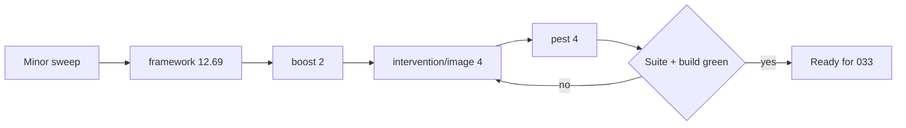

# Roadmap

<!-- Next task number: [034] -->

## [008] Design Upload Terms and Graveyard Option

**Status:** `next`
**Depends On:** none

### Goal

Horse design create/upload requires agreement to upload terms, and herd-leader designs capture leave-game disposition (free for others vs graveyard).

### Scope

- Required terms checkbox on horse create/upload
- Disposition field for herd-leader designs only (not NPC designs)
- Persist choice on horse (or related) record for later account-deletion / leave flows
- **Spec-flag:** exact graveyard rules and admin tooling for reclaim — confirm with client
- NOT in scope: full account-deletion automation that reassigns designs (can stub hook)

### Technical Notes

- Create UI: [`resources/js/pages/Horses/Create.vue`](resources/js/pages/Horses/Create.vue)
- Upload: `HorseController::uploadImage`
- Approval queue already exists; this adds consent + metadata only

### Acceptance Criteria

- [ ] Create/upload rejected without terms agreement
- [ ] Herd-leader designs require disposition choice; NPC path skips or hides it
- [ ] Choice stored and visible to admin on submission review
- [ ] Pest validation tests for required fields

### Tests

- [ ] `tests/Feature/HorseDesignTermsTest.php::it_rejects_creation_without_terms_agreement`
- [ ] `tests/Feature/HorseDesignTermsTest.php::it_requires_disposition_for_herd_leader_designs`
- [ ] `tests/Feature/HorseDesignTermsTest.php::it_skips_disposition_for_npc_designs`
- [ ] `tests/Feature/HorseDesignTermsTest.php::it_exposes_the_stored_choice_on_admin_review`

---

## [009] New-Player Onboarding Flow

**Status:** `next`
**Depends On:** none

### Goal

Players without a herd leader are prompted on the dashboard toward character creation, randomizer/claimable path, stats guidance, and horse-lines download.

### Scope

- Detect “no herd leader yet” (no herd or herd without leader horse)
- Dashboard prompt with clear next steps and links
- Dismissible or persistent until leader exists (product choice — prefer persistent until complete)
- NOT in scope: full wizard multi-step SPA; implementing claimable roller ([010]) beyond linking

### Technical Notes

- Dashboard currently [`Users/Index`](resources/js/pages/Users/Index.vue) via dashboard route
- Link targets: character handbook / stats-leveling CMS pages, horses create, claimable flow when ready

### Acceptance Criteria

- [ ] New users without herd leader see onboarding prompt on dashboard
- [ ] Users with an established herd leader do not see the prompt
- [ ] Links resolve to real routes/pages
- [ ] Pest or browser-level assertion for prompt visibility conditions

### Tests

- [ ] `tests/Feature/OnboardingPromptTest.php::it_shows_the_prompt_for_users_without_a_herd_leader`
- [ ] `tests/Feature/OnboardingPromptTest.php::it_hides_the_prompt_once_a_herd_leader_exists`
- [ ] `tests/Feature/OnboardingPromptTest.php::it_links_only_to_resolvable_routes`

---

## [010] Randomized Claimable Horses

**Status:** `next`
**Depends On:** none

### Goal

In-app roller offers unclaimed/claimable designs (bachelor stallions / herd mares) so new players can adopt a Randomized Claimable without Discord forms.

### Scope

- Pool of claimable horses (flag or Sanctuary-owned unclaimed designs)
- Roll N options per gender (match Getting Started: three of each gender) and claim one
- Claim assigns ownership and sets as herd leader candidate
- NOT in scope: “Ask a Designer” phenotype commission workflow; DeviantArt gallery sync

### Technical Notes

- Distinct from admin `HorseRandomizerService` (NPC stats) — this picks existing designed horses
- CMS Getting Started documents current Discord process — update copy when in-app ships
- May need `is_claimable` (or equivalent) on `horses`

### Acceptance Criteria

- [ ] Eligible user can request a claimable roll and receive options from the pool
- [ ] Claiming transfers ownership exactly once; horse leaves pool
- [ ] Empty pool / ineligible user handled with clear errors
- [ ] Pest tests for roll + claim concurrency (no double-claim)

### Tests

- [ ] `tests/Feature/ClaimableHorseTest.php::it_rolls_options_from_the_claimable_pool_per_gender`
- [ ] `tests/Feature/ClaimableHorseTest.php::it_transfers_ownership_and_removes_the_horse_from_the_pool`
- [ ] `tests/Feature/ClaimableHorseTest.php::it_prevents_double_claiming_the_same_horse`
- [ ] `tests/Feature/ClaimableHorseTest.php::it_errors_clearly_on_empty_pool_or_ineligible_user`

---

## [011] Item Usage and Equipment Workflows

**Status:** `next`
**Depends On:** none

### Goal

Players can equip/dequip items on horses (and use consumables where `uses_per_unit` applies), bridging user inventory and horse/herd equipment JSON.

### Scope

- Equip / dequip UI on horse (and optionally herd) pages
- Consume/use flow decrementing `user_items` or horse inventory consistently
- Respect `uses_per_unit` and `max_count`
- NOT in scope: full crafting; shop purchase (done); trading ([006])

### Technical Notes

- Dual model problem: relational `user_items` vs horse/herd JSON — pick one source of truth for equipped gear (document in implementation)
- Columns: `horses.inventory`, `horses.equipment`, `herds.*`; item `uses_per_unit` migration already exists
- Show pages currently display counts only

### Acceptance Criteria

- [ ] Player can move an owned item onto a horse’s equipment and back to inventory
- [ ] Consumable use decrements quantity / uses correctly
- [ ] Unauthorized users cannot equip on others’ horses
- [ ] Pest tests for equip, dequip, and consume

### Tests

- [ ] `tests/Feature/ItemEquipTest.php::it_moves_an_owned_item_onto_a_horse`
- [ ] `tests/Feature/ItemEquipTest.php::it_returns_equipped_gear_to_inventory_on_dequip`
- [ ] `tests/Feature/ItemEquipTest.php::it_decrements_uses_per_unit_when_consuming`
- [ ] `tests/Feature/ItemEquipTest.php::it_enforces_max_count_on_equip`
- [ ] `tests/Feature/ItemEquipTest.php::it_forbids_equipping_on_another_users_horse`

---

## [014] Client Spec Gathering (Activities and Seasonal)

**Status:** `next`
**Depends On:** none

### Goal

Extract roll tables and rules for activities, seasonal affixes, weather, and story logs from the client’s Sheets/Discord into `reference/` specs so post-MVP build can start without ambiguity.

### Scope

- Produce `reference/*-SPEC.md` (or similar) covering: traveling/checkpoints, art/lit submission hooks, encounter/drop tables, weather, GM tailored responses, per-horse story log, seasonal Wildlife Report / quests / affixes
- Call out open questions for client sign-off
- NOT in scope: implementation of those systems

### Technical Notes

- Existing hints: Google Sheets roller links in CMS / `useLinkDictionary`; admin horse randomizer already ported as a pattern
- Deliverable unblocks [015] and [016]

### Acceptance Criteria

- [ ] Spec documents committed under `reference/`
- [ ] Each major subsystem has enough detail to implement without rediscovering Discord tribal knowledge
- [ ] Open questions explicitly listed
- [ ] Roadmap [015]/[016] Dependencies updated to this item when specs land

### Tests

- [ ] No automated tests. Deliverable is documentation. Verified by client sign-off on `reference/*-SPEC.md`.

---

## [015] Activities and Competitions System

**Status:** `freezer`
**Depends On:** [014]

### Goal

In-app traveling progression, art/lit submissions, admin/GM rolls, results, relationships/drops/encounters, and per-horse story logs — replacing Discord/Sheets play loop.

### Scope

- Full play loop per client spec from [014]
- Site-wide weather if specified
- NOT in scope until spec signed off

### Technical Notes

- **Blocked:** awaiting [014] client spec
- Ref doc Site Plan → Activities/Competitions

### Acceptance Criteria

- [ ] Spec from [014] accepted
- [ ] End-to-end submit → approve → roll → results → story log
- [ ] Pest coverage for core state transitions

### Tests

- [ ] `tests/Feature/ActivitySubmissionTest.php::it_moves_a_submission_through_submit_approve_roll_results`
- [ ] `tests/Feature/ActivitySubmissionTest.php::it_forbids_non_staff_from_approving_or_rolling`
- [ ] `tests/Feature/ActivityStoryLogTest.php::it_appends_results_to_the_per_horse_story_log`
- [ ] `tests/Feature/ActivityEncounterTest.php::it_applies_encounter_and_drop_tables_from_spec`

---

## [016] Seasonal Events In-App

**Status:** `freezer`
**Depends On:** [014]

### Goal

Move Wildlife Report, quests, and seasonal affixes from Discord-only into platform features that affect rolls/rewards.

### Scope

- Per [014] seasonal spec
- NOT in scope: Discord bot integration unless requested later

### Technical Notes

- **Blocked:** awaiting [014]
- Post-MVP per launch grill decisions

### Acceptance Criteria

- [ ] Staff can configure a season’s affixes/quests
- [ ] Affixes affect eligible rolls/rewards as specified
- [ ] Tests for affix application

### Tests

- [ ] `tests/Feature/SeasonalEventTest.php::it_lets_staff_configure_a_seasons_affixes_and_quests`
- [ ] `tests/Feature/SeasonalEventTest.php::it_applies_active_affixes_to_eligible_rolls`
- [ ] `tests/Feature/SeasonalEventTest.php::it_ignores_affixes_outside_the_season_window`

---

## [017] Opt-In PvP

**Status:** `freezer`
**Depends On:** [015]

### Goal

Opt-in player-vs-player gameplay after core activity systems exist (ref doc: implement once everything else is done).

### Scope

- Opt-in flag; challenge/steal/spar rules per future spec
- NOT in scope for MVP launch

### Technical Notes

- CMS `player-vs-player` page is documentation only today
- Feathers in welcome package are PvP-oriented — economy exists before PvP

### Acceptance Criteria

- [ ] Opt-in required before PvP participation
- [ ] Core PvP actions implemented per agreed rules
- [ ] Tests for opt-in enforcement

### Tests

- [ ] `tests/Feature/PvpTest.php::it_blocks_pvp_actions_for_users_who_have_not_opted_in`
- [ ] `tests/Feature/PvpTest.php::it_allows_core_pvp_actions_between_opted_in_users`
- [ ] `tests/Feature/PvpTest.php::it_lets_a_user_opt_back_out`

---

## [018] Automatic Inactivity Freeze

**Status:** `next`
**Depends On:** [015]

### Goal

Freeze accounts after 4 months without art/lit submissions; frozen accounts skip aging/events/PvP until unfrozen.

### Scope

- Scheduler using submission activity (not login proxy)
- Enforce frozen state in aging/events/PvP
- Keep existing admin freeze + self-unfreeze
- NOT in scope: inventing a login-based proxy; full activities system ([015])

### Technical Notes

- Manual freeze already: `frozen_at`, Admin Users tab, profile self-unfreeze
- Unfrozen from post-MVP (2026-07-16); still gated on submission activity from [015]
- Can ship freeze _enforcement_ + scheduler skeleton before [015] if activity source is stubbed — confirm trigger strategy before coding

### Acceptance Criteria

- [ ] Accounts with no submissions for 4 months auto-freeze
- [ ] Frozen users excluded from aging/events/PvP
- [ ] Unfreeze restores eligibility
- [ ] Pest tests for scheduler and enforcement

### Tests

- [ ] `tests/Feature/InactivityFreezeTest.php::it_freezes_accounts_with_no_submissions_for_four_months`
- [ ] `tests/Feature/InactivityFreezeTest.php::it_leaves_recently_active_accounts_unfrozen`
- [ ] `tests/Feature/InactivityFreezeTest.php::it_excludes_frozen_users_from_aging_events_and_pvp`
- [ ] `tests/Feature/InactivityFreezeTest.php::it_restores_eligibility_after_unfreeze`

---

## [019] CMS Rich Text / WYSIWYG and Home Editability

**Status:** `freezer`
**Depends On:** none

### Goal

Replace multi-box JSON CMS editing with a simpler rich-text (or in-page WYSIWYG) experience, and make Home editable once that direction is chosen.

### Scope

- Product decision: rich-text body vs on-page WYSIWYG
- Home (`Welcome.vue`) becomes CMS-managed or section-editable
- NOT in scope until decision made (burndown blocked items)

### Technical Notes

- Admin: [`resources/js/pages/admin/CmsTab.vue`](resources/js/pages/admin/CmsTab.vue) — `contentJson` multi-box
- Home intentionally excluded from `CmsPageSeeder` historically

### Acceptance Criteria

- [ ] Editing direction decided and documented
- [ ] CMS pages editable via chosen editor
- [ ] Home content editable without deploy
- [ ] Tests for update + public render

### Tests

- [ ] `tests/Feature/AdminCmsPageTest.php::it_saves_rich_text_bodies_from_the_chosen_editor`
- [ ] `tests/Feature/AdminCmsPageTest.php::it_updates_home_content_without_a_deploy`
- [ ] `tests/Feature/CmsStaticPageTest.php::it_renders_edited_content_publicly`

---

## [020] Fix Local vs CI Test Discrepancies

**Status:** `freezer`
**Depends On:** none

### Goal

Tests behave the same locally and in CI so failures are trustworthy.

### Scope

- Identify environment-specific failures (filesystem, case sensitivity, mail, vite, DB)
- Align phpunit/pest config, env, and path assumptions
- NOT in scope: expanding coverage for unrelated features

### Technical Notes

- Noted in [`.cursor/burndown.md`](.cursor/burndown.md)
- Windows vs Linux path/case issues have bitten production before (Inertia path case)

### Acceptance Criteria

- [ ] Documented list of previously divergent tests now passing in both environments
- [ ] CI green on main with same suite run locally
- [ ] No skipped/commented tests left as silent CI workarounds without tickets

### Tests

- [ ] Full suite green locally and in CI on the same commit. No new test file. Verified by comparing both runs.

---

## [022] Lifecycle Health Roll Application

**Status:** `next`
**Depends On:** [004]

### Goal

On each lifecycle aging cycle, health rolls from `lifecycle_settings` add or subtract horse health based on injury state (once HP/injury exists), instead of settings-only deferred behavior left by [004].

### Scope

- Apply min/max health roll from Lifecycle settings during `horses:lifecycle` / Run now
- Direction of change depends on whether the horse is injured
- Persist current health (or equivalent) on the horse; log outcomes for support
- NOT in scope: full story-progression roller UI; PvP injury; redesigning lifespan modifiers beyond what’s needed for the roll

### Technical Notes

- Deferred from [004]: settings + UI already exist; runner intentionally skips apply
- Needs injury / HP model (likely with story progression) before coding
- Service: [`app/Services/LifecycleAgingService.php`](app/Services/LifecycleAgingService.php)
- Settings: `horse_auto_health_roll_min` / `horse_auto_health_roll_max` on `LifecycleSetting`

### Acceptance Criteria

- [ ] Lifecycle run updates living horses’ health within configured min/max using injury-aware +/- rules
- [ ] Uninjured / injured paths covered by Pest tests
- [ ] Outcomes logged for support
- [ ] Lifecycle UI no longer labels health rolls as deferred-only

### Tests

- [ ] `tests/Feature/LifecycleHealthRollTest.php::it_applies_a_health_roll_within_configured_min_and_max`
- [ ] `tests/Feature/LifecycleHealthRollTest.php::it_subtracts_health_for_injured_horses`
- [ ] `tests/Feature/LifecycleHealthRollTest.php::it_adds_health_for_uninjured_horses`
- [ ] `tests/Feature/LifecycleHealthRollTest.php::it_skips_dead_horses`
- [ ] `tests/Feature/LifecycleHealthRollTest.php::it_logs_each_health_outcome`

---

## [023] Advanced Breeding Lifecycle and Stone Modifiers

**Status:** `freezer`
**Depends On:** [005]

### Goal

Enforce full breeding season/estrus/checkpoint/attempt rules and allow Stones to modify breeding outcomes atomically.

### Scope

- Estrus, breeding season, checkpoint requirements, attempt limits, conception/failure odds
- Twins/rerolls and fuller foal outcome rolls (health/stats/traits) as specified
- Atomic Stone consumption during breeding for rare-gene modifiers
- NOT in scope until [005] MVP is live and client confirms remaining rules

### Technical Notes

- Builds on breeding requests/slots from [005]
- Item consumption overlaps [011]; coordinate before coding

### Acceptance Criteria

- [ ] Season/estrus/checkpoint/attempt rules enforced in-app
- [ ] Stones consume atomically when applied to a breeding
- [ ] Pest coverage for failure paths and item races

### Tests

- [ ] `tests/Feature/BreedingSeasonTest.php::it_rejects_breeding_outside_the_season_window`
- [ ] `tests/Feature/BreedingSeasonTest.php::it_enforces_estrus_and_attempt_limits`
- [ ] `tests/Feature/BreedingSeasonTest.php::it_requires_checkpoints_before_conception`
- [ ] `tests/Feature/BreedingStoneTest.php::it_consumes_a_stone_atomically_when_applied`
- [ ] `tests/Feature/BreedingStoneTest.php::it_does_not_consume_a_stone_when_breeding_fails`

---

## [024] Shared Genotype-to-Phenotype Reader

**Status:** `freezer`
**Depends On:** [005]

### Goal

Deterministic genotype → phenotype mapping reused by breeding results and the horse randomizer.

### Scope

- Canonical phenotype rules for supported loci (including Cream/Pearl interactions)
- Replace breeding phenotype placeholder and randomizer coat-label shortcuts
- NOT in scope: designer commission workflows; markings designer tools

### Technical Notes

- Intended shared service used by local Punnett provider and `HorseRandomizerService`
- Must stay compatible with `config/breeding.php` locus definitions

### Acceptance Criteria

- [ ] Supported genotypes produce stable phenotype labels
- [ ] Breeding and randomizer share the same reader
- [ ] Unit tests cover Cream/Pearl and base coat cases

### Tests

- [ ] `tests/Unit/PhenotypeReaderTest.php::it_maps_base_coat_genotypes_to_stable_labels`
- [ ] `tests/Unit/PhenotypeReaderTest.php::it_resolves_cream_and_pearl_interactions`
- [ ] `tests/Unit/PhenotypeReaderTest.php::it_matches_locus_definitions_from_config_breeding`
- [ ] `tests/Feature/BreedingTest.php::it_uses_the_shared_reader_for_foal_phenotypes`
- [ ] `tests/Feature/AdminHorseRandomizerTest.php::it_uses_the_shared_reader_for_coat_labels`

---

## [029] Designer High-Priority Submission Flag

**Status:** `next`
**Depends On:** none
**Spec:** none

### Goal

Designers can mark a design submission as high priority when they upload it, and submissions-capable staff can raise or clear that flag in the review queue, so urgent designs are visible at a glance instead of found by scrolling.

### Scope

- `design_priority` capability area added to the role matrix, seeded on for Designer and Admin
- "High priority" checkbox on `/horses/create` and `/horses/{horse}/edit`, rendered only for roles holding the capability, default unchecked
- Boolean on `horses`, persisted through approval
- Badge on flagged rows in the admin Submissions tab, plus a priority dropdown beside the existing status filter
- Staff route to raise or clear the flag on a queued submission, gated on `admin.submissions`
- NOT in scope: the designer NPC flag ([030]); auto-flagging derived from submitter role; changing the queue default sort; notifications

### Technical Notes

**User flows:**

- **Designer:** "High priority" checkbox on the horse form at `/horses/create` and `/horses/{horse}/edit`. Ticking it marks the submission for fast review.
- **Player:** the same two forms, with no checkbox. Nothing changes.
- **Staff (review):** Submissions tab at `/admin`. Flagged rows carry a "High priority" badge, a priority dropdown sits beside the status filter, and each row can be raised or cleared.
- **Admin:** role matrix at `/admin`. A `design_priority` column, togglable per staff role.

**Details:**

- `Role::areas()` (`app/Models/Role.php:18`) is a hardcoded seven-entry list, and `RoleCapabilityService::sync` intersects any submitted matrix against it (`app/Services/RoleCapabilityService.php:61`), so an area missing from that list is silently dropped on save. The new area goes there and into `Role::defaultCapabilities()` for Admin and Designer.
- `app/Providers/AppServiceProvider.php:46` mints an `admin.{area}` gate for every area, so `admin.design_priority` will exist. Nothing routes on it. The form uses the capability as a field-visibility check, not a route gate. Accepted.
- A new area does not produce a phantom admin tab: `resources/js/pages/admin/Index.vue:225` gates tab rendering on a fixed `ALL_TABS` list. It does need an `areaLabels` entry and a `DEFAULT_CAPABILITY_AREAS` entry in `resources/js/pages/admin/RoleCapabilityMatrix.vue` (`:27`, `:142`), or the matrix renders the raw slug.
- Existing `role_capabilities` rows need a seed migration for the new area. The [021] migration is the pattern.
- `statusFilter` is a single-select `Status | 'all'` ref (`resources/js/pages/admin/SubmissionsTab.vue:122`). Priority is a second independent ref, not another option in that dropdown, so "pending AND high priority" stays expressible. The filter chain at `:240` gains one clause.
- The flag persists through approval, so the approved filter still shows what was fast-tracked. No write on approve.
- Staff writes go through a new route beside `archive` / `unarchive` in `SubmissionController` and log to `AdminSubmissionLog` the way archive does (`:33`), which needs a new `AdminAction` case.

### Acceptance Criteria

- [ ] Roles holding `design_priority` see the checkbox on create and edit; players do not
      `tests/Feature/DesignPriorityFlagTest.php::it_shows_the_priority_checkbox_to_capable_roles`
      `tests/Feature/DesignPriorityFlagTest.php::it_hides_the_priority_checkbox_from_players`
- [ ] Submitting with the box ticked stores the flag, and a player posting the field cannot set it
      `tests/Feature/DesignPriorityFlagTest.php::it_stores_the_flag_from_a_capable_submitter`
      `tests/Feature/DesignPriorityFlagTest.php::it_ignores_the_field_from_an_uncapable_submitter`
- [ ] Submissions-capable staff can raise and clear the flag on a queued submission; others cannot
      `tests/Feature/DesignPriorityFlagTest.php::it_lets_staff_raise_and_clear_the_flag`
      `tests/Feature/DesignPriorityFlagTest.php::it_forbids_non_staff_from_changing_the_flag`
- [ ] The flag survives approval and is still visible under the approved filter
      `tests/Feature/DesignPriorityFlagTest.php::it_keeps_the_flag_after_approval`
- [ ] `design_priority` is seeded on for Designer and Admin, and toggling it in the matrix changes who sees the checkbox
      `tests/Feature/Admin/RoleCapabilityMatrixTest.php::it_seeds_design_priority_for_designer_and_admin`
      `tests/Feature/DesignPriorityFlagTest.php::it_respects_a_matrix_toggle_of_design_priority`
- [ ] Priority dropdown combines with the status filter rather than replacing it, confirmed in a browser as staff
- [ ] Flagged rows read "High priority" in the Submissions tab, confirmed in a browser

---

## [030] Designer NPC Design Flag

**Status:** `freezer`
**Depends On:** [029]
**Spec:** none

### Goal

A designer uploading a design meant to become an NPC, rather than one of their own characters, can say so at upload, so the reviewer does not have to ask and the approved horse lands in the correct ownership state.

### Scope

- `design_npc` capability area, seeded on for Designer and Admin, editable from the role matrix
- "Intended as an NPC" checkbox on `/horses/create` and `/horses/{horse}/edit`, default unchecked, visible only to roles holding the capability
- The stored intent shown to the reviewer in the Submissions tab
- What approval does with that intent: open, awaiting client
- NOT in scope: the priority flag ([029]); re-deriving `is_npc` for horses already in the database; the claimable roller ([010])

### Technical Notes

**Blocked:** the client has not confirmed what approving an NPC-flagged design should do to ownership. Asked 2026-09-07. Nothing beyond the capability plumbing can be specified until that lands.

**User flows:**

- **Designer:** "Intended as an NPC" checkbox on the horse form at `/horses/create` and `/horses/{horse}/edit`.
- **Staff (review):** Submissions tab at `/admin`. The row shows the designer NPC intent before the reviewer approves.

**Details:**

- `is_npc` is derived, not declared. `Horse::syncNpcFlagsFromOwner` (`app/Models/Horse.php:167`) sets it purely from Sanctuary ownership and runs on every save where `owner_id` is dirty (`:71`). It also sets `is_claimable`, which is the pool [010] draws from. A checkbox writing `is_npc` directly would be overwritten by the next ownership change.
- Three behaviours went to the client: assign the horse to the Sanctuary user on approval and let the existing logic derive both flags; store the intent as an advisory label and have a human reassign ownership; or decouple `is_npc` from ownership entirely. The first needs no change to the invariant. The third would mean rewriting `syncNpcFlagsFromOwner` and auditing `app/Services/LifecycleAgingService.php` (`:136`, `:257`), which reads `is_npc` to decide death proposals.
- Approval under the first option is a real giveaway of a designer's work, which is why the checkbox is capability-gated and defaults off.
- Capability plumbing mirrors [029]: `Role::areas()`, `defaultCapabilities()`, a `role_capabilities` seed migration, and an `areaLabels` entry in `RoleCapabilityMatrix.vue`. Two separate areas by decision of 2026-09-07, so priority-flagging can be granted without NPC-donation rights.

### Acceptance Criteria

- [ ] Client has confirmed what approval does to ownership, and the answer is recorded in Technical Notes
- [ ] Roles holding `design_npc` see the checkbox on create and edit; players never do
      `tests/Feature/DesignNpcFlagTest.php::it_shows_the_npc_checkbox_to_capable_roles`
      `tests/Feature/DesignNpcFlagTest.php::it_hides_the_npc_checkbox_from_players`
- [ ] Submitting with the box ticked stores the intent and surfaces it to the reviewer
      `tests/Feature/DesignNpcFlagTest.php::it_stores_and_surfaces_the_npc_intent`
- [ ] Approving an NPC-flagged design produces the confirmed ownership state, with `is_npc` and `is_claimable` consistent with it
      `tests/Feature/DesignNpcFlagTest.php::it_applies_the_confirmed_ownership_state_on_approval`
- [ ] An unflagged design approves exactly as it does today
      `tests/Feature/DesignNpcFlagTest.php::it_leaves_unflagged_approvals_unchanged`
- [ ] `design_npc` is seeded on for Designer and Admin
      `tests/Feature/Admin/RoleCapabilityMatrixTest.php::it_seeds_design_npc_for_designer_and_admin`

---

## [031] Repo-Wide Lint and Format Compliance

**Status:** `done`
**Depends On:** none
**Spec:** none

### Goal

`npm run format:check`, `npx eslint .`, and `./vendor/bin/pint --test` all pass on a clean checkout, and a pre-commit hook keeps them passing.

### Scope

- Remove the stray VS Code key from `.prettierrc` that Prettier rejects on every run
- Reformat the 50 Prettier-noncompliant files under `resources/`
- Clear the 2 ESLint errors
- Clear the 9 Pint style issues
- Add a pre-commit hook that formats staged files
- NOT in scope: changing any Prettier, ESLint, or Pint rule to make a violation disappear, other than the `_`-prefix unused-vars convention below
- NOT in scope: CI. Nothing in this repo runs in CI and this item does not change that

### Technical Notes

**Details:**

- `.prettierrc:18` carries `"terminal.integrated.defaultLocation": "editor"`, a VS Code setting pasted into the Prettier config. It is the sole cause of the `[warn] Ignored unknown option` line printed once per file. Delete the line. It changes no formatting, only the noise.
- Prettier reports 50 files. The formatting itself is mechanical (`npm run format`), but with `tabWidth: 5` and `singleAttributePerLine: true` the diff is large. Run it on a clean tree so the reformat is its own commit, separate from the in-flight upload-limit work.
- ESLint errors are two distinct kinds, and only one is a code change:
  - `resources/js/pages/Horses/Edit.vue:96` — `const { sex: _sex, ...rest } = data` is a deliberate destructure-discard, correctly named with the `_` convention. The code is right and the config is wrong. Set `varsIgnorePattern`/`argsIgnorePattern` to `^_` on `@typescript-eslint/no-unused-vars` in `eslint.config.js`.
  - `resources/js/pages/admin/Index.vue:216` — a `canManageRoleMatrix` computed shadows the prop of the same name declared at `:185`. Vue resolves the setup binding over the prop, so `:381` gets the computed, which is the intent, but the collision is silent and fragile. Rename the computed (`showRoleMatrix`) rather than suppressing the rule.
- Pint: 9 files, all trivial (`single_blank_line_at_eof`, `array_indentation`, `indentation_type`, `no_unused_imports`, and a `line_ending` in `database/seeders/LocalOnly.php` — a CRLF artifact of Windows development). `./vendor/bin/pint` fixes all of them. Note the shell: `./vendor/bin/pint` fails under Git Bash with `env: 'php': No such file or directory`, so run it from PowerShell.
- Guard: Husky plus lint-staged, running Prettier and ESLint on staged `resources/**` files and Pint on staged `*.php`. This is the only thing in the item that prevents a repeat. Without it the cleanup is a chore that recurs.

**As built (2026-09-07):**

- PHP runs from `.husky/pre-commit` directly, not through lint-staged. lint-staged spawns tasks without a shell, and Windows cannot exec the `.sh` wrapper that a Pint task would need. The hook is already running under `sh`, so it invokes Pint itself and re-stages what Pint rewrote.
- Resolving `php` in the hook needed a second pass. Herd installs `php.bat`, which carries no executable bit, so `command -v php.bat` fails under the POSIX-mode `sh` git runs hooks with, even though `php.bat -v` executes fine there. The hook probes by execution rather than lookup, and tries the plain `php` name first so Linux and macOS are unaffected.
- The hook excludes `*.blade.php` from the Pint pass. Pint is a PHP formatter and mangles Blade directives.
- ESLint gained `no-unused-vars` ignore patterns for `^_` (vars, args, caught errors, destructured array) plus `ignoreRestSiblings`. `_sex` in `Horses/Edit.vue` is untouched, as intended.
- Criterion 4 was verified twice: first by staging two deliberately misformatted probe files, running `.husky/pre-commit`, and reading the staged blobs back with `git show :<path>` (both came back formatted, probes then removed), and again by the two real commits below, where the hook ran end to end over 57 files.
- No behavioural change confirmed by the full suite (281 passed, 1638 assertions) and a clean `npm run build`.
- The renamed `showRoleMatrix` binding was verified in the browser: logged in, opened the "Users" tab at `/admin`, and confirmed the "Role capabilities" panel still renders. Screenshot at `storage/screenshots/031-role-matrix-verified.png`. `vue-tsc` also reports no error for the binding, though it does report two pre-existing `admin/Index.vue` errors on `:cms-pages` and `:menu-items` that are present unchanged on `HEAD`.
- Delivered on branch `chore/lint-format-compliance` as two commits off `0592dc4`: `chore(lint)` for the config fixes, the `showRoleMatrix` rename and the hook, then `style:` for the reformat alone. The split was made safe by proving which files were formatting-only, reformatting each file's `HEAD` version and comparing it to the working copy. 49 of 50 matched exactly; only `admin/Index.vue` differed, and only because of the rename, so it went in the first commit.

### Acceptance Criteria

- [x] `npm run format:check` exits 0 with no `Ignored unknown option` warnings
- [x] `npx eslint .` exits 0, with `_sex` still present in `Horses/Edit.vue` and the `admin/Index.vue` computed renamed
- [x] `./vendor/bin/pint --test` exits 0
- [x] Committing a deliberately misformatted `resources/` file and a misformatted PHP file leaves both formatted in the resulting commit
- [x] The reformat lands as its own commit, containing no behavioural change

---

## [032] Composer Dependency Refresh Ahead of Laravel 13

**Status:** `next`
**Depends On:** none
**Spec:** none

### Goal

Every composer dependency that can move without Laravel 13 is on its latest stable version, so the framework upgrade in [033] is the only variable left in the lockfile.

### Scope

- Minor and patch bumps: `laravel/pail` 1.2.2 → 1.2.7, `laravel/pint` 1.22.1 → 1.31.0, `laravel/sail` 1.42 → 1.67, `mockery/mockery` 1.6.12 → 1.6.15, `nunomaduro/collision` 8.8 → 8.9.5, `tightenco/ziggy` 2.5.2 → 2.6.4
- Major bumps not tied to the framework: `intervention/image` 3.11 → 4.3.2, `pestphp/pest` 3.8 → 4.7.8 with `pest-plugin-laravel` 3.2 → 4.1.0, `laravel/boost` 1.0.18 → 2.7.1
- `laravel/framework` to the newest 12.x. This is a lockfile move inside the existing `^12.0` constraint, forced by Boost 2 (see Technical Notes). The 12 → 13 major still belongs to [033]
- NOT in scope: the `laravel/framework` major, `symfony/*`, `inertiajs/inertia-laravel`, `laravel/tinker`. All move in [033]
- NOT in scope: Pest 5. It requires `symfony/process ^8`, which Laravel 12 forbids, so it moved to [033] (see Technical Notes)
- NOT in scope: `package.json`. The Node side is a separate breakage surface, and `@inertiajs/vue3` has to stay version-matched to `inertia-laravel`, which does not move until [033]

### Technical Notes

**Details:**

- `intervention/image` 4 is the only bump that touches application code. Two call sites construct the manager the v3 way: `HorseController.php:493` and `Settings/AppearanceController.php:39`, both `new ImageManager(new Driver)` followed by `->read($file)`. `config/image.php` also carries a v3-shaped driver config. Check the v4 upgrade guide for the manager constructor, the GD driver namespace, and encoder changes before touching either controller.
- Pest 3 → 5 skips a major. It pulls PHPUnit forward, and the suite is 281 tests across `tests/Feature` and `tests/Unit`. Expect churn in `tests/Pest.php` and in any test relying on PHPUnit 11 behaviour rather than in the Pest expectations themselves.
- `laravel/pint` 1.31 may format differently from 1.22. Run `./vendor/bin/pint` after the bump and land any reformat as its own commit, the way [031] did. Note the shell: Pint fails under Git Bash with `env: 'php': No such file or directory`, so run it from PowerShell.
- `laravel/boost` is a dev tool for AI-assisted development and carries no runtime risk. It can move first and alone.
- Bump in waves rather than one `composer update`. Minors together, then each major on its own, so a failure names its own cause.

**As built (2026-09-07):**

- Both acceptance-criteria test paths had to be written first. Neither existed, and `UploadLimitTest.php` only covers validation, never the image pipeline behind it. `AvatarUploadTest` and `HorseImageUploadTest` read the stored file back with `getimagesizefromstring` and assert format and dimensions, so they describe the processed output rather than the upload. Both were green on Intervention 3 before the bump, which is what made them a real guard.
- The `^8.3` PHP floor was not needed. Pest 4 and every other package here install on the existing `^8.2`.
- Boost 2.7 requires `illuminate/console ^12.41.1`, so it forced `laravel/framework` 12.13.0 → 12.69.1. That is a lockfile move only, inside the existing `^12.0` constraint, so `composer.json` is unchanged for the framework. Suite was green on 12.69.1 before Boost went in. Boost also dragged `laravel/mcp` 0.1.1 → 0.9.4 and `laravel/roster` 0.2.3 → 1.0.0.
- **Pest 5 is not installable on Laravel 12.** `pest-plugin-laravel` v5.0.1 requires `laravel/framework ^13.23.0`, and Pest 5 itself pulls `symfony/process ^8`, which conflicts with the `^7.2.0` Laravel 12 requires. Pest 4.7.8 is the ceiling here and is what landed. It still crosses the expensive boundary (PHPUnit 11.5 → 12.5), and the suite needed no change to `tests/Pest.php` or any test. Pest 5 moved to [033].
- Intervention 4 broke both call sites, exactly as the tests predicted. Two renames, not one: `ImageManager::read()` → `decode()`, and the `toWebp(85)` shortcut is gone in favour of `encode(new WebpEncoder(quality: 85))`. `ImageManager`'s constructor, the `Intervention\Image\Drivers\Gd\Driver` namespace, `cover()`, and `scaleDown()` are all unchanged. Both controllers swallow the failure into a generic 500, so without the new tests this would have shipped as a silent upload outage.
- `config/image.php` is dead config. Nothing reads it — this app builds the manager by hand rather than through `intervention/image-laravel`. Left in place; removing it is not this item's job.
- Pint 1.31 adds `fully_qualified_strict_types` and applies `ordered_imports` more widely than 1.22 did, so 55 files needed reformatting. Mechanical, no behavioural change.
- `composer audit` reports 41 advisories across 12 packages, all in the [033] set. Recheck after the framework upgrade.

**Diagrams:**

### Acceptance Criteria

- [x] `composer outdated --direct` lists only `laravel/framework`, `symfony/http-client`, `symfony/mailgun-mailer`, `inertiajs/inertia-laravel`, `laravel/tinker`, and the two Pest packages deferred to [033]
- [x] The full Pest suite passes on Pest 4 with no test skipped or removed to make it pass
- [x] Avatar upload and horse image upload still resize and store correctly on Intervention 4
      `tests/Feature/Settings/AvatarUploadTest.php`
      `tests/Feature/HorseImageUploadTest.php`
- [x] `npm run build` completes clean
- [x] `./vendor/bin/pint --test` exits 0
- [ ] The Pint reformat lands as its own commit, containing no behavioural change (working tree left dirty for review, so this is pending the commit)

---

## [033] Upgrade to Laravel 13

**Status:** `next`
**Depends On:** [032]
**Spec:** none

### Goal

The application runs on Laravel 13.30 with the Symfony 8, Inertia 3, and Tinker 3 versions it requires, with no behavioural change to any player-facing or admin flow.

### Scope

- `laravel/framework` 12.13 → 13.30.1
- The dependencies the framework drags with it: `symfony/http-client` and `symfony/mailgun-mailer` 7.3 → 8.1.6, `inertiajs/inertia-laravel` 2.0.2 → 3.3.3, `laravel/tinker` 2.10.1 → 3.0.2
- `pestphp/pest` 4.7.8 → 5.1.4 with `pest-plugin-laravel` 4.1.0 → 5.0.1, deferred here from [032] because `pest-plugin-laravel` v5.0.1 requires `laravel/framework ^13.23.0` and Pest 5 needs `symfony/process ^8`
- Raise the `"php"` constraint in `composer.json` to the Laravel 13 floor
- Work through the official upgrade guide against `bootstrap/app.php`, `config/`, and the 17 config files this app carries
- NOT in scope: adopting new Laravel 13 features. This item changes versions and whatever the guide forces, nothing else
- NOT in scope: `package.json`, except `@inertiajs/vue3`, which must be version-matched to whatever `inertia-laravel` 3 expects

### Technical Notes

**Details:**

- PHP is already 8.4 locally (Herd, 8.4.7) and on Forge, confirmed 2026-09-07, so the version floor is not a blocker and Forge needs no change before deploying.
- The skeleton is already the Laravel 11+ shape. `bootstrap/app.php` is the only bootstrap surface: `withRouting`, a `withMiddleware` closure aliasing `rate.limit.uploads` and `verified` and appending `DevPasswordProtection`, `HandleInertiaRequests`, `AddLinkHeadersForPreloadedAssets`, and an empty `withExceptions`. Check each against the guide, particularly the middleware alias and append APIs.
- `inertia-laravel` 3 is a major on the request-handling path, and `HandleInertiaRequests` is a custom middleware in this app. Read its changelog for prop resolution and shared-data changes before assuming the middleware carries over.
- Symfony 8 matters only through the Mailgun bridge. Mail config lives in `config/mail.php` and `config/services.php`. Verify a real send in the dev environment, not just that the container resolves the transport.
- Work on the existing `chore/laravel-13` branch.
- Verification is the automated pair only, by decision of 2026-09-07: the full Pest suite plus a production build. No Playwright pass is required for this item.

**As built (2026-09-07):**

- Laravel 13.30.1 on PHP 8.4.7. The `"php"` constraint went `^8.2` → `^8.3`, the Laravel 13 floor. Local Herd and Forge are both already 8.4, so nothing had to move on either machine.
- One `composer update` carried the whole set: framework 12.69.1 → 13.30.1, `inertia-laravel` 2.0.2 → 3.3.3, `tinker` 2.10.1 → 3.0.2, Pest 4.7.8 → 5.1.4 (PHPUnit 12.5 → 13.3), and Guzzle 7 → 8 underneath. `composer outdated --direct` is now empty.
- `bootstrap/app.php` needed no change. `Application::configure`, `withRouting`, `withMiddleware`, `withExceptions`, and every `Middleware` method the file uses (`encryptCookies`, `alias`, `web`, `append`) all still exist and are unchanged. `artisan route:list` under `E_ALL` emits no deprecation.
- Config was reconciled by diffing every key path in `config/` against the Laravel 13 defaults shipped in `vendor/laravel/framework/config/`. One real deviation: `logging.channels.daily.days` is `max_files` in Laravel 13. Renamed, keeping the `LOG_DAILY_DAYS` env name so no `.env` on Forge has to change. Laravel 13 still reads `max_files ?? days ?? 7`, so this was cosmetic rather than a live bug. Every other "ours-only" key (`app.dev_password`, `app.skip_email_verification`, `auth.admin_emails`, the Mailgun mailer and service blocks) is this app's own, not stale framework config. The rest of the diff is new optional Laravel 13 defaults (a `monthly` log channel, `failover`/`deferred` queue connections, new cache stores, new per-connection database options), deliberately not adopted since this item changes versions only.
- `@inertiajs/vue3` went 2.0.3 → 3.7.0 to match the server adapter. The app touches only `Head`, `Link`, `router`, `useForm`, `usePage`, and `createInertiaApp`, all stable across the major, and nothing in `resources/js` needed editing. The production bundle got smaller: `app.js` 287.53 kB → 250.57 kB.
- Mailgun on Symfony 8 was verified as far as a dev box allows. `MailgunHttpTransport` builds through Laravel's mail manager on the Symfony 8 bridge, and a send through the Symfony Mailer path succeeds. A real Mailgun API send was **not** performed: local `.env` is SMTP on `127.0.0.1:2525` with no `MAILGUN_*` credentials, and those live only in production. That criterion needs one send after deploy.
- Test count held at 287 with nothing skipped or removed, but assertion count moved 1668 → 1532. The tests are the same tests; PHPUnit 13 counts some framework-internal assertions differently. Noted rather than chased.
- `composer audit` was reporting 41 advisories across 12 packages before this item. It now reports none. That is the strongest single argument for having done the upgrade.

### Acceptance Criteria

- [x] `composer show laravel/framework` reports 13.x, and `composer outdated --direct` is empty
- [x] The full Pest suite passes on Pest 5, with the same test count as before the upgrade and none skipped or removed to make it pass
- [x] `npm run build` completes clean
- [x] Inertia pages render under `inertia-laravel` 3 with shared props intact
      `tests/Feature/DashboardTest.php`
- [ ] A test email sends through the Mailgun bridge on Symfony 8 (transport verified to build on Symfony 8 locally; a real send needs the production credentials, so this is pending deploy)
- [x] `bootstrap/app.php` and every file under `config/` reconciled against the Laravel 13 upgrade guide, with any deviation recorded in Technical Notes
