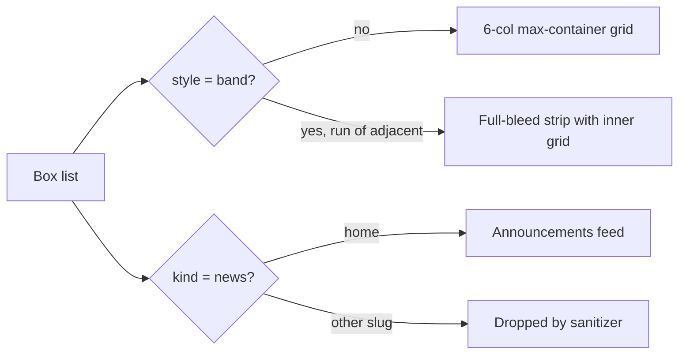
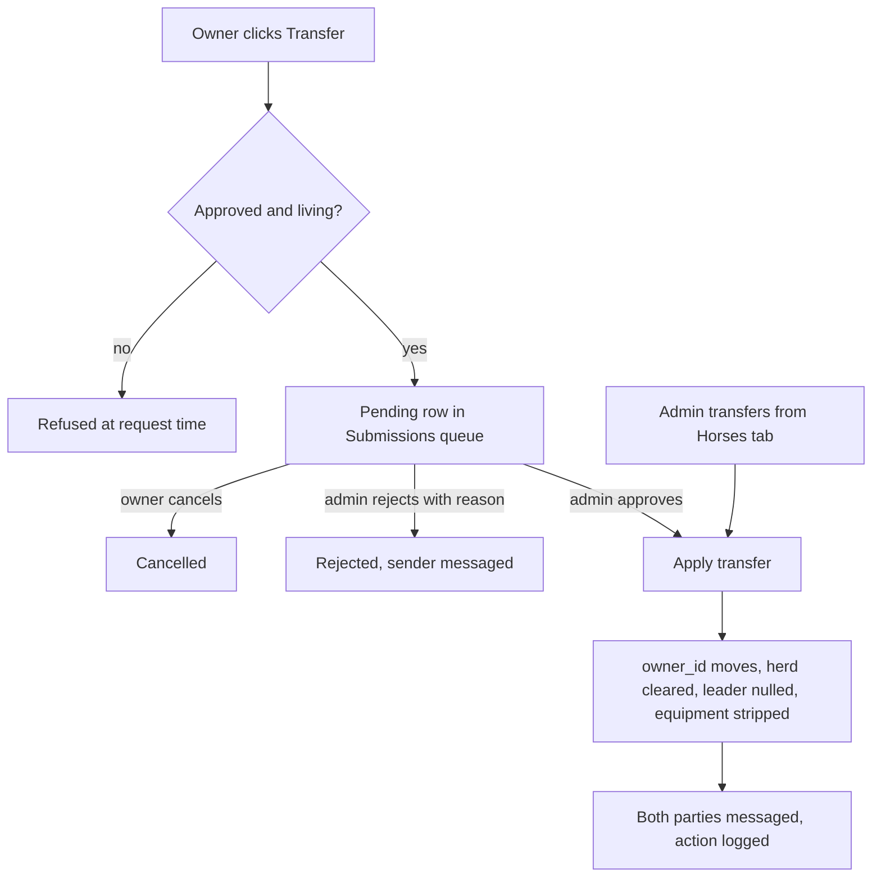
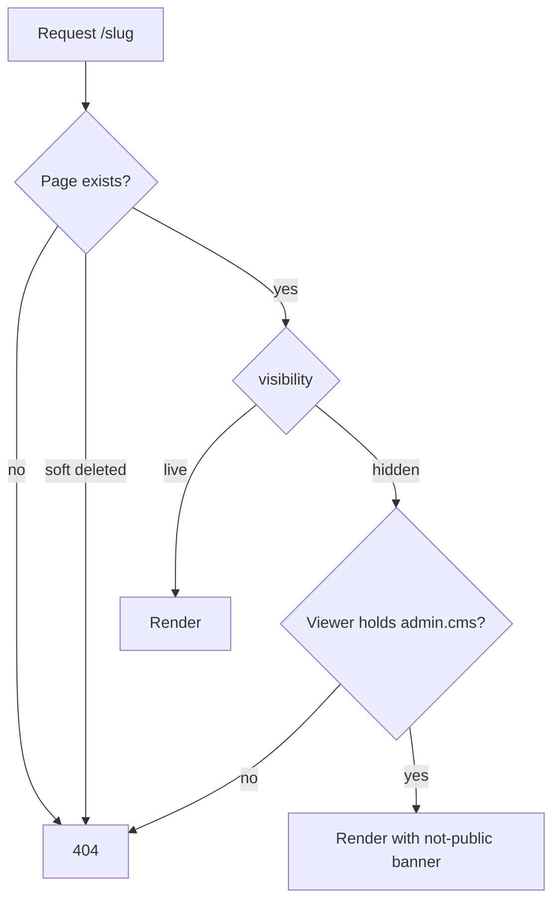
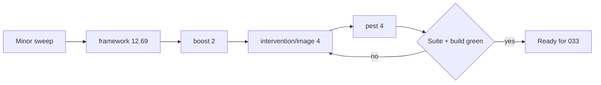
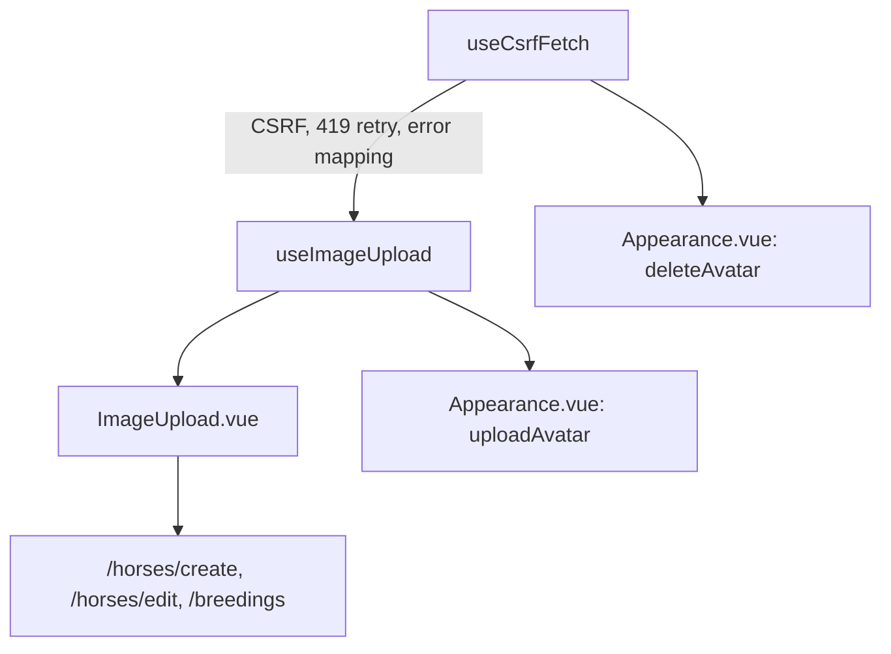

# Roadmap Done

## [040] Editable Home Page, Half-Width and Band Boxes

**Status:** `done`
**Depends On:** [037] (done, see ROADMAP_DONE.md)
**Spec:** none

### Goal

Admins edit `/` inline like any other CMS page, without it looking different from today. Home can't be hidden or deleted. To fit the current layout, boxes get a 1/2 width and a full-bleed "band" style on every CMS page.

### Scope

- `home` CMS page created by a data migration from the current `Welcome.vue` content, public visibility
- `/` renders through the shared CMS page and inline editor, with a home hero variant (arch shape, click-to-cycle season background) whose title and tagline are editable
- Pinned News slot on home: renders live announcements, can be moved and resized, can't be typed into or deleted
- Box width becomes a named `width` (`third`, `half`, `two-thirds`, `full`) on a 6-column grid, replacing int `span`, offered on every CMS page
- New `band` box style on every CMS page: consecutive band boxes share one full-bleed darker strip
- `/home` 301-redirects to `/`
- NOT in scope: image uploads and picker ([038]), news slot on other pages, sections or per-section backgrounds

### Technical Notes

**User flows:**

**Flows:** `verified`

- **Admin:** cog on `/`. Edit hero title and tagline, edit, add, reorder and resize boxes, move and resize the News slot, save and restore revisions.
- **Admin:** width menu on any box. Pick Width 1/3, 1/2, 2/3 or Full.
- **Admin:** style menu on any box. Pick "Band" to put the box in a full-bleed strip.
- **Visitor:** `/`. Looks the same as it does today. `/home` redirects here.

**Details:**

- Split out of [038], which no longer converts home.
- Hero text already exists: `hero_title` and `hero_description` on `cms_pages` and `cms_page_revisions`, edited through `PlainTextEdit` in `DynamicInfo.vue`. No home hero variant was needed: `Layout.vue` already renders the arch hero and season cycling for every CMS page. `Welcome.vue` and `LandingLinkBox.vue` are deleted.
- Home is served by `StaticPageController::home` (route name `home` kept), which passes `isHome` and `announcements` to `cms/Show`. Home drops `items-start` so row boxes share a height, and the tab title comes from the page title ("Home - Rattlesnake Mountain").
- The sanitizer strips `class` and unlisted tags, so the Get started box is a plain `<h2>` sized by `.cms-home .box > h2:only-child`, and band logos are sized by `.cms-band img` in `app.css`.
- `content.*.html` is `nullable` in all three CMS requests: `ConvertEmptyStringsToNull` turns the News slot's empty html into null, which failed validation on every home save.
- `CmsPageSeeder` converts int `span` boxes to `width`, so `database/data/cms-snapshot.json` still seeds. The width migration's `down` rounds `half` up to span 2. The home migration's `down` is empty so a rollback never deletes admin edits.
- The admin page list labels home's URL `/home`, which redirects to `/`.
- Browser verification (2026-09-12, 1280px and 390px): home as a visitor matched the old layout, with 2/3 About and 1/3 News at equal height, full Get started, and both link cards as halves in the dark strip. As admin on `/`, changed News to 1/2, saved, then restored through History, and News went back to a third. The News editor has no style menu, Remove or text editor. On `/admin`, home's Live and Delete are disabled. On `/wildlife`, two added 1/2 Band boxes saved and rendered in a full-width strip, then that page was restored through History.
- Width migration: rewrite every box in `cms_pages.content` and `cms_page_revisions.content` from `span` 1/2/3 to `width` `third`/`two-thirds`/`full`, with a reversible `down`. Update `CmsBox` and `spanClasses` in `boxes.ts`, the span select in `CmsBoxEditor.vue:44`, `CmsSanitizer.php:62-69` (unknown width falls back to `full`), and `CmsLegacyContent.php:60-64`. Grid goes to `lg:grid-cols-6` with widths mapping to `lg:col-span-2/3/4/6`. Below `lg` everything stacks, as now.
- News slot: a box marked as kind `news` with empty html. The sanitizer keeps it only on the `home` slug, drops it elsewhere, and re-adds it at the end if a home save leaves it out. The renderer fills it from `Announcement::publicFeed()`, which today is passed at `web.php:239-241`.
- Band: style value `band`. The renderer groups runs of adjacent band boxes, closes the `max-container` grid, and renders the run inside a `bg-cape-palliser-500` full-width strip with its own inner grid. Each card inside uses `box-alt`, matching `LandingLinkBox.vue`. The DeviantArt and Discord cards become two `half` band boxes, and their `h3 > a > img` markup already passes the sanitizer allowlist.
- "New? Get started here" hardcodes `/getting-started` in box HTML instead of `linkDict`.
- The hide and delete guards for `home` already exist from [036] (`CmsVisibilityTest`, `CmsPageDeletionTest`). No new guard is needed, but the admin page list must show home with hide and delete disabled.
- The data migration skips creating the row if `home` already exists, so reruns are safe.
- `/home` redirect goes above the `/{slug}` catch-all at `web.php:312`.

**Diagrams:**

### Acceptance Criteria

- [x] `/` renders the `home` CMS page with announcements, and `/home` 301-redirects to `/`
      `tests/Feature/Cms/HomePageTest.php::it_renders_home_from_the_cms_page`
      `tests/Feature/Cms/HomePageTest.php::it_redirects_the_home_slug_to_root`
- [x] The data migration creates a public `home` page with today's content and does nothing if one exists
      `tests/Feature/Cms/HomePageTest.php::it_creates_the_home_page_once`
- [x] Admin edits to home, including hero title and tagline, save and produce a revision through the existing inline endpoint
      `tests/Feature/Cms/HomePageTest.php::it_saves_inline_edits_to_the_home_page`
- [x] The News slot survives saves on home, is restored if omitted, and is stripped from any other page
      `tests/Feature/Cms/CmsSanitizerTest.php::it_keeps_the_news_slot_on_home_only`
      `tests/Feature/Cms/CmsSanitizerTest.php::it_restores_a_missing_news_slot_on_home`
- [x] Existing spans migrate to named widths in pages and revisions and roll back cleanly
      `tests/Feature/Cms/ContentMigrationTest.php::it_converts_spans_to_named_widths`
      `tests/Feature/Cms/ContentMigrationTest.php::it_reverts_named_widths_to_spans`
- [x] The sanitizer accepts `half` width and `band` style and falls back on unknown values
      `tests/Feature/Cms/CmsSanitizerTest.php::it_accepts_half_width_and_band_style`
- [x] Home can't be hidden or deleted from the admin page list, and the controls show as disabled
- [x] Home looks unchanged from the current `Welcome.vue` at desktop and phone widths, including the season-cycling hero and the links band, confirmed in a browser
- [x] 1/2 width and band boxes can be added and render correctly on a non-home CMS page, confirmed in a browser

---

## [037] Inline WYSIWYG Page Editing

**Status:** `done`
**Depends On:** [036]
**Spec:** none

### Goal

An admin editing a CMS page does it on the page itself. A cog beside the header enters edit mode, where hero text, page title and every box become directly editable rich text, boxes can be added, removed, resized and dragged, and a save publishes immediately while keeping the previous version recoverable.

### Scope

- Tiptap 3 with Vue 3 bindings, one editor instance per box
- Toolbar: bold, italic, headings, bullet and ordered lists, links, images, blockquote, horizontal rule
- Cog toggle beside the header; discard and save buttons with confirmation modals
- Add, remove, resize (span 1/2/3), restyle and drag-reorder boxes via `sortablejs`
- Editable in place: hero title, hero description, page title. Slug and visibility stay in admin
- Revisions: last 10 full-page snapshots per page, pruned beyond, restorable
- Navigation guard on unsaved changes, Inertia router plus `beforeunload`
- NOT in scope: image picking from the library ([038]); `cms/Shop.vue`, which stays a hardcoded dynamic page with no cog

### Technical Notes

**User flows:**

**Flows:** `verified`

- **Admin:** cog beside the header on any CMS page. Enters edit mode.
- **Admin, in edit mode:** each box shows a toolbar, a size control, a style control, a drag handle and its own "Remove" button. Hero title and hero description are editable in place as plain text.
- **Admin, in edit mode:** "Add box", "History", "Discard" and "Save" sit together in a sticky bar, alongside a labelled "Page title" field. Save and Discard each confirm first; Save publishes immediately. ("Add box" lives in the bar rather than under the grid, so every global action is in one place.)
- **Admin:** "History" in the edit bar. Lists the last 10 saves with timestamp and author, restores any of them behind a confirmation.

**Details:**

- Tiptap 3 core is MIT and ships first-class Vue 3 bindings. Only the Pro extensions are paid; none are needed here.
- One Tiptap document per box, serialized to HTML on save. The server sanitizes with the [036] allowlist before writing, so a crafted request cannot bypass the editor's constraints.
- `sortablejs` is already a dependency and already drives reorder in `admin/CmsTab.vue`. Reuse it rather than adding a drag library.
- Save writes the page and pushes the previous state into `cms_page_revisions` (page_id, content, hero fields, title, user_id, created_at), then prunes to the 10 newest for that page. Restoring is a normal save, so it is itself revisioned.
- Discard reverts to the last saved server state without a request. The guard covers browser navigation and tab close; the Inertia router guard covers in-app navigation.
- Edit mode is client state only. There is no draft on the server, so two admins editing at once means last save wins. Acceptable at this scale; not worth locking.
- The cog appears only to a holder of `admin.cms`, matching the existing route guard at `routes/web.php:106`.

**As built:**

- Link support comes from StarterKit 3.31, which now bundles it, so no `@tiptap/extension-link`. `code`, `codeBlock`, `strike` and `underline` are disabled explicitly because none are in the [036] allowlist.
- `title` has no on-page surface: `Layout` renders `hero_title` in the `<h1>` and `<Head>`. It is therefore edited as a labelled field in the sticky bar, not in place. Hero title and description are plain-text contenteditable, since both are flat string columns.
- Tiptap editors are drop targets. A SortableJS box drag ends over another box's editable area, and ProseMirror parsed the dragged markup into the document, filing the toolbar's own text as a paragraph. Fixed with `editorProps.handleDrop: () => true` in `CmsBoxEditor.vue`. Nothing in this editor wants a drop.
- The grid takes `pb-32` in edit mode so the sticky bar never covers the last row of boxes.
- Endpoints: `PUT /admin/cms/pages/{page}/inline` and `POST /admin/cms/pages/{page}/revisions/{revision}/restore`. A revision belonging to another page 404s. `StaticPageController` emits `can_edit` and `revisions` on the page prop.
- A revision snapshots `description` and `coming_soon` alongside the edited fields, so a restore writes them back even though inline editing cannot change either.
- `admin/CmsTab.vue` still has a raw "Content (JSON)" textarea writing the same `content` column through `admin.cms.pages.update`, which does not create a revision. Two write paths for one field; worth its own item.

### Acceptance Criteria

- [x] Saving a page persists edited hero text, page title and box HTML, and the page renders the change
      `tests/Feature/Cms/CmsInlineEditTest.php::it_saves_edited_hero_and_box_content`
- [x] Adding, removing, resizing and reordering boxes persists across a save
      `tests/Feature/Cms/CmsInlineEditTest.php::it_persists_added_and_removed_boxes`
      `tests/Feature/Cms/CmsInlineEditTest.php::it_persists_box_order_and_spans`
- [x] A save request carrying script tags or non-allowlisted markup is sanitized before it is stored
      `tests/Feature/Cms/CmsInlineEditTest.php::it_sanitizes_content_submitted_directly_to_the_endpoint`
- [x] The slug cannot be changed through the inline editing endpoint
      `tests/Feature/Cms/CmsInlineEditTest.php::it_ignores_a_slug_submitted_to_the_inline_editor`
- [x] Each save records the previous version, history keeps only the 10 newest, and restoring one returns the page to that state
      `tests/Feature/Cms/CmsRevisionTest.php::it_records_the_previous_version_on_save`
      `tests/Feature/Cms/CmsRevisionTest.php::it_prunes_revisions_beyond_ten`
      `tests/Feature/Cms/CmsRevisionTest.php::it_restores_a_previous_revision`
- [x] A user without `admin.cms` gets no cog and cannot reach the save or restore endpoints
      `tests/Feature/Cms/CmsInlineEditTest.php::it_forbids_saving_without_the_cms_capability`
      `tests/Feature/Cms/CmsRevisionTest.php::it_forbids_restoring_without_the_cms_capability`
- [x] Toolbar formatting, box drag/drop, resize and the save and discard confirmations behave correctly, confirmed in a browser
- [x] Navigating away or closing the tab with unsaved edits prompts before discarding, confirmed in a browser

---

## [034] Horse Ownership Transfer

**Status:** `done`
**Depends On:** [011] (done, see ROADMAP_DONE.md)
**Spec:** none

### Goal

A player can offer one of their horses to another player from the horse's own page, an admin approves or rejects it in the existing Submissions queue, and an admin can move any horse to any owner immediately from a new Horses tab, so ownership changes stop being a database edit.

### Scope

- `horse_transfers` table and service: pending, approved, rejected, cancelled
- "Transfer this horse" control on the owner's own horse page, recipient picked from a name list
- Transfer rows appear in the Submissions tab as a third `kind` beside designs and breeding requests, with approve and reject actions gated on `admin.submissions`
- New `horses` capability area and a Horses tab in `/admin` whose only content is starting an immediate admin transfer
- On approval: `owner_id` moves, `herd_id` clears, any herd led by the horse has `herd_leader_id` nulled, equipment returns to the sender
- In-app `Message` on approval, rejection, and admin-initiated transfer
- NOT in scope: a horse browser or any other horse management in the Horses tab
- NOT in scope: recipient consent. Admin approval is the only gate (decision of 2026-09-10)
- NOT in scope: locking a pending horse out of breeding, editing, or herd changes
- NOT in scope: transferring herds, breeding slots, or items between users

### Technical Notes

**User flows:**

**Flows:** `verified`

- **Owner:** "Transfer this horse" in the Transfer panel on `/horses/{horse}`. Choose a recipient and optionally write a note. The panel then shows the request as pending, with a "Cancel transfer" button.
- **Recipient:** nothing to do. The horse appears in their stable with no herd once an admin approves, and an in-app message says where it came from.
- **Staff (review):** Submissions tab at `/admin`. Transfer rows sit in the same list as designs and breeding requests, filterable by the existing type dropdown. Approve, or reject with a required reason.
- **Admin (direct):** "Horses" tab at `/admin`. Search a horse by name, pick a new owner, write a required reason, then "Transfer horse". Choosing the Sanctuary shows a warning inline and a confirmation step before anything moves.

**Details:**

- The Submissions tab is already a unified list. `SubmissionsTab.vue:100` builds a `UnifiedRow` with a `kind` discriminator and `:127` filters on it, so designs and breeding requests already coexist there. Transfers are a third `kind`, a third source array on the props, and a third branch in `DashboardController::submissions` (`:245`). No new list component.
- An admin-initiated transfer writes an already-approved `horse_transfers` row, so every ownership change has one history shape and appears in the queue under the approved filter. There is no pending state it passes through.
- Two capabilities, deliberately. `horses` is a new entry in `Role::areas()` (the tenth, since [031] added `design_priority` and `design_npc`) (`app/Models/Role.php:18`), seeded on for Admin only, and gates the Horses tab plus the immediate-transfer route. Approving and rejecting queued transfers stays on `admin.submissions`, because that is what gates the tab the rows live in. `RoleCapabilityService::sync` intersects against `Role::areas()` (`app/Services/RoleCapabilityService.php:61`), so the area must go in that list, in `defaultCapabilities()`, in a `role_capabilities` seed migration, and in `areaLabels` plus `DEFAULT_CAPABILITY_AREAS` in `RoleCapabilityMatrix.vue`. `ALL_TABS` in `resources/js/pages/admin/Index.vue:190` gains `horses`, since a capability alone renders no tab.
- Player eligibility: approved and living horses only. Admins bypass that entirely, since admin transfer exists to correct states the rules produced, and can move an unapproved, archived, or dead horse.
- Herd detachment is not a rule, it is an integrity requirement, so it applies on both paths. A herd row pointing at a horse someone else owns is a broken reference, and `horses.herd_id` is a real foreign key (`create_horses_table.php:25`) while `herds.herd_leader_id` is an unconstrained column (`create_herds_table.php:19`). Clear both.
- Breeding requests survive a transfer untouched. `BreedingRequest.requester_id` owns the outcome, so a foal from a pending breeding goes to whoever submitted it, not to the horse's new owner. Nothing to cancel.
- Equipment returns to the sender via a new `EquipmentService::returnAllToOwner`, stripped before `owner_id` moves so the inventory credit still resolves to the sender. Unlike `dequip` it cannot refuse, so a partly used unit, or one that would overflow the sender's `max_count`, is discarded rather than returned: `user_items` counts whole units only and there is nowhere else for those to land. This is why the item depends on [011]. `horses.equipment` is JSON that nothing currently writes, and there is no dequip path to call. Without [011] the strip would have to invent the relational-versus-JSON source of truth that [011] exists to decide.
- One pending transfer per horse, enforced by the database, not by a service check alone. MySQL has no partial indexes, so this is a generated `pending_horse_id` column holding `horse_id` only while the row is pending and NULL otherwise, under a plain unique index: repeated NULLs are legal, so resolved rows never collide. The column is VIRTUAL rather than STORED because MySQL forbids an `ON DELETE CASCADE` foreign key on the base column of a stored generated column, and `horse_id` is both. It also has to be declared inside `Schema::create`, since MySQL cannot ALTER a generated column onto a table that already carries foreign keys. Two admins approving the same horse in the same second must not both write `owner_id`. The approval itself runs in a transaction and re-reads the horse, since nothing locks it while pending.
- The recipient list reuses the trade rule at `TradeController.php:66`: every active player, excluding self, banned users, and the Sanctuary. Players cannot see each other's numeric ids anywhere, so the picker is a name-to-id list.
- The Sanctuary is available to admins only, and the tab warns before confirming. `Horse::syncNpcFlagsFromOwner` (`app/Models/Horse.php:167`) fires on any dirty `owner_id` and sets both `is_npc` and `is_claimable` when the new owner is the Sanctuary, so a Sanctuary transfer publishes the horse to the claimable pool. This is the manual handover [030] leaves to an admin.
- Messages go through `Message`, the channel `SubmissionController.php:113` already uses for design decisions. Rejection carries the admin's required reason. An admin-initiated transfer messages both the old and the new owner.
- Admin actions log to `AdminSubmissionLog` the way archive does (`SubmissionController.php:33`), which needs new `AdminAction` cases for the transfer approval, rejection, and direct move.

**Built:**

- Routes: `horse-transfers.store` (`POST /horses/{horse}/transfers`), `horse-transfers.cancel`, `admin.horse-transfers.approve`, `admin.horse-transfers.reject`, `admin.horses.transfer`, `admin.horses.search`.
- The Submissions status filter gained `rejected` and `cancelled` options. Transfer statuses map straight through rather than being squeezed into the design vocabulary, so a rejected transfer reads as rejected rather than archived.
- `AdminAction` gained `TransferApproved`, `TransferRejected` and `TransferredDirectly`; `MessageType` gained `HorseTransfer`.

**Diagrams:**

### Acceptance Criteria

- [x] An owner can request a transfer of an approved, living horse to another player, and cannot request one for a horse that is unapproved, archived, dead, or not theirs
      `tests/Feature/HorseTransferTest.php::it_lets_an_owner_request_a_transfer`
      `tests/Feature/HorseTransferTest.php::it_refuses_requests_for_ineligible_horses`
      `tests/Feature/HorseTransferTest.php::it_forbids_requesting_a_transfer_of_someone_elses_horse`
- [x] A second pending transfer for the same horse is refused at the database level, and two concurrent approvals move the horse exactly once
      `tests/Feature/HorseTransferTest.php::it_allows_only_one_pending_transfer_per_horse`
      `tests/Feature/HorseTransferTest.php::it_moves_the_horse_exactly_once_under_concurrent_approval`
- [x] The sender can cancel while pending, and a cancelled or rejected request leaves ownership untouched
      `tests/Feature/HorseTransferTest.php::it_lets_the_sender_cancel_a_pending_transfer`
      `tests/Feature/HorseTransferTest.php::it_leaves_ownership_untouched_on_rejection`
- [x] Approval moves `owner_id`, clears `herd_id`, nulls `herd_leader_id` on any herd the horse led, and returns equipment to the sender
      `tests/Feature/HorseTransferTest.php::it_moves_ownership_and_detaches_the_horse_from_its_herd`
      `tests/Feature/HorseTransferTest.php::it_clears_herd_leadership_when_the_leader_is_transferred`
      `tests/Feature/HorseTransferTest.php::it_returns_equipped_items_to_the_sender`
- [x] A pending breeding request involving the horse survives the transfer, and its foal still goes to the requester
      `tests/Feature/HorseTransferTest.php::it_leaves_pending_breeding_requests_with_the_original_requester`
- [x] Rejection requires a reason, and approval, rejection, and admin transfer each send in-app messages to the right people
      `tests/Feature/HorseTransferTest.php::it_requires_a_reason_to_reject`
      `tests/Feature/HorseTransferTest.php::it_messages_both_parties_on_an_admin_transfer`
- [x] An admin holding `horses` can transfer any horse immediately, including unapproved and dead ones, with a required reason, and the action is logged
      `tests/Feature/HorseTransferTest.php::it_lets_an_admin_transfer_any_horse_immediately`
      `tests/Feature/HorseTransferTest.php::it_requires_a_reason_for_an_admin_transfer`
      `tests/Feature/HorseTransferTest.php::it_logs_admin_transfers`
- [x] Transferring to the Sanctuary is available to admins only and leaves `is_npc` and `is_claimable` true
      `tests/Feature/HorseTransferTest.php::it_marks_a_sanctuary_transfer_as_npc_and_claimable`
      `tests/Feature/HorseTransferTest.php::it_excludes_the_sanctuary_from_the_player_recipient_list`
- [x] Staff without `admin.submissions` cannot approve or reject, and staff without `horses` see no Horses tab and cannot transfer directly
      `tests/Feature/HorseTransferTest.php::it_forbids_approving_without_the_submissions_capability`
      `tests/Feature/HorseTransferTest.php::it_forbids_direct_transfer_without_the_horses_capability`
- [x] `horses` is seeded on for Admin and appears in the role matrix
      `tests/Feature/Admin/RoleCapabilityMatrixTest.php::it_seeds_horses_for_admin`
- [x] Transfer rows appear in the Submissions queue alongside designs and breeding requests and respond to the existing type and status filters, confirmed in a browser as an admin
- [x] The Horses tab warns before a Sanctuary transfer that the horse becomes an NPC and claimable, confirmed in a browser

---

## [030] Designer NPC Design Flag

**Status:** `done`
**Depends On:** [029]
**Spec:** none

### Goal

A designer uploading a design meant to become an NPC, rather than one of their own characters, can say so at upload, so the reviewer sees the intent in the queue instead of having to ask. The flag is advisory only: approval changes nothing about ownership.

### Scope

- `design_npc` capability area, seeded on for Designer and Admin, editable from the role matrix
- "Intended as an NPC" checkbox on `/horses/create` and `/horses/{horse}/edit`, default unchecked, visible only to roles holding the capability
- A dedicated advisory column on `horses`, separate from the derived `is_npc`
- The stored intent shown to the reviewer in the Submissions tab
- NOT in scope: any ownership change on approval. Approval behaves exactly as it does today, and an admin hands the horse to the Sanctuary by hand afterwards (decision of 2026-09-10)
- NOT in scope: an admin per-horse ownership transfer UI. None exists today, so the manual step is a database or Tinker edit. Worth its own item
- NOT in scope: the priority flag ([029]); re-deriving `is_npc` for horses already in the database; the claimable roller ([010])

### Technical Notes

**User flows:**

**Flows:** `verified`

- **Designer:** "Intended as an NPC" checkbox on the horse form at `/horses/create` and `/horses/{horse}/edit`.
- **Staff (review):** Submissions tab at `/admin`. Flagged rows carry an "Intended as NPC" badge beside the submission name, visible before the reviewer approves.
- **Admin:** role matrix at `/admin`. A `design_npc` column, togglable per staff role.

**Details:**

- Client decision, 2026-09-10: store the intent and leave ownership alone. Of the three behaviours put to them, this is the advisory-label option. `syncNpcFlagsFromOwner` keeps its invariant untouched and no code path gives a designer's work away automatically.
- The column must not be `is_npc`. `Horse::syncNpcFlagsFromOwner` (`app/Models/Horse.php:167`) derives `is_npc` and `is_claimable` from Sanctuary ownership on every save where `owner_id` is dirty (`:71`), so a checkbox writing `is_npc` would be overwritten by the next ownership change. Use a separate boolean, `intended_as_npc`, that nothing derives and nothing else reads.
- Because the flag is inert, the capability gate is a review-noise control rather than a permission over someone's property. It still defaults off and still lives in the matrix.
- The manual handover an admin performs afterwards is the existing ownership change: setting `owner_id` to the Sanctuary user makes `syncNpcFlagsFromOwner` set both `is_npc` and `is_claimable`. Nothing new is needed for that to work, only a way to do it from the UI, which this item does not build.
- Capability plumbing mirrors [029]: `Role::areas()`, `defaultCapabilities()`, a `role_capabilities` seed migration, and an `areaLabels` plus `DEFAULT_CAPABILITY_AREAS` entry in `RoleCapabilityMatrix.vue`. Two separate areas by decision of 2026-09-07, so priority-flagging can be granted without NPC-intent rights.

**As built:**

- Column is `horses.intended_as_npc`, boolean, default false. Nothing derives it and nothing else reads it.
- Surfaced to the reviewer as a badge on the queue row. There is no separate reviewer control: the flag is the submitter's statement of intent, so staff have nothing to set.
- Each seed lives in the same migration as its column rather than in a separate one, so a rollback takes the area and the column together.

### Acceptance Criteria

- [x] Roles holding `design_npc` see the checkbox on create and edit; players never do
      `tests/Feature/DesignNpcFlagTest.php::it_shows_the_npc_checkbox_to_capable_roles`
      `tests/Feature/DesignNpcFlagTest.php::it_hides_the_npc_checkbox_from_players`
- [x] Submitting with the box ticked stores the intent and surfaces it to the reviewer, and a player posting the field cannot set it
      `tests/Feature/DesignNpcFlagTest.php::it_stores_and_surfaces_the_npc_intent`
      `tests/Feature/DesignNpcFlagTest.php::it_ignores_the_field_from_an_uncapable_submitter`
- [x] Approving a flagged design leaves `owner_id`, `is_npc`, and `is_claimable` exactly as they were, and an unflagged approval is unchanged too
      `tests/Feature/DesignNpcFlagTest.php::it_leaves_ownership_untouched_when_approving_a_flagged_design`
      `tests/Feature/DesignNpcFlagTest.php::it_leaves_unflagged_approvals_unchanged`
- [x] A later hand transfer to the Sanctuary still derives `is_npc` and `is_claimable` from ownership, with the intent flag untouched
      `tests/Feature/DesignNpcFlagTest.php::it_derives_npc_flags_when_ownership_moves_to_the_sanctuary`
- [x] `design_npc` is seeded on for Designer and Admin
      `tests/Feature/Admin/RoleCapabilityMatrixTest.php::it_seeds_design_npc_for_designer_and_admin`

---

## [029] Designer High-Priority Submission Flag

**Status:** `done`
**Depends On:** none
**Spec:** none

### Goal

Designers can mark a design submission as high priority when they upload it, and submissions-capable staff can raise or clear that flag in the review queue, so urgent designs are visible at a glance instead of found by scrolling.

### Scope

- `design_priority` capability area added to the role matrix, seeded on for Designer and Admin
- "High priority" checkbox on `/horses/create` and `/horses/{horse}/edit`, rendered only for roles holding the capability, default unchecked
- Boolean on `horses`, persisted through approval
- Badge on flagged rows in the admin Submissions tab, plus a priority dropdown beside the existing status filter
- Staff route to raise or clear the flag on a queued submission, gated on `admin.submissions`
- NOT in scope: the designer NPC flag ([030]); auto-flagging derived from submitter role; changing the queue default sort; notifications

### Technical Notes

**User flows:**

**Flows:** `verified`

- **Designer:** "High priority" checkbox on the horse form at `/horses/create` and `/horses/{horse}/edit`. Ticking it marks the submission for fast review.
- **Player:** the same two forms, with no checkbox. Nothing changes.
- **Staff (review):** Submissions tab at `/admin`. Flagged rows carry a "High priority" badge, an "All Priorities / High priority / Normal priority" dropdown sits beside the status filter, and each queued row carries a "Raise priority" / "Clear priority" button beside Review.
- **Admin:** role matrix at `/admin`. A `design_priority` column, togglable per staff role.

**Details:**

- `Role::areas()` (`app/Models/Role.php:18`) is a hardcoded seven-entry list, and `RoleCapabilityService::sync` intersects any submitted matrix against it (`app/Services/RoleCapabilityService.php:61`), so an area missing from that list is silently dropped on save. The new area goes there and into `Role::defaultCapabilities()` for Admin and Designer.
- `app/Providers/AppServiceProvider.php:46` mints an `admin.{area}` gate for every area, so `admin.design_priority` will exist. Nothing routes on it. The form uses the capability as a field-visibility check, not a route gate. Accepted.
- A new area does not produce a phantom admin tab: `resources/js/pages/admin/Index.vue:225` gates tab rendering on a fixed `ALL_TABS` list. It does need an `areaLabels` entry and a `DEFAULT_CAPABILITY_AREAS` entry in `resources/js/pages/admin/RoleCapabilityMatrix.vue` (`:27`, `:142`), or the matrix renders the raw slug.
- Existing `role_capabilities` rows need a seed migration for the new area. The [021] migration is the pattern.
- `statusFilter` is a single-select `Status | 'all'` ref (`resources/js/pages/admin/SubmissionsTab.vue:122`). Priority is a second independent ref, not another option in that dropdown, so "pending AND high priority" stays expressible. The filter chain at `:240` gains one clause.
- The flag persists through approval, so the approved filter still shows what was fast-tracked. No write on approve.
- Staff writes go through a new route beside `archive` / `unarchive` in `SubmissionController` and log to `AdminSubmissionLog` the way archive does (`:33`), which needs a new `AdminAction` case.

**As built:**

- Column is `horses.is_high_priority`, boolean, default false.
- `POST /admin/horses/{horse}/priority` (`admin.horses.priority`) takes `is_high_priority` and logs `AdminAction::PriorityRaised` or `AdminAction::PriorityCleared`. Two cases rather than one, so the log reads as an action rather than a state.
- The row control is a toggle button, not a per-row dropdown: with one boolean there is nothing to pick from.
- `HorseController::designFlagInput()` drops any flag field the submitter lacks the capability for, so a player posting `is_high_priority` is ignored rather than rejected. Same helper serves [030].
- `tests/Feature/AdminAccessTest.php` asserted the designer's exact capability list, so it was updated for the two new areas.

### Acceptance Criteria

- [x] Roles holding `design_priority` see the checkbox on create and edit; players do not
      `tests/Feature/DesignPriorityFlagTest.php::it_shows_the_priority_checkbox_to_capable_roles`
      `tests/Feature/DesignPriorityFlagTest.php::it_hides_the_priority_checkbox_from_players`
- [x] Submitting with the box ticked stores the flag, and a player posting the field cannot set it
      `tests/Feature/DesignPriorityFlagTest.php::it_stores_the_flag_from_a_capable_submitter`
      `tests/Feature/DesignPriorityFlagTest.php::it_ignores_the_field_from_an_uncapable_submitter`
- [x] Submissions-capable staff can raise and clear the flag on a queued submission; others cannot
      `tests/Feature/DesignPriorityFlagTest.php::it_lets_staff_raise_and_clear_the_flag`
      `tests/Feature/DesignPriorityFlagTest.php::it_forbids_non_staff_from_changing_the_flag`
- [x] The flag survives approval and is still visible under the approved filter
      `tests/Feature/DesignPriorityFlagTest.php::it_keeps_the_flag_after_approval`
- [x] `design_priority` is seeded on for Designer and Admin, and toggling it in the matrix changes who sees the checkbox
      `tests/Feature/Admin/RoleCapabilityMatrixTest.php::it_seeds_design_priority_for_designer_and_admin`
      `tests/Feature/DesignPriorityFlagTest.php::it_respects_a_matrix_toggle_of_design_priority`
- [x] Priority dropdown combines with the status filter rather than replacing it, confirmed in a browser as staff
- [x] Flagged rows read "High priority" in the Submissions tab, confirmed in a browser

---

## [031] Repo-Wide Lint and Format Compliance

**Status:** `done`
**Depends On:** none
**Spec:** none

### Goal

`npm run format:check`, `npx eslint .`, and `./vendor/bin/pint --test` all pass on a clean checkout, and a pre-commit hook keeps them passing.

### Scope

- Remove the stray VS Code key from `.prettierrc` that Prettier rejects on every run
- Reformat the 50 Prettier-noncompliant files under `resources/`
- Clear the 2 ESLint errors
- Clear the 9 Pint style issues
- Add a pre-commit hook that formats staged files
- NOT in scope: changing any Prettier, ESLint, or Pint rule to make a violation disappear, other than the `_`-prefix unused-vars convention below
- NOT in scope: CI. Nothing in this repo runs in CI and this item does not change that

### Technical Notes

**User flows:**

**Flows:** `none`

**Details:**

- `.prettierrc:18` carries `"terminal.integrated.defaultLocation": "editor"`, a VS Code setting pasted into the Prettier config. It is the sole cause of the `[warn] Ignored unknown option` line printed once per file. Delete the line. It changes no formatting, only the noise.
- Prettier reports 50 files. The formatting itself is mechanical (`npm run format`), but with `tabWidth: 5` and `singleAttributePerLine: true` the diff is large. Run it on a clean tree so the reformat is its own commit, separate from the in-flight upload-limit work.
- ESLint errors are two distinct kinds, and only one is a code change:
  - `resources/js/pages/Horses/Edit.vue:96` — `const { sex: _sex, ...rest } = data` is a deliberate destructure-discard, correctly named with the `_` convention. The code is right and the config is wrong. Set `varsIgnorePattern`/`argsIgnorePattern` to `^_` on `@typescript-eslint/no-unused-vars` in `eslint.config.js`.
  - `resources/js/pages/admin/Index.vue:216` — a `canManageRoleMatrix` computed shadows the prop of the same name declared at `:185`. Vue resolves the setup binding over the prop, so `:381` gets the computed, which is the intent, but the collision is silent and fragile. Rename the computed (`showRoleMatrix`) rather than suppressing the rule.
- Pint: 9 files, all trivial (`single_blank_line_at_eof`, `array_indentation`, `indentation_type`, `no_unused_imports`, and a `line_ending` in `database/seeders/LocalOnly.php` — a CRLF artifact of Windows development). `./vendor/bin/pint` fixes all of them. Note the shell: `./vendor/bin/pint` fails under Git Bash with `env: 'php': No such file or directory`, so run it from PowerShell.
- Guard: Husky plus lint-staged, running Prettier and ESLint on staged `resources/**` files and Pint on staged `*.php`. This is the only thing in the item that prevents a repeat. Without it the cleanup is a chore that recurs.

**As built (2026-09-07):**

- PHP runs from `.husky/pre-commit` directly, not through lint-staged. lint-staged spawns tasks without a shell, and Windows cannot exec the `.sh` wrapper that a Pint task would need. The hook is already running under `sh`, so it invokes Pint itself and re-stages what Pint rewrote.
- Resolving `php` in the hook needed a second pass. Herd installs `php.bat`, which carries no executable bit, so `command -v php.bat` fails under the POSIX-mode `sh` git runs hooks with, even though `php.bat -v` executes fine there. The hook probes by execution rather than lookup, and tries the plain `php` name first so Linux and macOS are unaffected.
- The hook excludes `*.blade.php` from the Pint pass. Pint is a PHP formatter and mangles Blade directives.
- ESLint gained `no-unused-vars` ignore patterns for `^_` (vars, args, caught errors, destructured array) plus `ignoreRestSiblings`. `_sex` in `Horses/Edit.vue` is untouched, as intended.
- Criterion 4 was verified twice: first by staging two deliberately misformatted probe files, running `.husky/pre-commit`, and reading the staged blobs back with `git show :<path>` (both came back formatted, probes then removed), and again by the two real commits below, where the hook ran end to end over 57 files.
- No behavioural change confirmed by the full suite (281 passed, 1638 assertions) and a clean `npm run build`.
- The renamed `showRoleMatrix` binding was verified in the browser: logged in, opened the "Users" tab at `/admin`, and confirmed the "Role capabilities" panel still renders. Screenshot at `storage/screenshots/031-role-matrix-verified.png`. `vue-tsc` also reports no error for the binding, though it does report two pre-existing `admin/Index.vue` errors on `:cms-pages` and `:menu-items` that are present unchanged on `HEAD`.
- Delivered on branch `chore/lint-format-compliance` as two commits off `0592dc4`: `chore(lint)` for the config fixes, the `showRoleMatrix` rename and the hook, then `style:` for the reformat alone. The split was made safe by proving which files were formatting-only, reformatting each file's `HEAD` version and comparing it to the working copy. 49 of 50 matched exactly; only `admin/Index.vue` differed, and only because of the rename, so it went in the first commit.

### Acceptance Criteria

- [x] `npm run format:check` exits 0 with no `Ignored unknown option` warnings
- [x] `npx eslint .` exits 0, with `_sex` still present in `Horses/Edit.vue` and the `admin/Index.vue` computed renamed
- [x] `./vendor/bin/pint --test` exits 0
- [x] Committing a deliberately misformatted `resources/` file and a misformatted PHP file leaves both formatted in the resulting commit
- [x] The reformat lands as its own commit, containing no behavioural change

---

## [036] CMS Block Schema, Visibility and Page Deletion

**Status:** `done`
**Depends On:** [035]
**Spec:** none

### Goal

CMS page content becomes an ordered list of boxes with a column span and a style, rendered from sanitized HTML on a three-column grid. Pages gain live/hidden visibility and recoverable deletion, managed from the admin page list.

### Scope

- Migrate `content` from `{box1: [markdown], ...}` to an ordered array of `{id, span, style, html}`
- Convert the `images` array into image boxes with visible "Art by @name" captions, then drop the column
- `symfony/html-sanitizer` allowlist applied on every write
- `visibility` column, `live` / `hidden`, existing pages grandfathered to `live`
- Soft delete on `cms_pages`, with a confirm modal listing menu items pointing at the slug
- `DynamicInfo.vue` rewritten to render the new shape on a three-column grid
- The conversion lives in `App\Support\CmsLegacyContent`, shared by the migration and `CmsPageSeeder`, so a fresh `migrate:fresh --seed` also lands on the box shape
- NOT in scope: the editor UI ([037]), media library and home conversion ([038])
- NOT in scope: any change to the role capability matrix; `admin.cms` continues to gate everything

### Technical Notes

**User flows:**

**Flows:** `verified`

- **Admin:** page list in the admin CMS tab. Toggle a page between Live and Hidden, delete a page, reorder pages.
- **Visitor:** `/{slug}`. A hidden page returns the 404 page.
- **Admin:** `/{slug}` for a hidden page. Renders normally with a banner saying it is not public.

**Details:**

- Box shape is `{id, span, style, html}`. `span` is 1, 2 or 3 on a three-column grid at `lg` and above; below `lg` every box is full width in drag order, matching the current pages. `style` is one of `box`, `box-alt`, `box-centered`; the first two are the CSS classes at `resources/css/app.css:69-96` and `box-centered` renders `box` plus `text-center`, so no new CSS was needed.
- Conversion order: text boxes and image boxes interleave (text, art, text, art…), a text box spans 2 when an image box sits beside it and 3 once the art runs out, and image boxes always span 1. That reproduces the old 2fr/1fr reading order.
- Image boxes now render below `lg` as well. The old image column was `hidden lg:flex`, so on a phone the attribution was invisible; the drag-order rule above puts it back in the flow.
- The three-column grid replaces the fixed `lg:grid-cols-[2fr_1fr]` in `DynamicInfo.vue:52` and unifies CMS pages with the home layout at `Welcome.vue:88-128`, which already uses `lg:col-span-1/2/3`.
- Markdown is converted to HTML by the migration, not at render time. `markdown-it` is currently instantiated with defaults (`DynamicInfo.vue:5`), meaning raw HTML is escaped, so nothing in the existing content can be hostile. After conversion the sanitizer is the only thing standing between an admin and stored XSS.
- Sanitizer allowlist matches what the pages already use: `strong`, `em`, `h1`-`h4`, `ul`, `ol`, `li`, `a`, `img`, `blockquote`, `hr`, `p`, `br`. No `table`, no `script`, no inline event attributes, no `style`.
- The migration snapshots every page's pre-conversion state, including the full `images` array with artist name and link, to `database/data/cms-legacy-content-{Y_m_d_His}.json` before writing. `down()` restores from the most recent one. That archive is the structured attribution [039] re-imports, so it must not be pruned.
- Attribution survives visually as caption text in the converted boxes and structurally in the archive. Between this item and [039] it is not queryable. Accepted deliberately.
- `coming_soon` stays an independent flag driving its own banner (`DynamicInfo.vue:29`). A page can be live and flagged.
- Home cannot be hidden or deleted. Guard it in the request classes, not only the UI. No `home` row exists in `cms_pages` yet ([038] converts it); the guard is keyed on the slug and is in place ahead of that.
- Adding `SoftDeletes` to `CmsPage` broke `2026_07_23_174936_update_breeding_foaling_cms_copy`, which read the table through the model and so inherited a `deleted_at` scope for a column that migration runs before. It now uses `DB::table`, which is what a migration should have been doing.
- Every test that replays the migration lives in `ContentMigrationTest`, which owns its own lifecycle (`migrate:fresh` per test, explicit restore after) and uses no `RefreshDatabase`. DDL implicitly commits in MySQL, so a migration replay silently ends the per-test transaction and leaves later, unrelated tests failing on a half-migrated schema. Pest's `uses()` is file-scoped, so the replay cases cannot share a file with transactional ones. That is why `it_grandfathers_existing_pages_to_live` sits in `ContentMigrationTest` rather than `CmsVisibilityTest`.
- `MenuItem.path` is free text, so nothing links a menu row to a page. The delete confirm queries menu items whose `path` matches `/{slug}` and lists them; it does not cascade.

**Diagrams:**

### Acceptance Criteria

- [x] The migration converts every seeded page's markdown boxes to sanitized HTML boxes with a span and style, and `down()` restores the originals
      `tests/Feature/Cms/ContentMigrationTest.php::it_converts_markdown_boxes_to_html_boxes`
      `tests/Feature/Cms/ContentMigrationTest.php::it_restores_the_original_content_on_rollback`
- [x] Every `images` entry becomes an image box whose caption carries the artist name and link, and the pre-conversion array is written to the fixture archive
      `tests/Feature/Cms/ContentMigrationTest.php::it_converts_image_credits_into_captioned_image_boxes`
      `tests/Feature/Cms/ContentMigrationTest.php::it_archives_the_original_images_array`
- [x] Saving a page strips script tags, event handlers and any tag outside the allowlist
      `tests/Feature/Cms/CmsSanitizerTest.php::it_strips_script_tags_and_event_handlers`
      `tests/Feature/Cms/CmsSanitizerTest.php::it_keeps_allowlisted_formatting_tags`
- [x] A hidden page 404s for guests and players, and renders with a banner for a holder of `admin.cms`
      `tests/Feature/Cms/CmsVisibilityTest.php::it_returns_not_found_for_a_hidden_page`
      `tests/Feature/Cms/CmsVisibilityTest.php::it_renders_a_hidden_page_for_a_cms_admin`
- [x] Existing pages migrate to live and newly created pages default to hidden
      `tests/Feature/Cms/ContentMigrationTest.php::it_grandfathers_existing_pages_to_live`
      `tests/Feature/Cms/CmsVisibilityTest.php::it_defaults_new_pages_to_hidden`
- [x] Deleting a page soft deletes it, 404s the slug, and the response names any menu items pointing at it
      `tests/Feature/Cms/CmsPageDeletionTest.php::it_soft_deletes_a_page`
      `tests/Feature/Cms/CmsPageDeletionTest.php::it_reports_menu_items_pointing_at_the_deleted_slug`
- [x] Home cannot be hidden or deleted through any route
      `tests/Feature/Cms/CmsPageDeletionTest.php::it_refuses_to_delete_the_home_page`
      `tests/Feature/Cms/CmsVisibilityTest.php::it_refuses_to_hide_the_home_page`
- [x] Span 1, 2 and 3 boxes lay out correctly on the three-column grid and stack full width on mobile, confirmed in a browser at desktop and phone widths
- [x] All 16 migrated pages read the same as before the migration, confirmed in a browser
      (15 are reachable as CMS pages; the `shop` row converted too but `/shop` is served by `ShopController`, so it never renders through `DynamicInfo`)

---

## [035] Non-Destructive CMS Seeders and Snapshot Command

**Status:** `done`
**Depends On:** none
**Spec:** none

### Goal

Seeding the database stops destroying CMS pages and navigation. `db:seed` fills gaps without overwriting live content, and `php artisan cms:snapshot` captures the current pages and menu to a fixture the seeder reads, so a `migrate:fresh --seed` restores the latest state instead of the original hardcoded copy.

### Scope

- `CmsPageSeeder` and `MenuItemSeeder` switch to non-destructive creation
- `cms:snapshot` Artisan command writing pages and menu to a JSON fixture
- Seeders read the fixture when present, fall back to the hardcoded arrays when not
- Delete the 16 unreferenced components in `resources/js/pages/cms/`
- NOT in scope: any change to `cms_pages` schema, rendering, or the admin UI

### Technical Notes

**User flows:**

**Flows:** `verified`

- **Developer:** `php artisan cms:snapshot` in the project root. Writes the current pages and menu to a fixture so the next reseed restores them.

**Details:**

- `CmsPageSeeder.php:38` calls `CmsPage::truncate()` and `MenuItemSeeder.php:15-16` deletes every row, so a `db:seed` run for unrelated data (items, shop) silently wipes CMS content and navigation. `ItemSeeder` and `ShopCatalogSeeder` already use `updateOrCreate` and are safe to re-run; these two are the outliers.
- Use `firstOrCreate` keyed on `slug` for pages and on `label` + `parent_id` for menu items. Not `updateOrCreate`: once inline editing lands ([037]) the database is canonical and seeder copy is stale by definition, so the seeder must never overwrite an edit.
- Fixture at `database/data/cms-snapshot.json` (alongside `shop_catalog.json`, the repo's one home for committed seed input), committed. It holds pages (all columns) and the menu tree. `cms:snapshot` overwrites it; the seeders prefer it over the hardcoded arrays.
- Menu parents must be created before children, so the fixture stores the tree nested rather than flat.
- The 16 dead components (`Rules.vue`, `Lore.vue`, `_Default.vue`, `ContactUs.vue` and siblings) are referenced by nothing. Only `cms/Show.vue` (`StaticPageController.php:21`) and `cms/Shop.vue` (`ShopController.php:90`) are rendered. Their markup stays in git history.
- Built: fixture read/write lives in `App\Support\CmsSnapshot`, which exposes a `$pathOverride` test hook so the seeder tests can exercise the fixture and the fallback without touching the committed file. `cms:snapshot` is `app/Console/Commands/CmsSnapshotCommand.php`.
- The dev database had already been wiped of all 16 pages and 16 menu items before this item ran. The destructive seeders were only half the cause: `phpunit.xml` set `DB_CONNECTION=mysql` with no `DB_DATABASE` override and there is no `.env.testing`, so `RefreshDatabase` dropped every table in the working `rattlesnake_mountain` database on each `php artisan test` run. Fixed in the same pass by pointing `phpunit.xml` at `rattlesnake_mountain_testing`. Anyone pulling this branch needs to create that database once.

### Acceptance Criteria

- [x] Running the CMS and menu seeders twice leaves admin edits intact and creates no duplicates
      `tests/Feature/Cms/CmsSeederTest.php::it_does_not_overwrite_edited_pages_on_reseed`
      `tests/Feature/Cms/CmsSeederTest.php::it_does_not_duplicate_menu_items_on_reseed`
- [x] Seeding an empty database still produces the full page set and menu tree
      `tests/Feature/Cms/CmsSeederTest.php::it_seeds_every_page_and_the_menu_tree_from_empty`
- [x] `cms:snapshot` writes a fixture that the seeders restore verbatim after a fresh migration
      `tests/Feature/Cms/CmsSnapshotCommandTest.php::it_writes_pages_and_menu_to_the_fixture`
      `tests/Feature/Cms/CmsSnapshotCommandTest.php::it_restores_snapshot_content_when_seeding_a_fresh_database`
- [x] Seeders fall back to their hardcoded arrays when no fixture exists
      `tests/Feature/Cms/CmsSeederTest.php::it_falls_back_to_hardcoded_pages_without_a_fixture`
- [x] The 16 unreferenced `pages/cms/` components are gone and every CMS route still renders, confirmed in a browser

---

## [019] CMS Rich Text / WYSIWYG and Home Editability

**Status:** `cancelled`
***Cancelled:** 2026-09-10 - Superseded by [037] Inline WYSIWYG Page Editing, which delivers the editing direction this item was waiting on.*
**Depends On:** none

### Goal

Replace multi-box JSON CMS editing with a simpler rich-text (or in-page WYSIWYG) experience, and make Home editable once that direction is chosen.

### Scope

- Product decision: rich-text body vs on-page WYSIWYG
- Home (`Welcome.vue`) becomes CMS-managed or section-editable
- NOT in scope until decision made (burndown blocked items)

### Technical Notes

- Admin: [`resources/js/pages/admin/CmsTab.vue`](resources/js/pages/admin/CmsTab.vue) — `contentJson` multi-box
- Home intentionally excluded from `CmsPageSeeder` historically

### Acceptance Criteria

- [ ] Editing direction decided and documented
- [ ] CMS pages editable via chosen editor
- [ ] Home content editable without deploy
- [ ] Tests for update + public render

### Tests

- [ ] `tests/Feature/AdminCmsPageTest.php::it_saves_rich_text_bodies_from_the_chosen_editor`
- [ ] `tests/Feature/AdminCmsPageTest.php::it_updates_home_content_without_a_deploy`
- [ ] `tests/Feature/CmsStaticPageTest.php::it_renders_edited_content_publicly`

---

## [033] Upgrade to Laravel 13

**Status:** `done`
**Depends On:** [032] (done, see ROADMAP_DONE.md)
**Spec:** none

### Goal

The application runs on Laravel 13.30 with the Symfony 8, Inertia 3, and Tinker 3 versions it requires, with no behavioural change to any player-facing or admin flow.

### Scope

- `laravel/framework` 12.13 → 13.30.1
- The dependencies the framework drags with it: `symfony/http-client` and `symfony/mailgun-mailer` 7.3 → 8.1.6, `inertiajs/inertia-laravel` 2.0.2 → 3.3.3, `laravel/tinker` 2.10.1 → 3.0.2
- `pestphp/pest` 4.7.8 → 5.1.4 with `pest-plugin-laravel` 4.1.0 → 5.0.1, deferred here from [032] because `pest-plugin-laravel` v5.0.1 requires `laravel/framework ^13.23.0` and Pest 5 needs `symfony/process ^8`
- Raise the `"php"` constraint in `composer.json` to the Laravel 13 floor
- Work through the official upgrade guide against `bootstrap/app.php`, `config/`, and the 17 config files this app carries
- NOT in scope: adopting new Laravel 13 features. This item changes versions and whatever the guide forces, nothing else
- NOT in scope: `package.json`, except `@inertiajs/vue3`, which must be version-matched to whatever `inertia-laravel` 3 expects

### Technical Notes

**User flows:**

**Flows:** `none`

**Details:**

- PHP is already 8.4 locally (Herd, 8.4.7) and on Forge, confirmed 2026-09-07, so the version floor is not a blocker and Forge needs no change before deploying.
- The skeleton is already the Laravel 11+ shape. `bootstrap/app.php` is the only bootstrap surface: `withRouting`, a `withMiddleware` closure aliasing `rate.limit.uploads` and `verified` and appending `DevPasswordProtection`, `HandleInertiaRequests`, `AddLinkHeadersForPreloadedAssets`, and an empty `withExceptions`. Check each against the guide, particularly the middleware alias and append APIs.
- `inertia-laravel` 3 is a major on the request-handling path, and `HandleInertiaRequests` is a custom middleware in this app. Read its changelog for prop resolution and shared-data changes before assuming the middleware carries over.
- Symfony 8 matters only through the Mailgun bridge. Mail config lives in `config/mail.php` and `config/services.php`. Verify a real send in the dev environment, not just that the container resolves the transport.
- Work on the existing `chore/laravel-13` branch.
- Verification is the automated pair only, by decision of 2026-09-07: the full Pest suite plus a production build. No Playwright pass is required for this item.

**As built (2026-09-07):**

- Laravel 13.30.1 on PHP 8.4.7. The `"php"` constraint went `^8.2` → `^8.3`, the Laravel 13 floor. Local Herd and Forge are both already 8.4, so nothing had to move on either machine.
- One `composer update` carried the whole set: framework 12.69.1 → 13.30.1, `inertia-laravel` 2.0.2 → 3.3.3, `tinker` 2.10.1 → 3.0.2, Pest 4.7.8 → 5.1.4 (PHPUnit 12.5 → 13.3), and Guzzle 7 → 8 underneath. `composer outdated --direct` is now empty.
- `bootstrap/app.php` needed no change. `Application::configure`, `withRouting`, `withMiddleware`, `withExceptions`, and every `Middleware` method the file uses (`encryptCookies`, `alias`, `web`, `append`) all still exist and are unchanged. `artisan route:list` under `E_ALL` emits no deprecation.
- Config was reconciled by diffing every key path in `config/` against the Laravel 13 defaults shipped in `vendor/laravel/framework/config/`. One real deviation: `logging.channels.daily.days` is `max_files` in Laravel 13. Renamed, keeping the `LOG_DAILY_DAYS` env name so no `.env` on Forge has to change. Laravel 13 still reads `max_files ?? days ?? 7`, so this was cosmetic rather than a live bug. Every other "ours-only" key (`app.dev_password`, `app.skip_email_verification`, `auth.admin_emails`, the Mailgun mailer and service blocks) is this app's own, not stale framework config. The rest of the diff is new optional Laravel 13 defaults (a `monthly` log channel, `failover`/`deferred` queue connections, new cache stores, new per-connection database options), deliberately not adopted since this item changes versions only.
- `@inertiajs/vue3` went 2.0.3 → 3.7.0 to match the server adapter. The app touches only `Head`, `Link`, `router`, `useForm`, `usePage`, and `createInertiaApp`, all stable across the major, and nothing in `resources/js` needed editing. The production bundle got smaller: `app.js` 287.53 kB → 250.57 kB.
- Mailgun on Symfony 8 is covered by `tests/Feature/MailgunTransportTest.php`, added by decision of 2026-09-08 in place of a live send. Nothing else in the suite touches the bridge — every other test runs on the array transport and would stay green even if the Mailgun transport had stopped resolving, which is the gap this closes. The tests assert that the `mailgun` mailer resolves to `MailgunHttpTransport`, that the configured domain and endpoint reach the transport (read off its DSN string), and that the Symfony Mailer send path works. Credentials are dummies and nothing leaves the machine: building a transport opens no connection. Proved non-vacuous by pointing `mail.mailers.mailgun` at the array transport, which fails both Mailgun-specific tests.
- A real Mailgun API send was **not** performed and is not required by this item. Local `.env` is SMTP on `127.0.0.1:2525` with no `MAILGUN_*` credentials; those live only in production. Worth one live send after deploy as a smoke check, but the wiring regression is now guarded automatically.
- Test count held at 287 with nothing skipped or removed, but assertion count moved 1668 → 1532. The tests are the same tests; PHPUnit 13 counts some framework-internal assertions differently. Noted rather than chased.
- `composer audit` was reporting 41 advisories across 12 packages before this item. It now reports none. That is the strongest single argument for having done the upgrade.

### Acceptance Criteria

- [x] `composer show laravel/framework` reports 13.x, and `composer outdated --direct` is empty
- [x] The full Pest suite passes on Pest 5, with the same test count as before the upgrade and none skipped or removed to make it pass
- [x] `npm run build` completes clean
- [x] Inertia pages render under `inertia-laravel` 3 with shared props intact
      `tests/Feature/DashboardTest.php`
- [x] Mail resolves and sends through the Mailgun bridge on Symfony 8
      `tests/Feature/MailgunTransportTest.php`
- [x] `bootstrap/app.php` and every file under `config/` reconciled against the Laravel 13 upgrade guide, with any deviation recorded in Technical Notes

---

## [032] Composer Dependency Refresh Ahead of Laravel 13

**Status:** `done`
**Depends On:** none
**Spec:** none

### Goal

Every composer dependency that can move without Laravel 13 is on its latest stable version, so the framework upgrade in [033] is the only variable left in the lockfile.

### Scope

- Minor and patch bumps: `laravel/pail` 1.2.2 → 1.2.7, `laravel/pint` 1.22.1 → 1.31.0, `laravel/sail` 1.42 → 1.67, `mockery/mockery` 1.6.12 → 1.6.15, `nunomaduro/collision` 8.8 → 8.9.5, `tightenco/ziggy` 2.5.2 → 2.6.4
- Major bumps not tied to the framework: `intervention/image` 3.11 → 4.3.2, `pestphp/pest` 3.8 → 4.7.8 with `pest-plugin-laravel` 3.2 → 4.1.0, `laravel/boost` 1.0.18 → 2.7.1
- `laravel/framework` to the newest 12.x. This is a lockfile move inside the existing `^12.0` constraint, forced by Boost 2 (see Technical Notes). The 12 → 13 major still belongs to [033]
- NOT in scope: the `laravel/framework` major, `symfony/*`, `inertiajs/inertia-laravel`, `laravel/tinker`. All move in [033]
- NOT in scope: Pest 5. It requires `symfony/process ^8`, which Laravel 12 forbids, so it moved to [033] (see Technical Notes)
- NOT in scope: `package.json`. The Node side is a separate breakage surface, and `@inertiajs/vue3` has to stay version-matched to `inertia-laravel`, which does not move until [033]

### Technical Notes

**User flows:**

**Flows:** `none`

**Details:**

- `intervention/image` 4 is the only bump that touches application code. Two call sites construct the manager the v3 way: `HorseController.php:493` and `Settings/AppearanceController.php:39`, both `new ImageManager(new Driver)` followed by `->read($file)`. `config/image.php` also carries a v3-shaped driver config. Check the v4 upgrade guide for the manager constructor, the GD driver namespace, and encoder changes before touching either controller.
- Pest 3 → 5 skips a major. It pulls PHPUnit forward, and the suite is 281 tests across `tests/Feature` and `tests/Unit`. Expect churn in `tests/Pest.php` and in any test relying on PHPUnit 11 behaviour rather than in the Pest expectations themselves.
- `laravel/pint` 1.31 may format differently from 1.22. Run `./vendor/bin/pint` after the bump and land any reformat as its own commit, the way [031] did. Note the shell: Pint fails under Git Bash with `env: 'php': No such file or directory`, so run it from PowerShell.
- `laravel/boost` is a dev tool for AI-assisted development and carries no runtime risk. It can move first and alone.
- Bump in waves rather than one `composer update`. Minors together, then each major on its own, so a failure names its own cause.

**As built (2026-09-07):**

- Both acceptance-criteria test paths had to be written first. Neither existed, and `UploadLimitTest.php` only covers validation, never the image pipeline behind it. `AvatarUploadTest` and `HorseImageUploadTest` read the stored file back with `getimagesizefromstring` and assert format and dimensions, so they describe the processed output rather than the upload. Both were green on Intervention 3 before the bump, which is what made them a real guard.
- The `^8.3` PHP floor was not needed. Pest 4 and every other package here install on the existing `^8.2`.
- Boost 2.7 requires `illuminate/console ^12.41.1`, so it forced `laravel/framework` 12.13.0 → 12.69.1. That is a lockfile move only, inside the existing `^12.0` constraint, so `composer.json` is unchanged for the framework. Suite was green on 12.69.1 before Boost went in. Boost also dragged `laravel/mcp` 0.1.1 → 0.9.4 and `laravel/roster` 0.2.3 → 1.0.0.
- **Pest 5 is not installable on Laravel 12.** `pest-plugin-laravel` v5.0.1 requires `laravel/framework ^13.23.0`, and Pest 5 itself pulls `symfony/process ^8`, which conflicts with the `^7.2.0` Laravel 12 requires. Pest 4.7.8 is the ceiling here and is what landed. It still crosses the expensive boundary (PHPUnit 11.5 → 12.5), and the suite needed no change to `tests/Pest.php` or any test. Pest 5 moved to [033].
- Intervention 4 broke both call sites, exactly as the tests predicted. Two renames, not one: `ImageManager::read()` → `decode()`, and the `toWebp(85)` shortcut is gone in favour of `encode(new WebpEncoder(quality: 85))`. `ImageManager`'s constructor, the `Intervention\Image\Drivers\Gd\Driver` namespace, `cover()`, and `scaleDown()` are all unchanged. Both controllers swallow the failure into a generic 500, so without the new tests this would have shipped as a silent upload outage.
- `config/image.php` is dead config. Nothing reads it — this app builds the manager by hand rather than through `intervention/image-laravel`. Left in place; removing it is not this item's job.
- Pint 1.31 adds `fully_qualified_strict_types` and applies `ordered_imports` more widely than 1.22 did, so 55 files needed reformatting. Mechanical, no behavioural change.
- `composer audit` reports 41 advisories across 12 packages, all in the [033] set. Recheck after the framework upgrade.
- Delivered on branch `chore/laravel-13` as two commits off `942abaf`, shared with [033] because the two items were executed back to back in one tree: `chore(deps)` for the dependency and code changes, then `style:` for the Pint 1.31 reformat alone. The split was made safe with the [031] technique — reformat each file's `HEAD` version and compare it to the working copy. 55 of 58 modified PHP files matched exactly and went in the reformat commit; the other three (`HorseController`, `AppearanceController`, `config/logging.php`) carry real changes and went in the first commit.

**Diagrams:**

### Acceptance Criteria

- [x] `composer outdated --direct` lists only `laravel/framework`, `symfony/http-client`, `symfony/mailgun-mailer`, `inertiajs/inertia-laravel`, `laravel/tinker`, and the two Pest packages deferred to [033]
- [x] The full Pest suite passes on Pest 4 with no test skipped or removed to make it pass
- [x] Avatar upload and horse image upload still resize and store correctly on Intervention 4
      `tests/Feature/Settings/AvatarUploadTest.php`
      `tests/Feature/HorseImageUploadTest.php`
- [x] `npm run build` completes clean
- [x] `./vendor/bin/pint --test` exits 0
- [x] The Pint reformat lands as its own commit, containing no behavioural change

---

## [011] Item Usage and Equipment Workflows

**Status:** `done`
**Depends On:** none

### Goal

Players can equip/dequip items on horses (and use consumables where `uses_per_unit` applies), bridging user inventory and horse/herd equipment JSON.

### Scope

- Equip / dequip UI on horse pages
- Consume/use flow decrementing `user_items` or horse inventory consistently
- Respect `uses_per_unit` and `max_count`
- NOT in scope: full crafting; shop purchase (done); trading ([006])
- Herd equip/dequip was the optional half of this item and was not built. Herd pages never rendered `herds.inventory` / `herds.equipment` at all, so there was no surface to extend. `EquipmentService` is written against `Horse` and would need a shared interface first.

### Technical Notes

**User flows:**

**Flows:** `verified`

- **Player:** "Equipment" card on `/horses/{horse}`. Pick an owned item from the dropdown and press "Equip" to move it onto the horse, press "Use" to spend one use of a multi-use item, press "Return to inventory" to move a full unit back.
- **Viewer:** `/horses/{horse}` and `/u/{user}/horses/{horse}`. Sees the equipped list and remaining uses, with no equip, use, or return controls.

**Details:**

- Dual model resolved: `user_items` is the source of truth for stock a player holds, `horses.equipment` is the source of truth for units worn by a horse. A unit is in exactly one of the two, never both, so equipping is a move rather than a copy. Documented in the `EquipmentService` class docblock.
- Equipment entry shape, one per equipped unit: `{uid, item_id, uses_remaining, equipped_at}`. `uses_remaining` is seeded from `items.uses_per_unit` at equip time.
- A partly used unit cannot be returned to inventory. `user_items` counts whole units only, so returning a half-spent unit would silently refill it on re-equip. The "Return to inventory" button is disabled in that state.
- `max_count` is enforced per horse on equip and per player on dequip.
- Both inventories always belong to the horse's **owner**, not the acting user, so an admin acting on a player's horse spends and refunds that player's stock.
- Concurrency follows `TradeService`: `lockForUpdate` on the horse row (a JSON blob cannot be locked per entry) and `insertOrIgnore` then `lockForUpdate` on the `user_items` row.
- `horses.inventory` is untouched. "Back to inventory" in the criteria means the player's inventory.
- Fixed along the way: `HandleInertiaRequests::share()` only exposed `flash.rollResult`, so the `->with('success', ...)` calls in ~13 controllers were dead on the front end. `success` and `error` are now shared.
- `HorseController::show()` and `HorseController::publicShow()` both render `Horses/Show`, so both must supply `equipment` and `equippableItems`. Browser verification caught `publicShow` missing them, which crashed the Equipment card on `/u/{user}/horses/{horse}` with "Cannot read properties of undefined". Both now go through the shared `equipmentProps()` helper, covered by `it_sends_equipment_props_to_both_horse_show_routes`.
- Browser-verified on `/horses/{horse}`: equip, Use to 2/3, Use to zero (entry removed), re-equip, and Return to inventory, with the flash banner and the disabled-while-partly-used button all behaving. The public page fix is covered by test only.
- No migration was needed. `items` still has no slot or type column, so any active item can be equipped.

### Acceptance Criteria

- [x] Player can move an owned item onto a horse’s equipment and back to inventory
- [x] Consumable use decrements quantity / uses correctly
- [x] Unauthorized users cannot equip on others’ horses
- [x] Pest tests for equip, dequip, and consume

### Tests

- [x] `tests/Feature/ItemEquipTest.php::it_moves_an_owned_item_onto_a_horse`
- [x] `tests/Feature/ItemEquipTest.php::it_returns_equipped_gear_to_inventory_on_dequip`
- [x] `tests/Feature/ItemEquipTest.php::it_decrements_uses_per_unit_when_consuming`
- [x] `tests/Feature/ItemEquipTest.php::it_enforces_max_count_on_equip`
- [x] `tests/Feature/ItemEquipTest.php::it_forbids_equipping_on_another_users_horse`
- [x] `tests/Feature/ItemEquipTest.php::it_refuses_to_return_partly_used_gear_to_inventory`
- [x] `tests/Feature/ItemEquipTest.php::it_refuses_to_equip_an_item_the_owner_does_not_have`
- [x] `tests/Feature/ItemEquipTest.php::it_forbids_dequipping_and_using_on_another_users_horse`
- [x] `tests/Feature/ItemEquipTest.php::it_sends_equipment_props_to_both_horse_show_routes`

---

## [027] Configurable Staff and Player Upload Size Limits

**Status:** `done`
**Depends On:** [026], [028]
**Spec:** none

### Goal

The agreed limits (10 MB for staff, 2 MB for players) hold on every upload path and are defined in exactly one place, so a limit change is a one-line config edit rather than a hunt through five files.

### Scope

- `config/uploads.php` holding staff and player maximums in kilobytes
- Server-side: `HorseImageUploadRequest` and `AvatarUploadRequest` read the config instead of literals
- Client-side: limits reach Vue through a shared Inertia prop, replacing the hardcoded `(isStaff ? 10 : 2) * 1024 * 1024` computeds and the literal size hints
- Error copy and the file-type hint under each upload control state the size that applies to the signed-in user
- NOT in scope: changing the agreed 10 / 2 values, server-level `upload_max_filesize` on Forge (the client set that on 2026-08-01), rate limiting, image dimension or format rules

### Technical Notes

**User flows:**

- **Staff:** upload controls at `/horses/create`, `/horses/{horse}/edit`, `/breedings`, and `/settings/appearance` accept files up to 10 MB and say so.
- **Player:** the same four controls cap at 2 MB and say so.

**Details:**

- Current state, before this item:
  - `HorseImageUploadRequest.php:16` — correct staff/player ternary, but a literal
  - `AvatarUploadRequest.php:25` — flat `max:2048`, no staff allowance
  - `Horses/Create.vue:29`, `Horses/Edit.vue:57`, `Breedings/Index.vue:86` — three copies of the same computed
  - `settings/Appearance.vue:54` — its own inline size check and an "Max 2MB" string, bypassing `ImageUpload.vue` entirely
  - `ImageUpload.vue:38` — `maxSize` prop defaults to 2 MB with a matching `fileTypeHint` default
- Avatars gain the staff allowance per the decision of 2026-09-07.
- Ship the config values to the front end via `HandleInertiaRequests::share`, resolved for the signed-in user, so `ImageUpload.vue` consumers stop computing it themselves.
- `ImageUpload.vue` already handles a 413 from the server with a "contact support" message. That path stays as the backstop for a PHP-level rejection, which no Laravel validation rule can catch.
- Local Herd `php.ini` may cap `upload_max_filesize` below 10 MB. If a staff 10 MB upload 413s locally while validation would have allowed it, that is an environment gap, not an application bug. Record the local value in the item when verifying.
- **Local values, 2026-09-07:** `upload_max_filesize=12M`, `post_max_size=16M`. Both clear the 10 MB staff limit, so there is no environment gap on this machine.
- **As built, 2026-09-07:** `config/uploads.php` holds `max_kilobytes.staff` and `max_kilobytes.player`. `App\Support\UploadLimit` resolves the figure that applies to a user (`kilobytesFor` / `bytesFor` / `megabytesFor`) and is the only reader of that config. A guest resolves to the player limit.
- The shared prop is `uploads` on every Inertia response, carrying all three units. `resources/js/composables/useUploadLimit.ts` reads it and also builds the `max NMB` hint fragment. `ImageUpload.vue`'s `maxSize` and `fileTypeHint` props became optional overrides that fall back to the shared value, so `Horses/Create.vue`, `Horses/Edit.vue`, and `Breedings/RequestCard.vue` no longer compute a limit at all, and `Breedings/Index.vue` no longer drills one down.
- **Closeout note, 2026-09-07:** archived on the user's instruction with the player-account browser pass not run. The staff pass was run and both hints read 10MB. A client-side rejection was also exercised on both paths: a 16.5MB PNG produced "File size must be less than 10MB." from the shared limit, with no request sent.
- Avatar copy on `settings/Appearance.vue` reads "JPEG, PNG, or WebP. Max NMB." — capitalised, since it follows a full stop, unlike the mid-sentence hint under the horse controls.

### Acceptance Criteria

- [x] Staff can upload a file between 2 MB and 10 MB on every upload path
      `tests/Feature/UploadLimitTest.php::it_accepts_a_staff_upload_over_the_player_limit`
- [x] Players are rejected above 2 MB on every upload path, with a message naming 2MB
      `tests/Feature/UploadLimitTest.php::it_rejects_a_player_upload_over_the_player_limit`
      `tests/Feature/UploadLimitTest.php::it_names_the_applicable_limit_in_the_error_message`
- [x] Both staff and players are rejected above 10 MB
      `tests/Feature/UploadLimitTest.php::it_rejects_any_upload_over_the_staff_limit`
- [x] Changing `config/uploads.php` changes the enforced limit with no other edit
      `tests/Feature/UploadLimitTest.php::it_enforces_the_limit_from_config`
- [x] The limit for the signed-in user is available to Vue as a shared Inertia prop
      `tests/Feature/UploadLimitTest.php::it_shares_the_resolved_limit_with_inertia`
- [x] No hardcoded `2048`, `10240`, or `(isStaff ? 10 : 2)` remains in `app` or `resources/js`
- [x] Each upload control's on-screen size hint matches the limit for the signed-in user, confirmed in a browser as staff: `/horses/create` reads "PNG, JPG, or JPEG files only, max 10MB" and `/settings/appearance` reads "JPEG, PNG, or WebP. Max 10MB." The player pass was not run for want of a non-staff login; both hints derive from the one shared `uploads` prop, whose player and staff values are asserted by `UploadLimitTest::it_shares_the_resolved_limit_with_inertia`

---

## [028] Shared Upload Composable

**Status:** `done`
**Depends On:** [026]
**Spec:** none

### Goal

The CSRF refresh, 419 retry, and error-mapping logic duplicated between `ImageUpload.vue` and `settings/Appearance.vue` lives in one composable, so the avatar path gains the 413 handling it currently lacks and a limit or transport change happens once instead of twice.

### Scope

- `useCsrfFetch` composable: CSRF token read, session refresh, single 419 retry, response error mapping
- `useImageUpload` composable built on it: FormData assembly, file type and size validation, 413 message
- `ImageUpload.vue` and `Appearance.vue` (both avatar upload and avatar delete) consume the composables
- Replace `ImageUpload.vue`'s simulated progress bar with the `LoaderCircle` spinner idiom; apply the same spinner to the avatar button
- NOT in scope: changing `alert()` error reporting, converting `ItemsTab.vue`'s three fetches, the 10/2 limit values or config wiring ([027]), any change to upload endpoints or server behaviour

### Technical Notes

**User flows:**

- **Any user:** upload controls at `/horses/create`, `/horses/{horse}/edit`, `/breedings`, and `/settings/appearance` behave exactly as before, except the progress bar becomes a spinner and a server-level rejection on the avatar path now explains itself instead of showing a bare HTTP status.

**Details:**

- Duplication being removed: `fetchFreshCsrfToken` is byte-for-byte identical at `ImageUpload.vue:153` and `Appearance.vue:66`. `performUpload` / `performAvatarUpload` differ only in URL and form field name. `performAvatarDelete` repeats the same CSRF and 419 block while uploading nothing, which is why the generic `useCsrfFetch` sits underneath rather than a single upload-shaped composable.
- Only `ImageUpload.vue` handles 413 today. The avatar path lacks it, so the "exceeds server upload limit" message the client hit on 2026-07-31 never appears on the settings page.
- **Move the fetch, CSRF, and 419 logic verbatim.** No cleanup, no rewrite, no transport change. The 419 retry cannot be reliably triggered in a browser, so an unchanged diff is the only real evidence it still works. Tidying it is a separate item.
- XMLHttpRequest was considered for genuine upload progress and rejected on 2026-09-07: it would force a reimplementation of the 419 retry, which is the exact risk the verbatim rule exists to contain.
- The progress bar is theatre. `ImageUpload.vue:236` ticks a timer to 90% because `fetch` reports no upload progress. It goes, replaced by `LoaderCircle` with `animate-spin`, the idiom already used in `Login.vue` and five other auth pages.
- `components/ui/progress/` becomes unused after this. Leave it. It is shadcn scaffolding, not this item's code.
- Size limits are a parameter on `useImageUpload`. Call sites keep today's literals so [027] has one seam to change.
- Composables go in `resources/js/composables/`, alongside `useInitials`, `useLinkDictionary`, and `useRules`.
- `Dashboard.vue` is a third consumer of this pattern but is deleted by [026], hence the dependency.
- **As built, 2026-09-07:** `useCsrfFetch` exposes `csrfFetch(url, { method, body })` and `resolveErrorMessage(response, { action, fileSizeMB })`. `useImageUpload` exposes `validateFile` and `uploadFile`. `performAvatarDelete` collapsed into a `csrfFetch` call with a DELETE method and no body. Sharing `resolveErrorMessage` is what gives the avatar path its 413 message.
- `resolveErrorMessage` drops the original's second 413/419 check inside the JSON-parse `catch`. The early returns above it made that branch unreachable in both files, so observable behaviour is unchanged.
- **Closeout note, 2026-09-07:** archived on the user's instruction with two criteria left unchecked, both marked DEFERRED above: the by-hand avatar upload/delete pass, and the 413 message check that needs a local `php.ini` change. What was verified in a browser: horse image upload from `/horses/create` (by the user), both pages rendering with no console errors, the spinner in place of the progress bar, and an oversized file rejected client-side on both the horse and avatar paths with the existing alert.
- Repo-wide `npm run lint` and `npm run format:check` did **not** pass before this item and still do not: `Horses/Edit.vue:96` carries a pre-existing `'_sex' is assigned a value but never used`, and roughly fifty untouched files fail Prettier. Every file this item touched passes both. Cleaning the rest is a separate item.

### Acceptance Criteria

- [x] Horse image upload works from `/horses/create`, verified in a browser by the user. `/horses/{horse}/edit` and `/breedings` were not exercised by hand; all three render the same `ImageUpload.vue` against the same `POST /horses/upload-image` endpoint, and all three routes were confirmed present
- [ ] Avatar upload and avatar delete work from `/settings/appearance`, verified in a browser — DEFERRED, not exercised by hand. The page renders, the controls are present, and the upload endpoint is covered by `UploadLimitTest`, but no avatar was written or deleted through the browser
- [x] Oversized file is rejected client-side on both paths with the existing alert
- [ ] Avatar path shows the "exceeds server upload limit" message on a 413 — DEFERRED, needs a local `php.ini` change and a PHP restart. The message now reaches that path in code: `Appearance.vue` maps errors through the shared `resolveErrorMessage`, which returns the 413 copy
- [x] No CSRF, retry, or upload transport code remains in `ImageUpload.vue` or `Appearance.vue`
- [x] CSRF and 419 retry logic is unchanged from the original, confirmed by reading the diff
- [x] Spinner replaces the progress bar in `ImageUpload.vue` and the avatar button, matching the auth pages
- [x] `npm run lint` and `npm run format:check` pass for every file this item touched. Repo-wide they do not, and did not before this item either: `Horses/Edit.vue:96` carries a pre-existing unused-variable error and roughly fifty untouched files fail Prettier. Out of scope here

---

## [026] Remove Orphaned Character Images System

**Status:** `done`
**Depends On:** none
**Spec:** none

### Goal

The `character_images` subsystem is unreachable dead code: no route renders the only page that uses it. Remove it entirely so the codebase stops carrying a second, divergent image pipeline that confuses every upload change made after it.

### Scope

- Delete `CharacterImage` model, controller, form request, factory, and feature test
- Delete `Dashboard.vue` (its sole consumer) and the `characterImages` relation on `User`
- Remove the three `character-images` routes and the `model:prune` schedule entry in `routes/console.php`
- Migration dropping the `character_images` table
- Delete any stored files under `storage/app/public/character-images`
- NOT in scope: horse images, avatars, or the upload size limits themselves (that is [027])

### Technical Notes

**User flows:**

- No actor reaches this system today. `CharacterImageController::index()` renders the `Dashboard` page, but the `dashboard` route (`routes/web.php:35`) is a closure rendering `Users/Index` and passes no `characterImages` prop. `Dashboard.vue` is therefore never served, and it is the only page containing the character-image gallery and its upload box.

**Details:**

- Introduced `2025_09_03_222043_create_character_images_table.php`, before horses had their own upload path. Superseded by `POST /horses/upload-image`, which is the live system.
- "Character" here meant a user's persona image, not a horse. It is per-user (`user_id`), with no `horse_id` or `herd_id`.
- Files to remove: `app/Models/CharacterImage.php`, `app/Http/Controllers/CharacterImageController.php`, `app/Http/Requests/CharacterImageUploadRequest.php`, `database/factories/CharacterImageFactory.php`, `tests/Feature/CharacterImageTest.php`, `resources/js/pages/Dashboard.vue`
- Routes to remove: `character-images.serve` (`routes/web.php:148`), `character-images.store` (`:155`), `character-images.destroy` (`:156`)
- `routes/console.php` imports `CharacterImage` for a daily `model:prune`. Both the import and the `Schedule::command` block go.
- `AppSidebar.vue:13` has a "Dashboard" nav entry, but it targets the `dashboard` route rendering `Users/Index`. Leave it alone.
- **Data check before dropping:** the working `rattlesnake_mountain` dev database may hold rows and files from early testing. Confirm the table is empty or the contents are disposable before writing the drop migration. Per the client agreement of 2026-07-28 the database is no longer wiped, so this is a real destructive migration.
- **Data check result, 2026-09-07:** `character_images` held 0 rows. `storage/app/public/character-images` held 4 orphaned `.webp` files with no matching rows, so nothing referenced them. Both removed. The drop migration is `2026_09_07_000001_drop_character_images_table.php`; it ran against the dev database and `Schema::hasTable` now reports the table gone.
- `tests/Feature/FileServePathTraversalTest.php` also asserted path traversal on the `character-images` serve route. That case went with the route; the `avatars` and `horse-images` cases stay.
- **Closeout note, 2026-09-07:** archived on the user's instruction with the by-hand browser criterion only partly exercised. Confirmed: the user uploaded a horse image locally, and `/dashboard` still renders (it serves `Users/Index`, never the deleted `Dashboard.vue`). Not exercised by hand: an avatar upload. Pest suite green at 281 tests.

### Acceptance Criteria

- [x] `character_images` table dropped by a migration that runs clean on the dev database
- [x] No reference to `CharacterImage`, `character-images`, or `characterImages` remains anywhere in `app`, `routes`, `resources`, `database`, or `tests`
- [x] Scheduled task list no longer includes the character image prune, confirmed with `php artisan schedule:list`
- [x] Full Pest suite green after removal
- [x] Horse image upload still works in a browser, confirmed by hand by the user on the local site. The avatar path was not exercised by hand; it shares no code with the removed system, and `UploadLimitTest` covers its endpoint

---

## [025] Playwright MCP for Agent-Driven Browser Verification

**Status:** `done`
**Depends On:** none

### Goal

Coding agents working in this repo can drive the real app in a browser to verify a change rendered correctly, instead of relying on Pest feature assertions that never exercise Inertia or the compiled front end. This is tooling for manual verification, not a committed test suite.

### Scope

- Playwright MCP server registered in a committed project `.mcp.json`
- Convention documented in `CLAUDE.md`: base URL, headless default, screenshot destination, login procedure
- `PLAYWRIGHT_TEST_EMAIL` / `PLAYWRIGHT_TEST_PASSWORD` added to `.env` and `.env.example` (example values only in the committed file)
- `storage/screenshots` created and gitignored
- NOT in scope: a committed Playwright test suite, `@playwright/test` as a project dependency, CI wiring, visual regression baselines, seeded or isolated test databases, a local impersonation login route

### Technical Notes

- Decisions came from a grill session on 2026-08-28. Explicitly rejected: a committed e2e suite, CI execution, screenshot diffing, per-test fixtures, and a `storageState` session file. This item is a config change plus documented conventions, deliberately.
- Runs against the live Herd site using the working dev MySQL database (`rattlesnake_mountain`). No isolation, no rollback. Accepted risk: an agent clicking through admin, lifecycle, or breeding flows mutates real dev data.
- Base URL is `https://rattlesnake-mountain.test`, not the `http://` value of `APP_URL`: Herd 301s plain HTTP to HTTPS with a self-signed certificate, so `.mcp.json` passes `--ignore-https-errors`.
- The agent logs in through the real login form each session. No session file is persisted (`--isolated`).
- Local `.env` holds a real dev account's credentials; `.env.example` carries placeholders only. `.env` stays gitignored.
- `storage/screenshots` is kept in the repo with a self-ignoring `.gitignore` (`*` plus `!.gitignore`), the same pattern Laravel uses elsewhere, so a fresh clone has the directory but never tracks its contents.
- This repo had no `CLAUDE.md` before this item. One was created for the conventions.
- `DEV_PASSWORD` is a staging-only gate to keep staging off the public web. It is not enabled locally and plays no part in this setup.
- Item [020] (local vs CI test discrepancies) stays unaffected: nothing here runs in CI.

### Acceptance Criteria

- [x] `.mcp.json` registers the Playwright MCP server and is committed
- [x] A fresh agent session in this repo has browser tools available without extra setup — verified by launching the server with the exact `.mcp.json` args and running an MCP handshake: it reports `Playwright 1.63.0-alpha-2026-08-05` and lists the `browser_*` tools
- [x] Agent can log in and reach an authenticated page reading credentials from `.env`, with no credentials pasted into the prompt
- [x] Screenshots land in `storage/screenshots` and that path is gitignored
- [x] Browser runs headless by default
- [x] `CLAUDE.md` documents the base URL, the login sequence, and the screenshot path
- [x] `.env.example` lists the two new variables with placeholder values

### Tests

- [x] No automated tests. This is agent tooling with no application code. Verified out of session with a throwaway headless script driving the same flow the MCP server will: navigated `https://rattlesnake-mountain.test/login`, filled the two `PLAYWRIGHT_TEST_*` values read from `.env`, landed on `/dashboard`, wrote a screenshot into `storage/screenshots`, and confirmed `git status` stayed clean.

---

## [012] Light Mode Only and Legibility Pass

**Status:** `done`
**Depends On:** none

### Goal

The site is light-mode only (no dark theme / appearance variants), with a per-page pass for contrast/legibility, plus landing cleanup of obsolete ToyHouse / admin-account CTAs where still present.

### Scope

- Remove or disable dark-mode theme switching; force light appearance
- Strip or neutralize problematic `dark:` usage that assumes a dual theme (prefer light-readable defaults)
- Per-page legibility check (text/background contrast)
- Landing: remove or replace obsolete links (ref doc: ToyHouse + rattlesnake-admin; Home still promotes `@rattlesnakeadmin`)
- NOT in scope: full visual redesign / brand refresh; WYSIWYG CMS

### Technical Notes

- Full write-up in [`reference/LIGHT-MODE-AUDIT.md`](reference/LIGHT-MODE-AUDIT.md): what was removed, the contrast measurements, and the per-page list
- The `dark:` classes were **not** inert. `app.css` had the custom dark variant commented out, which reads as "already off", but Tailwind v4 then falls back to its built-in variant compiling to `@media (prefers-color-scheme: dark)`. Every one was live for visitors whose OS was set to dark
- Two `@source` globs fed non-app CSS into the build: compiled views under `storage/` (Laravel's exception-renderer, with its own theme switcher) and the vendor paginator. The storage glob is gone; the paginator views were published to `resources/views/vendor/pagination/`, stripped, and the glob repointed there
- Removed: `initializeTheme()`, `useAppearance.ts`, `AppearanceTabs.vue`, `HandleAppearance` middleware, and the `appearance` cookie exemption. The built stylesheet now has zero `dark:` utilities and zero `prefers-color-scheme` queries
- Contrast fixes: `h2`/`h3` `shakespeare-400` → `700` (was 1.79:1, fails at any size), `h4`/`h5` `new-orleans-500` → `800` (was 1.99:1), body `cape-palliser-600` → `700`, and markdown links in `.box` get colour plus an underline
- Deleted `resources/js/pages/Home.vue`, an unrouted duplicate of `Welcome.vue` that still carried the obsolete `@rattlesnakeadmin` CTA. Deep links to that DeviantArt account in `useLinkDictionary` are resource links (lineart, map, design guide), not the promotional CTA, so they stay
- The settings tab is relabelled **Avatar** since the theme switcher is gone. The route stays `/settings/appearance` and keeps its route names, so existing links and bookmarks still work
- Accepted: white on `shakespeare-500` buttons measures 3.64:1, below AA for the `text-sm` labels used. Fixing it means changing the primary brand surface site-wide, which is a client decision, not a bug fix
- Accepted: contrast was computed from palette tokens, not sampled from screenshots, so stacked translucent surfaces (dialog overlays, `/50` hover states) are not covered
- Pre-existing, untouched: 18 files under `resources/` fail `prettier --check`, and `eslint` reports 2 errors, both predating this work

### Acceptance Criteria

- [x] No user-facing dark/theme toggle; app renders consistently in light mode
- [x] Documented list of pages checked for contrast issues; critical failures fixed
- [x] Obsolete ToyHouse / rattlesnake-admin promotional links removed or replaced per product decision
- [x] Smoke test: key public + auth pages render without theme flash to dark

### Tests

- [x] `tests/Feature/LightModeTest.php::it_renders_key_pages_without_a_theme_toggle`
- [x] `tests/Feature/LightModeTest.php::it_omits_obsolete_toyhouse_and_admin_account_links_from_home`

---

## [006] Player Trading

**Status:** `done`
**Depends On:** none

### Goal

Players can offer and accept simple item transfers using the existing `user_items` inventory, replacing Discord `#trading-post` for basic trades.

### Scope

- Offer create / accept / decline / cancel between two users
- Atomic quantity transfer with max_count enforcement
- Basic trade history for both parties
- NOT in scope: horse trading, auction house, Scorpion-only shop (already exists), escrow disputes UI beyond cancel/decline

### Technical Notes

- `Trade` + `TradeItem` over the existing `user_items` pivot. Offers are one-way: the sender gives, the recipient accepts. No escrow, so nothing leaves the sender's inventory until accept
- [`TradeService`](app/Services/TradeService.php) holds the transfer. Every inventory row the trade touches is created at zero and locked in one globally consistent `(item_id, user_id)` order before any arithmetic. Per-trade sender-then-recipient ordering deadlocks the moment two players trade the same item in opposite directions
- Rows are created before they are locked on purpose: locking a row that does not exist takes only a gap lock, and gap locks disappear under `READ COMMITTED`, which would let two first-time credits to the same player overwrite each other
- Accept re-checks holdings, `is_active`, and recipient `max_count`, because an offer can sit open while the world changes underneath it
- Reachable from the user menu ("My Trades"). The recipient field is a name search fed by a `recipients` prop, since players never see each other's numeric ids
- Accepted: the deadlock ordering and the `READ COMMITTED` insert race are argued from the lock protocol, not covered by a test. Pest cannot deterministically interleave two transactions here
- Accepted: the `recipients` list is unbounded and loads every non-banned player on each page view, matching the existing `/users` route. Worth revisiting as a search endpoint when the player count grows
- Accepted: trade history is offset-paginated with no pruning, so deep pages get slower for heavy traders

### Acceptance Criteria

- [x] User A can offer items to User B; B can accept or decline
- [x] Accept moves quantities atomically; inventories never go negative
- [x] Cancel works for open offers; accepted trades immutable
- [x] Pest tests cover happy path, insufficient qty, and unauthorized accept

### Tests

- [x] `tests/Feature/TradeTest.php::it_creates_an_offer_between_two_users`
- [x] `tests/Feature/TradeTest.php::it_transfers_quantities_atomically_on_accept`
- [x] `tests/Feature/TradeTest.php::it_rejects_an_offer_exceeding_owned_quantity`
- [x] `tests/Feature/TradeTest.php::it_forbids_a_third_party_from_accepting`
- [x] `tests/Feature/TradeTest.php::it_cancels_open_offers_and_freezes_accepted_trades`
- [x] `tests/Feature/TradeTest.php::it_rejects_an_accept_that_would_exceed_the_recipient_max_count`
- [x] `tests/Feature/TradeTest.php::it_refuses_to_accept_an_item_retired_after_the_offer`
- [x] `tests/Feature/TradeTest.php::it_refuses_to_accept_a_trade_whose_items_were_deleted`
- [x] `tests/Feature/TradeTest.php::it_forbids_a_banned_user_from_acting_on_an_open_trade`
- [x] `tests/Feature/TradeTest.php::it_counts_rejected_offers_against_the_rate_limit`
- [x] `tests/Feature/TradeTest.php::it_credits_a_recipient_who_has_never_held_the_item`
- [x] `tests/Feature/TradeTest.php::it_offers_to_a_recipient_picked_by_name`

---

## [013] Coming Soon Placeholders for Deferred Gameplay

**Status:** `done`
**Depends On:** none

### Goal

Activities/story progression and seasonal events clearly show Coming Soon in-app so players are not sent into incomplete Discord-only flows as if they were finished product features.

### Scope

- Coming Soon treatment on story-progression / activities entry points and seasonal/wildlife event UX as agreed
- Keep lore readable where it is documentation; distinguish “rules docs” vs “playable feature”
- NOT in scope: building the systems ([015], [016]); removing CMS lore content

### Technical Notes

- Implemented as a `coming_soon` boolean on `cms_pages`, rendered as a banner above the content in [`DynamicInfo.vue`](resources/js/components/custom/DynamicInfo.vue). No CMS content was deleted
- Flagged: `story-progression`, `player-vs-player`, `claiming-npcs` (claiming is gated on story-progression rolls), `wildlife` (seasonal hub). Not flagged: `herd-unity` and `lifespans` describe mechanics rather than offering a play action, and `breeding-foaling` shipped in-app with [005]
- Staff can clear the banner from the admin CMS tab when a feature ships, so no deploy is needed. `CmsPageSeeder` holds the list for fresh installs; the migration carries a frozen copy for existing databases
- Accepted: the Pest tests assert the server sends `coming_soon`, not that the banner paints. There is no component-test harness in the repo, so a regression that dropped the `v-if` in `DynamicInfo.vue` would not be caught
- Accepted: the migration backfill matches on slug and silently updates zero rows if an environment renamed a page before migrating. Recoverable from the admin CMS tab

### Acceptance Criteria

- [x] Primary play entry points for activities and seasonal events show Coming Soon
- [x] No dead “submit play” CTA that posts nowhere
- [x] Lightweight test or snapshot asserting Coming Soon presence on those routes

### Tests

- [x] `tests/Feature/ComingSoonTest.php::it_shows_coming_soon_on_activity_entry_points`
- [x] `tests/Feature/ComingSoonTest.php::it_shows_coming_soon_on_seasonal_event_entry_points`
- [x] `tests/Feature/ComingSoonTest.php::it_exposes_no_submit_play_cta_on_those_routes`
- [x] `tests/Feature/ComingSoonTest.php::it_leaves_reference_pages_without_a_coming_soon_banner`
- [x] `tests/Feature/ComingSoonTest.php::it_lets_staff_clear_a_coming_soon_banner_once_the_feature_ships`

---

## [007] Announcements System

**Status:** `done`
**Depends On:** none

### Goal

Staff can post announcements that appear on the Home page, replacing the hardcoded September 2023 news box.

### Scope

- `Announcement` model (title, body, published_at, author)
- Admin CRUD tab or section
- Home displays latest published announcement(s)
- Remove stale hardcoded news copy from [`Welcome.vue`](resources/js/pages/Welcome.vue)
- NOT in scope: CMS rich-text/WYSIWYG ([019]); making entire Home CMS-editable

### Technical Notes

- Home is not a `CmsPage` — props come from the `/` route closure via `Announcement::publicFeed()`
- Announcement body is plain text rendered with `whitespace-pre-line`; rich text is deferred to [019]
- Admin CRUD lives as a section under the existing CMS tab and is gated by the `admin.cms` capability, so no new capability area or role-matrix migration was needed
- `published_at` is normalised to the app timezone by a model mutator. Eloquent's plain `datetime` cast preserves the incoming offset, which would let a non-UTC admin publish hours early or late
- Admin list is capped at the 50 most recent announcements with no pagination. Accepted: the public feed is bounded at 3 and the admin list only degrades past 50 rows

### Acceptance Criteria

- [x] Admin can create/update/unpublish announcements
- [x] Home shows current published announcement(s); no 2023 hardcoded activity-check copy
- [x] Guests can read announcements; only staff can manage
- [x] Pest tests for public display and admin authz

### Tests

- [x] `tests/Feature/AnnouncementTest.php::it_shows_the_latest_published_announcement_on_home`
- [x] `tests/Feature/AnnouncementTest.php::it_hides_unpublished_announcements_from_guests`
- [x] `tests/Feature/Admin/AdminAnnouncementTest.php::it_lets_staff_create_and_unpublish_announcements`
- [x] `tests/Feature/Admin/AdminAnnouncementTest.php::it_forbids_non_staff_from_managing_announcements`
- [x] `tests/Feature/Admin/AdminAnnouncementTest.php::it_stores_an_offset_aware_publish_time_as_the_correct_instant`

---

## [005] Breeding System (Punnett-Square)

**Status:** `done`
**Priority:** high
**Depends On:** [004]

### Goal

Players submit breeding requests; staff with rollers access publish two Punnett genotype options; players choose one and create a pending foal. Breeding authorization uses transferable per-horse slots (10), not horse ownership alone.

### Scope

-   Strict local Punnett provider behind a genetics-provider contract (external API seam reserved)
-   Transferable breeding slots with offer/accept and Sanctuary staff grants
-   Create pending foal after player chooses one of two immutable results; update `bloodline` / `progeny` / `bred_by`
-   Add nullable horse `sex`; staff backfill required for existing horses
-   NOT in scope: phenotype reader; Stones; seasons/estrus/checkpoints/attempt limits; twins/rerolls; health/stats/traits rolls; full foaling story UI

### Technical Notes

-   Provider contract + local Punnett: `app/Services/Contracts/BreedingGeneticsProvider.php`, `config/breeding.php`
-   Admin UI: Rollers Breeding section; player UI: `/breedings`
-   Deferred: [023] advanced breeding lifecycle + Stones; [024] shared phenotype reader

### Acceptance Criteria

-   [x] Breeding two horses with known genos yields offspring geno consistent with Punnett rules (unit-tested)
-   [x] Bloodline/progeny relationships update correctly
-   [x] Ineligible pairs rejected with clear errors (same horse, wrong/missing sex, underage, dead, bad geno, missing slots)
-   [x] Feature test covers create-foal happy path
-   [x] Documented inheritance edge cases listed if deferred

---

## [004] Lifecycle Automation

**Status:** `done`
**Priority:** high
**Depends On:** none

### Goal

Horses auto-age on the schedule stored in `lifecycle_settings`, and old NPC death rolls produce **proposals** that admins confirm before horses are marked dead. Health roll *application* deferred to [022].

### Scope

-   Artisan command + scheduler entry reading `LifecycleSetting`
-   Age horses by configured game-years each run (years + months via `age_months`)
-   NPC death-roll proposals queued for admin confirmation in Lifecycle tab (not auto-delete)
-   Logging of aging/death outcomes for support
-   Health roll settings retained in UI but not applied (deferred → [022])
-   NOT in scope: auto-freeze ([018]); player PvP death; fully automatic NPC deletion without review; applying health ± from injury

### Technical Notes

-   Model: [`app/Models/LifecycleSetting.php`](app/Models/LifecycleSetting.php)
-   Service: [`app/Services/LifecycleAgingService.php`](app/Services/LifecycleAgingService.php)
-   UI: [`resources/js/pages/admin/LifecycleTab.vue`](resources/js/pages/admin/LifecycleTab.vue)
-   Command: `horses:lifecycle` scheduled daily in [`routes/console.php`](routes/console.php)
-   NPC = `is_npc` (auto for Sanctuary-owned; cleared on claim); soft death via `died_at`

### Acceptance Criteria

-   [x] Scheduled command ages eligible horses per settings and advances next-update date
-   [x] Health roll settings persist; application deferred to [022] (injury/HP + story progression)
-   [x] NPC death proposals appear for admin confirm/reject; confirm applies death state
-   [x] Pest tests cover aging math, proposal creation, and confirm path
-   [x] Dry-run or admin “run now” supported for staging

---

## [021] Admin-Managed User Role Matrix

**Status:** `done`
**Priority:** high
**Depends On:** none

### Goal

Admins can view and edit the role → capability matrix (which admin areas each role can access) from the admin panel, instead of capabilities being hardcoded in the `Role` enum.

### Scope

-   Admin UI (Users tab or new section) showing roles × capability areas as an editable matrix
-   Persist matrix in DB (e.g. `role_capabilities` table or config-backed settings model); `Role::capabilities()` reads from it with sensible defaults
-   Only Admin role can edit the matrix; Admin's own `users` capability cannot be removed (no lockout)
-   Seeder/migration establishing current defaults from existing enum matrix
-   NOT in scope: creating/deleting roles (enum stays fixed); per-user capability overrides; full permissions package (spatie) unless approved

### Technical Notes

-   Current matrix hardcoded: [`app/Models/Role.php`](app/Models/Role.php) `capabilities()`
-   Capability checks: `User::hasCapability()` used by admin middleware/controllers ([`app/Http/Controllers/Admin/DashboardController.php`](app/Http/Controllers/Admin/DashboardController.php))
-   Role assignment UI already exists in Admin Users tab (`UpdateUserRoleRequest`); this manages what roles *can do*, not who has them
-   Cache matrix lookups; invalidate on save
-   Security: guard against self-lockout and privilege escalation by non-admin staff

### Acceptance Criteria

-   [x] Admin can toggle capability areas per role in admin UI; changes persist
-   [x] Capability checks throughout app respect the stored matrix
-   [x] Non-admin staff cannot access or edit the matrix
-   [x] Admin role cannot lose `users` capability (lockout guard tested)
-   [x] Migration/seeder installs defaults matching current enum behavior
-   [x] Pest tests cover toggle persistence, enforcement, and authorization

---

## [003] Recruit-a-Friend Rewards

**Status:** `done`
**Priority:** high
**Depends On:** [001]

### Goal

When a new player registers with a valid referrer, both recruiter and recruit receive the documented referral bonuses on top of the welcome package.

### Scope

-   Reward both parties using existing `referred_by_username` field
-   Validate referrer exists and is eligible (not self-referral)
-   **Spec-flagged:** confirm exact bonus amounts with client (CMS documents +100 Scorpions, stones/herbs/feathers choices, and submission bonuses for 3 months — submission bonuses may need placeholder until activities exist)
-   NOT in scope: ongoing +10 Scorpions per submission until activities system ([015])

### Technical Notes

-   Referral link: `referrals` table (`recruit_id`, `referrer_id`, `granted_at`, `revoked_at`); registration stores `referrer_id` via searchable picker; `users.referred_by_username` kept for display
-   Grant trigger: `ReferralRewardService` on `Verified` (`GrantReferralRewards` listener); `skip_email_verification` fires `Verified` after `markEmailAsVerified()`
-   Config: [`config/referral-rewards.php`](config/referral-rewards.php) (`each` bundle); voucher pools in [`config/vouchers.php`](config/vouchers.php)
-   Registration search: `GET /register/referrer-search` (guest, throttled, min 2 chars, limit 10); [`Register.vue`](resources/js/pages/auth/Register.vue)
-   Voucher redeem: generalized in `WelcomePackageService::redeemVoucher` + [`Inventory/Index.vue`](resources/js/pages/Inventory/Index.vue)
-   Tests: [`tests/Feature/ReferralRewardTest.php`](tests/Feature/ReferralRewardTest.php), [`ReferrerSearchTest.php`](tests/Feature/ReferrerSearchTest.php), [`RedeemVoucherTest.php`](tests/Feature/RedeemVoucherTest.php)
-   **Pending client sign-off:** voucher pool contents (stones/herbs/feathers). **Deferred to [015]:** +10 Scorpions / +1 stat per submission for 3 months (`referrals.granted_at` is window start)

### Acceptance Criteria

-   [x] Valid referral grants configured bonuses to both users
-   [x] Invalid / self / missing username does not grant bonuses (and does not block registration if field optional)
-   [x] Pest tests cover happy path and abuse cases (self-referral)
-   [x] Open amount questions documented in Technical Notes if still pending at build time

---

## [002] Staff Role Gates

**Status:** `done`
**Priority:** high
**Depends On:** none

### Goal

`Designer`, `StoryAdmin`, and `GameMaster` roles unlock the admin features they are meant to use, instead of being cosmetic labels while only `Admin` passes `access-admin`.

### Scope

-   Define per-role capability map (e.g. Designer → submissions review; StoryAdmin/GM → rollers/lifecycle; Admin → full)
-   Replace or extend `Gate::define('access-admin')` and tab-level authorization
-   Update admin UI to hide tabs the role cannot use
-   NOT in scope: inventing a Founder role; changing Discord staff process

### Technical Notes

-   Capability map: `Role::capabilities()` in [`app/Models/Role.php`](app/Models/Role.php); `User::isStaff()` / `hasCapability()`
-   Gates: `access-admin` = any staff; per-area `admin.*` in [`app/Providers/AppServiceProvider.php`](app/Providers/AppServiceProvider.php)
-   Routes: per-area `can:admin.*` middleware in [`routes/web.php`](routes/web.php)
-   Admin shell: [`resources/js/pages/admin/Index.vue`](resources/js/pages/admin/Index.vue) — tabs + props scoped via `adminCapabilities`
-   Login sync: [`app/Listeners/SyncAdminRoleFromEmailList.php`](app/Listeners/SyncAdminRoleFromEmailList.php) only toggles Admin ↔ User; preserves Designer/StoryAdmin/GameMaster
-   Tests: [`tests/Feature/StaffRoleGatesTest.php`](tests/Feature/StaffRoleGatesTest.php) — dataset-driven role × area matrix
-   Matrix (pending client confirm): Designer → submissions; StoryAdmin/GameMaster → rollers + lifecycle; Admin → all

### Acceptance Criteria

-   [x] Each non-admin staff role can access at least one documented admin capability
-   [x] Users with `Role::User` remain forbidden from all admin routes
-   [x] Pest tests cover allow/deny per role for representative routes
-   [x] Admin nav only shows authorized tabs

---

## [001] Welcome Package on Registration

**Status:** `done`
**Priority:** high
**Depends On:** none

### Goal

New players receive the documented welcome package in their inventory immediately on account creation so they can start character customization without Discord handouts.

### Scope

-   Grant on successful registration: 500 Scorpions, 1 White-Modifier Stone, 1 Cream or Pearl Stone (player choice or deferred claim), 2 Randomized Stones, 2 Random Herbs, 2 Random Feathers
-   Ensure required `Item` catalog rows exist (extend `ItemSeeder` / shop catalog as needed)
-   Idempotent grant (no double-grant on re-verify / re-register edge cases)
-   NOT in scope: recruit-a-friend bonus package ([003]), item consumption UI ([011])

### Technical Notes

-   Spec: [`.cursor/burndown.md`](.cursor/burndown.md), CMS Getting Started (`CmsPageSeeder`)
-   Grant: `WelcomePackageService` + `GrantWelcomePackage` listener on `Registered`; config in `config/welcome-package.php`
-   Idempotency: `users.welcome_package_granted_at`; repair via `welcome-package:grant {user}`
-   Cream/Pearl: deferred via `Cream/Pearl Stone Voucher` + inventory redeem route
-   Catalog: [`database/seeders/ItemSeeder.php`](database/seeders/ItemSeeder.php) extended with stones/voucher/feathers; herbs from `ShopCatalogSeeder`
-   **Audits:** [reference/FEATURE-AUDIT.md](reference/FEATURE-AUDIT.md), [reference/DATA-LAYER-AUDIT.md](reference/DATA-LAYER-AUDIT.md)

### Acceptance Criteria

-   [x] New registration grants the full welcome package quantities to `user_items`
-   [x] Missing catalog items are seeded or creation fails loudly in tests
-   [x] Pest feature test covers grant on register; no duplicate grant on email verify
-   [x] Grant is logged or otherwise auditable for support

---

## [001] Example Completed Task

**Status:** `done`
**Depends On:** none

### Goal

One-paragraph description of what this task accomplished and why.

### Scope

- What was included
- What was explicitly out of scope

### Technical Notes

- Key implementation decisions and relevant files/tables/commands

### Acceptance Criteria

- [x] Criterion one
- [x] Criterion two
- [x] Criterion three

---
