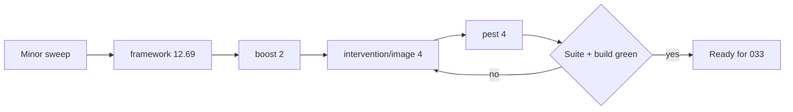
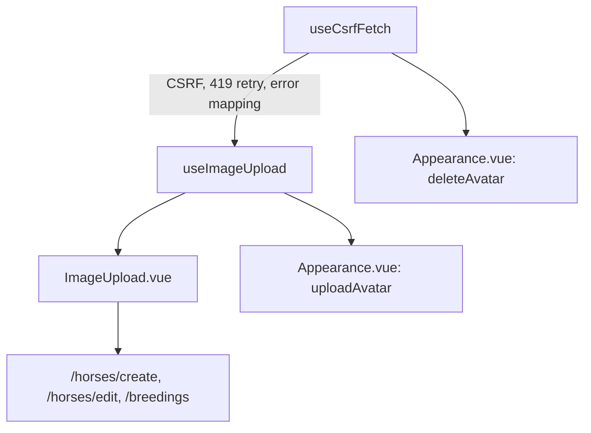

# Roadmap Done

## [032] Composer Dependency Refresh Ahead of Laravel 13

**Status:** `done`
**Depends On:** none
**Spec:** none

### Goal

Every composer dependency that can move without Laravel 13 is on its latest stable version, so the framework upgrade in [033] is the only variable left in the lockfile.

### Scope

- Minor and patch bumps: `laravel/pail` 1.2.2 → 1.2.7, `laravel/pint` 1.22.1 → 1.31.0, `laravel/sail` 1.42 → 1.67, `mockery/mockery` 1.6.12 → 1.6.15, `nunomaduro/collision` 8.8 → 8.9.5, `tightenco/ziggy` 2.5.2 → 2.6.4
- Major bumps not tied to the framework: `intervention/image` 3.11 → 4.3.2, `pestphp/pest` 3.8 → 4.7.8 with `pest-plugin-laravel` 3.2 → 4.1.0, `laravel/boost` 1.0.18 → 2.7.1
- `laravel/framework` to the newest 12.x. This is a lockfile move inside the existing `^12.0` constraint, forced by Boost 2 (see Technical Notes). The 12 → 13 major still belongs to [033]
- NOT in scope: the `laravel/framework` major, `symfony/*`, `inertiajs/inertia-laravel`, `laravel/tinker`. All move in [033]
- NOT in scope: Pest 5. It requires `symfony/process ^8`, which Laravel 12 forbids, so it moved to [033] (see Technical Notes)
- NOT in scope: `package.json`. The Node side is a separate breakage surface, and `@inertiajs/vue3` has to stay version-matched to `inertia-laravel`, which does not move until [033]

### Technical Notes

**User flows:**

**Flows:** `none`

**Details:**

- `intervention/image` 4 is the only bump that touches application code. Two call sites construct the manager the v3 way: `HorseController.php:493` and `Settings/AppearanceController.php:39`, both `new ImageManager(new Driver)` followed by `->read($file)`. `config/image.php` also carries a v3-shaped driver config. Check the v4 upgrade guide for the manager constructor, the GD driver namespace, and encoder changes before touching either controller.
- Pest 3 → 5 skips a major. It pulls PHPUnit forward, and the suite is 281 tests across `tests/Feature` and `tests/Unit`. Expect churn in `tests/Pest.php` and in any test relying on PHPUnit 11 behaviour rather than in the Pest expectations themselves.
- `laravel/pint` 1.31 may format differently from 1.22. Run `./vendor/bin/pint` after the bump and land any reformat as its own commit, the way [031] did. Note the shell: Pint fails under Git Bash with `env: 'php': No such file or directory`, so run it from PowerShell.
- `laravel/boost` is a dev tool for AI-assisted development and carries no runtime risk. It can move first and alone.
- Bump in waves rather than one `composer update`. Minors together, then each major on its own, so a failure names its own cause.

**As built (2026-09-07):**

- Both acceptance-criteria test paths had to be written first. Neither existed, and `UploadLimitTest.php` only covers validation, never the image pipeline behind it. `AvatarUploadTest` and `HorseImageUploadTest` read the stored file back with `getimagesizefromstring` and assert format and dimensions, so they describe the processed output rather than the upload. Both were green on Intervention 3 before the bump, which is what made them a real guard.
- The `^8.3` PHP floor was not needed. Pest 4 and every other package here install on the existing `^8.2`.
- Boost 2.7 requires `illuminate/console ^12.41.1`, so it forced `laravel/framework` 12.13.0 → 12.69.1. That is a lockfile move only, inside the existing `^12.0` constraint, so `composer.json` is unchanged for the framework. Suite was green on 12.69.1 before Boost went in. Boost also dragged `laravel/mcp` 0.1.1 → 0.9.4 and `laravel/roster` 0.2.3 → 1.0.0.
- **Pest 5 is not installable on Laravel 12.** `pest-plugin-laravel` v5.0.1 requires `laravel/framework ^13.23.0`, and Pest 5 itself pulls `symfony/process ^8`, which conflicts with the `^7.2.0` Laravel 12 requires. Pest 4.7.8 is the ceiling here and is what landed. It still crosses the expensive boundary (PHPUnit 11.5 → 12.5), and the suite needed no change to `tests/Pest.php` or any test. Pest 5 moved to [033].
- Intervention 4 broke both call sites, exactly as the tests predicted. Two renames, not one: `ImageManager::read()` → `decode()`, and the `toWebp(85)` shortcut is gone in favour of `encode(new WebpEncoder(quality: 85))`. `ImageManager`'s constructor, the `Intervention\Image\Drivers\Gd\Driver` namespace, `cover()`, and `scaleDown()` are all unchanged. Both controllers swallow the failure into a generic 500, so without the new tests this would have shipped as a silent upload outage.
- `config/image.php` is dead config. Nothing reads it — this app builds the manager by hand rather than through `intervention/image-laravel`. Left in place; removing it is not this item's job.
- Pint 1.31 adds `fully_qualified_strict_types` and applies `ordered_imports` more widely than 1.22 did, so 55 files needed reformatting. Mechanical, no behavioural change.
- `composer audit` reports 41 advisories across 12 packages, all in the [033] set. Recheck after the framework upgrade.
- Delivered on branch `chore/laravel-13` as two commits off `942abaf`, shared with [033] because the two items were executed back to back in one tree: `chore(deps)` for the dependency and code changes, then `style:` for the Pint 1.31 reformat alone. The split was made safe with the [031] technique — reformat each file's `HEAD` version and compare it to the working copy. 55 of 58 modified PHP files matched exactly and went in the reformat commit; the other three (`HorseController`, `AppearanceController`, `config/logging.php`) carry real changes and went in the first commit.

**Diagrams:**

### Acceptance Criteria

- [x] `composer outdated --direct` lists only `laravel/framework`, `symfony/http-client`, `symfony/mailgun-mailer`, `inertiajs/inertia-laravel`, `laravel/tinker`, and the two Pest packages deferred to [033]
- [x] The full Pest suite passes on Pest 4 with no test skipped or removed to make it pass
- [x] Avatar upload and horse image upload still resize and store correctly on Intervention 4
      `tests/Feature/Settings/AvatarUploadTest.php`
      `tests/Feature/HorseImageUploadTest.php`
- [x] `npm run build` completes clean
- [x] `./vendor/bin/pint --test` exits 0
- [x] The Pint reformat lands as its own commit, containing no behavioural change

---

## [011] Item Usage and Equipment Workflows

**Status:** `done`
**Depends On:** none

### Goal

Players can equip/dequip items on horses (and use consumables where `uses_per_unit` applies), bridging user inventory and horse/herd equipment JSON.

### Scope

- Equip / dequip UI on horse pages
- Consume/use flow decrementing `user_items` or horse inventory consistently
- Respect `uses_per_unit` and `max_count`
- NOT in scope: full crafting; shop purchase (done); trading ([006])
- Herd equip/dequip was the optional half of this item and was not built. Herd pages never rendered `herds.inventory` / `herds.equipment` at all, so there was no surface to extend. `EquipmentService` is written against `Horse` and would need a shared interface first.

### Technical Notes

**User flows:**

**Flows:** `verified`

- **Player:** "Equipment" card on `/horses/{horse}`. Pick an owned item from the dropdown and press "Equip" to move it onto the horse, press "Use" to spend one use of a multi-use item, press "Return to inventory" to move a full unit back.
- **Viewer:** `/horses/{horse}` and `/u/{user}/horses/{horse}`. Sees the equipped list and remaining uses, with no equip, use, or return controls.

**Details:**

- Dual model resolved: `user_items` is the source of truth for stock a player holds, `horses.equipment` is the source of truth for units worn by a horse. A unit is in exactly one of the two, never both, so equipping is a move rather than a copy. Documented in the `EquipmentService` class docblock.
- Equipment entry shape, one per equipped unit: `{uid, item_id, uses_remaining, equipped_at}`. `uses_remaining` is seeded from `items.uses_per_unit` at equip time.
- A partly used unit cannot be returned to inventory. `user_items` counts whole units only, so returning a half-spent unit would silently refill it on re-equip. The "Return to inventory" button is disabled in that state.
- `max_count` is enforced per horse on equip and per player on dequip.
- Both inventories always belong to the horse's **owner**, not the acting user, so an admin acting on a player's horse spends and refunds that player's stock.
- Concurrency follows `TradeService`: `lockForUpdate` on the horse row (a JSON blob cannot be locked per entry) and `insertOrIgnore` then `lockForUpdate` on the `user_items` row.
- `horses.inventory` is untouched. "Back to inventory" in the criteria means the player's inventory.
- Fixed along the way: `HandleInertiaRequests::share()` only exposed `flash.rollResult`, so the `->with('success', ...)` calls in ~13 controllers were dead on the front end. `success` and `error` are now shared.
- `HorseController::show()` and `HorseController::publicShow()` both render `Horses/Show`, so both must supply `equipment` and `equippableItems`. Browser verification caught `publicShow` missing them, which crashed the Equipment card on `/u/{user}/horses/{horse}` with "Cannot read properties of undefined". Both now go through the shared `equipmentProps()` helper, covered by `it_sends_equipment_props_to_both_horse_show_routes`.
- Browser-verified on `/horses/{horse}`: equip, Use to 2/3, Use to zero (entry removed), re-equip, and Return to inventory, with the flash banner and the disabled-while-partly-used button all behaving. The public page fix is covered by test only.
- No migration was needed. `items` still has no slot or type column, so any active item can be equipped.

### Acceptance Criteria

- [x] Player can move an owned item onto a horse’s equipment and back to inventory
- [x] Consumable use decrements quantity / uses correctly
- [x] Unauthorized users cannot equip on others’ horses
- [x] Pest tests for equip, dequip, and consume

### Tests

- [x] `tests/Feature/ItemEquipTest.php::it_moves_an_owned_item_onto_a_horse`
- [x] `tests/Feature/ItemEquipTest.php::it_returns_equipped_gear_to_inventory_on_dequip`
- [x] `tests/Feature/ItemEquipTest.php::it_decrements_uses_per_unit_when_consuming`
- [x] `tests/Feature/ItemEquipTest.php::it_enforces_max_count_on_equip`
- [x] `tests/Feature/ItemEquipTest.php::it_forbids_equipping_on_another_users_horse`
- [x] `tests/Feature/ItemEquipTest.php::it_refuses_to_return_partly_used_gear_to_inventory`
- [x] `tests/Feature/ItemEquipTest.php::it_refuses_to_equip_an_item_the_owner_does_not_have`
- [x] `tests/Feature/ItemEquipTest.php::it_forbids_dequipping_and_using_on_another_users_horse`
- [x] `tests/Feature/ItemEquipTest.php::it_sends_equipment_props_to_both_horse_show_routes`

---

## [027] Configurable Staff and Player Upload Size Limits

**Status:** `done`
**Depends On:** [026], [028]
**Spec:** none

### Goal

The agreed limits (10 MB for staff, 2 MB for players) hold on every upload path and are defined in exactly one place, so a limit change is a one-line config edit rather than a hunt through five files.

### Scope

- `config/uploads.php` holding staff and player maximums in kilobytes
- Server-side: `HorseImageUploadRequest` and `AvatarUploadRequest` read the config instead of literals
- Client-side: limits reach Vue through a shared Inertia prop, replacing the hardcoded `(isStaff ? 10 : 2) * 1024 * 1024` computeds and the literal size hints
- Error copy and the file-type hint under each upload control state the size that applies to the signed-in user
- NOT in scope: changing the agreed 10 / 2 values, server-level `upload_max_filesize` on Forge (the client set that on 2026-08-01), rate limiting, image dimension or format rules

### Technical Notes

**User flows:**

- **Staff:** upload controls at `/horses/create`, `/horses/{horse}/edit`, `/breedings`, and `/settings/appearance` accept files up to 10 MB and say so.
- **Player:** the same four controls cap at 2 MB and say so.

**Details:**

- Current state, before this item:
  - `HorseImageUploadRequest.php:16` — correct staff/player ternary, but a literal
  - `AvatarUploadRequest.php:25` — flat `max:2048`, no staff allowance
  - `Horses/Create.vue:29`, `Horses/Edit.vue:57`, `Breedings/Index.vue:86` — three copies of the same computed
  - `settings/Appearance.vue:54` — its own inline size check and an "Max 2MB" string, bypassing `ImageUpload.vue` entirely
  - `ImageUpload.vue:38` — `maxSize` prop defaults to 2 MB with a matching `fileTypeHint` default
- Avatars gain the staff allowance per the decision of 2026-09-07.
- Ship the config values to the front end via `HandleInertiaRequests::share`, resolved for the signed-in user, so `ImageUpload.vue` consumers stop computing it themselves.
- `ImageUpload.vue` already handles a 413 from the server with a "contact support" message. That path stays as the backstop for a PHP-level rejection, which no Laravel validation rule can catch.
- Local Herd `php.ini` may cap `upload_max_filesize` below 10 MB. If a staff 10 MB upload 413s locally while validation would have allowed it, that is an environment gap, not an application bug. Record the local value in the item when verifying.
- **Local values, 2026-09-07:** `upload_max_filesize=12M`, `post_max_size=16M`. Both clear the 10 MB staff limit, so there is no environment gap on this machine.
- **As built, 2026-09-07:** `config/uploads.php` holds `max_kilobytes.staff` and `max_kilobytes.player`. `App\Support\UploadLimit` resolves the figure that applies to a user (`kilobytesFor` / `bytesFor` / `megabytesFor`) and is the only reader of that config. A guest resolves to the player limit.
- The shared prop is `uploads` on every Inertia response, carrying all three units. `resources/js/composables/useUploadLimit.ts` reads it and also builds the `max NMB` hint fragment. `ImageUpload.vue`'s `maxSize` and `fileTypeHint` props became optional overrides that fall back to the shared value, so `Horses/Create.vue`, `Horses/Edit.vue`, and `Breedings/RequestCard.vue` no longer compute a limit at all, and `Breedings/Index.vue` no longer drills one down.
- **Closeout note, 2026-09-07:** archived on the user's instruction with the player-account browser pass not run. The staff pass was run and both hints read 10MB. A client-side rejection was also exercised on both paths: a 16.5MB PNG produced "File size must be less than 10MB." from the shared limit, with no request sent.
- Avatar copy on `settings/Appearance.vue` reads "JPEG, PNG, or WebP. Max NMB." — capitalised, since it follows a full stop, unlike the mid-sentence hint under the horse controls.

### Acceptance Criteria

- [x] Staff can upload a file between 2 MB and 10 MB on every upload path
      `tests/Feature/UploadLimitTest.php::it_accepts_a_staff_upload_over_the_player_limit`
- [x] Players are rejected above 2 MB on every upload path, with a message naming 2MB
      `tests/Feature/UploadLimitTest.php::it_rejects_a_player_upload_over_the_player_limit`
      `tests/Feature/UploadLimitTest.php::it_names_the_applicable_limit_in_the_error_message`
- [x] Both staff and players are rejected above 10 MB
      `tests/Feature/UploadLimitTest.php::it_rejects_any_upload_over_the_staff_limit`
- [x] Changing `config/uploads.php` changes the enforced limit with no other edit
      `tests/Feature/UploadLimitTest.php::it_enforces_the_limit_from_config`
- [x] The limit for the signed-in user is available to Vue as a shared Inertia prop
      `tests/Feature/UploadLimitTest.php::it_shares_the_resolved_limit_with_inertia`
- [x] No hardcoded `2048`, `10240`, or `(isStaff ? 10 : 2)` remains in `app` or `resources/js`
- [x] Each upload control's on-screen size hint matches the limit for the signed-in user, confirmed in a browser as staff: `/horses/create` reads "PNG, JPG, or JPEG files only, max 10MB" and `/settings/appearance` reads "JPEG, PNG, or WebP. Max 10MB." The player pass was not run for want of a non-staff login; both hints derive from the one shared `uploads` prop, whose player and staff values are asserted by `UploadLimitTest::it_shares_the_resolved_limit_with_inertia`

---

## [028] Shared Upload Composable

**Status:** `done`
**Depends On:** [026]
**Spec:** none

### Goal

The CSRF refresh, 419 retry, and error-mapping logic duplicated between `ImageUpload.vue` and `settings/Appearance.vue` lives in one composable, so the avatar path gains the 413 handling it currently lacks and a limit or transport change happens once instead of twice.

### Scope

- `useCsrfFetch` composable: CSRF token read, session refresh, single 419 retry, response error mapping
- `useImageUpload` composable built on it: FormData assembly, file type and size validation, 413 message
- `ImageUpload.vue` and `Appearance.vue` (both avatar upload and avatar delete) consume the composables
- Replace `ImageUpload.vue`'s simulated progress bar with the `LoaderCircle` spinner idiom; apply the same spinner to the avatar button
- NOT in scope: changing `alert()` error reporting, converting `ItemsTab.vue`'s three fetches, the 10/2 limit values or config wiring ([027]), any change to upload endpoints or server behaviour

### Technical Notes

**User flows:**

- **Any user:** upload controls at `/horses/create`, `/horses/{horse}/edit`, `/breedings`, and `/settings/appearance` behave exactly as before, except the progress bar becomes a spinner and a server-level rejection on the avatar path now explains itself instead of showing a bare HTTP status.

**Details:**

- Duplication being removed: `fetchFreshCsrfToken` is byte-for-byte identical at `ImageUpload.vue:153` and `Appearance.vue:66`. `performUpload` / `performAvatarUpload` differ only in URL and form field name. `performAvatarDelete` repeats the same CSRF and 419 block while uploading nothing, which is why the generic `useCsrfFetch` sits underneath rather than a single upload-shaped composable.
- Only `ImageUpload.vue` handles 413 today. The avatar path lacks it, so the "exceeds server upload limit" message the client hit on 2026-07-31 never appears on the settings page.
- **Move the fetch, CSRF, and 419 logic verbatim.** No cleanup, no rewrite, no transport change. The 419 retry cannot be reliably triggered in a browser, so an unchanged diff is the only real evidence it still works. Tidying it is a separate item.
- XMLHttpRequest was considered for genuine upload progress and rejected on 2026-09-07: it would force a reimplementation of the 419 retry, which is the exact risk the verbatim rule exists to contain.
- The progress bar is theatre. `ImageUpload.vue:236` ticks a timer to 90% because `fetch` reports no upload progress. It goes, replaced by `LoaderCircle` with `animate-spin`, the idiom already used in `Login.vue` and five other auth pages.
- `components/ui/progress/` becomes unused after this. Leave it. It is shadcn scaffolding, not this item's code.
- Size limits are a parameter on `useImageUpload`. Call sites keep today's literals so [027] has one seam to change.
- Composables go in `resources/js/composables/`, alongside `useInitials`, `useLinkDictionary`, and `useRules`.
- `Dashboard.vue` is a third consumer of this pattern but is deleted by [026], hence the dependency.
- **As built, 2026-09-07:** `useCsrfFetch` exposes `csrfFetch(url, { method, body })` and `resolveErrorMessage(response, { action, fileSizeMB })`. `useImageUpload` exposes `validateFile` and `uploadFile`. `performAvatarDelete` collapsed into a `csrfFetch` call with a DELETE method and no body. Sharing `resolveErrorMessage` is what gives the avatar path its 413 message.
- `resolveErrorMessage` drops the original's second 413/419 check inside the JSON-parse `catch`. The early returns above it made that branch unreachable in both files, so observable behaviour is unchanged.
- **Closeout note, 2026-09-07:** archived on the user's instruction with two criteria left unchecked, both marked DEFERRED above: the by-hand avatar upload/delete pass, and the 413 message check that needs a local `php.ini` change. What was verified in a browser: horse image upload from `/horses/create` (by the user), both pages rendering with no console errors, the spinner in place of the progress bar, and an oversized file rejected client-side on both the horse and avatar paths with the existing alert.
- Repo-wide `npm run lint` and `npm run format:check` did **not** pass before this item and still do not: `Horses/Edit.vue:96` carries a pre-existing `'_sex' is assigned a value but never used`, and roughly fifty untouched files fail Prettier. Every file this item touched passes both. Cleaning the rest is a separate item.

### Acceptance Criteria

- [x] Horse image upload works from `/horses/create`, verified in a browser by the user. `/horses/{horse}/edit` and `/breedings` were not exercised by hand; all three render the same `ImageUpload.vue` against the same `POST /horses/upload-image` endpoint, and all three routes were confirmed present
- [ ] Avatar upload and avatar delete work from `/settings/appearance`, verified in a browser — DEFERRED, not exercised by hand. The page renders, the controls are present, and the upload endpoint is covered by `UploadLimitTest`, but no avatar was written or deleted through the browser
- [x] Oversized file is rejected client-side on both paths with the existing alert
- [ ] Avatar path shows the "exceeds server upload limit" message on a 413 — DEFERRED, needs a local `php.ini` change and a PHP restart. The message now reaches that path in code: `Appearance.vue` maps errors through the shared `resolveErrorMessage`, which returns the 413 copy
- [x] No CSRF, retry, or upload transport code remains in `ImageUpload.vue` or `Appearance.vue`
- [x] CSRF and 419 retry logic is unchanged from the original, confirmed by reading the diff
- [x] Spinner replaces the progress bar in `ImageUpload.vue` and the avatar button, matching the auth pages
- [x] `npm run lint` and `npm run format:check` pass for every file this item touched. Repo-wide they do not, and did not before this item either: `Horses/Edit.vue:96` carries a pre-existing unused-variable error and roughly fifty untouched files fail Prettier. Out of scope here

---

## [026] Remove Orphaned Character Images System

**Status:** `done`
**Depends On:** none
**Spec:** none

### Goal

The `character_images` subsystem is unreachable dead code: no route renders the only page that uses it. Remove it entirely so the codebase stops carrying a second, divergent image pipeline that confuses every upload change made after it.

### Scope

- Delete `CharacterImage` model, controller, form request, factory, and feature test
- Delete `Dashboard.vue` (its sole consumer) and the `characterImages` relation on `User`
- Remove the three `character-images` routes and the `model:prune` schedule entry in `routes/console.php`
- Migration dropping the `character_images` table
- Delete any stored files under `storage/app/public/character-images`
- NOT in scope: horse images, avatars, or the upload size limits themselves (that is [027])

### Technical Notes

**User flows:**

- No actor reaches this system today. `CharacterImageController::index()` renders the `Dashboard` page, but the `dashboard` route (`routes/web.php:35`) is a closure rendering `Users/Index` and passes no `characterImages` prop. `Dashboard.vue` is therefore never served, and it is the only page containing the character-image gallery and its upload box.

**Details:**

- Introduced `2025_09_03_222043_create_character_images_table.php`, before horses had their own upload path. Superseded by `POST /horses/upload-image`, which is the live system.
- "Character" here meant a user's persona image, not a horse. It is per-user (`user_id`), with no `horse_id` or `herd_id`.
- Files to remove: `app/Models/CharacterImage.php`, `app/Http/Controllers/CharacterImageController.php`, `app/Http/Requests/CharacterImageUploadRequest.php`, `database/factories/CharacterImageFactory.php`, `tests/Feature/CharacterImageTest.php`, `resources/js/pages/Dashboard.vue`
- Routes to remove: `character-images.serve` (`routes/web.php:148`), `character-images.store` (`:155`), `character-images.destroy` (`:156`)
- `routes/console.php` imports `CharacterImage` for a daily `model:prune`. Both the import and the `Schedule::command` block go.
- `AppSidebar.vue:13` has a "Dashboard" nav entry, but it targets the `dashboard` route rendering `Users/Index`. Leave it alone.
- **Data check before dropping:** the working `rattlesnake_mountain` dev database may hold rows and files from early testing. Confirm the table is empty or the contents are disposable before writing the drop migration. Per the client agreement of 2026-07-28 the database is no longer wiped, so this is a real destructive migration.
- **Data check result, 2026-09-07:** `character_images` held 0 rows. `storage/app/public/character-images` held 4 orphaned `.webp` files with no matching rows, so nothing referenced them. Both removed. The drop migration is `2026_09_07_000001_drop_character_images_table.php`; it ran against the dev database and `Schema::hasTable` now reports the table gone.
- `tests/Feature/FileServePathTraversalTest.php` also asserted path traversal on the `character-images` serve route. That case went with the route; the `avatars` and `horse-images` cases stay.
- **Closeout note, 2026-09-07:** archived on the user's instruction with the by-hand browser criterion only partly exercised. Confirmed: the user uploaded a horse image locally, and `/dashboard` still renders (it serves `Users/Index`, never the deleted `Dashboard.vue`). Not exercised by hand: an avatar upload. Pest suite green at 281 tests.

### Acceptance Criteria

- [x] `character_images` table dropped by a migration that runs clean on the dev database
- [x] No reference to `CharacterImage`, `character-images`, or `characterImages` remains anywhere in `app`, `routes`, `resources`, `database`, or `tests`
- [x] Scheduled task list no longer includes the character image prune, confirmed with `php artisan schedule:list`
- [x] Full Pest suite green after removal
- [x] Horse image upload still works in a browser, confirmed by hand by the user on the local site. The avatar path was not exercised by hand; it shares no code with the removed system, and `UploadLimitTest` covers its endpoint

---

## [025] Playwright MCP for Agent-Driven Browser Verification

**Status:** `done`
**Depends On:** none

### Goal

Coding agents working in this repo can drive the real app in a browser to verify a change rendered correctly, instead of relying on Pest feature assertions that never exercise Inertia or the compiled front end. This is tooling for manual verification, not a committed test suite.

### Scope

- Playwright MCP server registered in a committed project `.mcp.json`
- Convention documented in `CLAUDE.md`: base URL, headless default, screenshot destination, login procedure
- `PLAYWRIGHT_TEST_EMAIL` / `PLAYWRIGHT_TEST_PASSWORD` added to `.env` and `.env.example` (example values only in the committed file)
- `storage/screenshots` created and gitignored
- NOT in scope: a committed Playwright test suite, `@playwright/test` as a project dependency, CI wiring, visual regression baselines, seeded or isolated test databases, a local impersonation login route

### Technical Notes

- Decisions came from a grill session on 2026-08-28. Explicitly rejected: a committed e2e suite, CI execution, screenshot diffing, per-test fixtures, and a `storageState` session file. This item is a config change plus documented conventions, deliberately.
- Runs against the live Herd site using the working dev MySQL database (`rattlesnake_mountain`). No isolation, no rollback. Accepted risk: an agent clicking through admin, lifecycle, or breeding flows mutates real dev data.
- Base URL is `https://rattlesnake-mountain.test`, not the `http://` value of `APP_URL`: Herd 301s plain HTTP to HTTPS with a self-signed certificate, so `.mcp.json` passes `--ignore-https-errors`.
- The agent logs in through the real login form each session. No session file is persisted (`--isolated`).
- Local `.env` holds a real dev account's credentials; `.env.example` carries placeholders only. `.env` stays gitignored.
- `storage/screenshots` is kept in the repo with a self-ignoring `.gitignore` (`*` plus `!.gitignore`), the same pattern Laravel uses elsewhere, so a fresh clone has the directory but never tracks its contents.
- This repo had no `CLAUDE.md` before this item. One was created for the conventions.
- `DEV_PASSWORD` is a staging-only gate to keep staging off the public web. It is not enabled locally and plays no part in this setup.
- Item [020] (local vs CI test discrepancies) stays unaffected: nothing here runs in CI.

### Acceptance Criteria

- [x] `.mcp.json` registers the Playwright MCP server and is committed
- [x] A fresh agent session in this repo has browser tools available without extra setup — verified by launching the server with the exact `.mcp.json` args and running an MCP handshake: it reports `Playwright 1.63.0-alpha-2026-08-05` and lists the `browser_*` tools
- [x] Agent can log in and reach an authenticated page reading credentials from `.env`, with no credentials pasted into the prompt
- [x] Screenshots land in `storage/screenshots` and that path is gitignored
- [x] Browser runs headless by default
- [x] `CLAUDE.md` documents the base URL, the login sequence, and the screenshot path
- [x] `.env.example` lists the two new variables with placeholder values

### Tests

- [x] No automated tests. This is agent tooling with no application code. Verified out of session with a throwaway headless script driving the same flow the MCP server will: navigated `https://rattlesnake-mountain.test/login`, filled the two `PLAYWRIGHT_TEST_*` values read from `.env`, landed on `/dashboard`, wrote a screenshot into `storage/screenshots`, and confirmed `git status` stayed clean.

---

## [012] Light Mode Only and Legibility Pass

**Status:** `done`
**Depends On:** none

### Goal

The site is light-mode only (no dark theme / appearance variants), with a per-page pass for contrast/legibility, plus landing cleanup of obsolete ToyHouse / admin-account CTAs where still present.

### Scope

- Remove or disable dark-mode theme switching; force light appearance
- Strip or neutralize problematic `dark:` usage that assumes a dual theme (prefer light-readable defaults)
- Per-page legibility check (text/background contrast)
- Landing: remove or replace obsolete links (ref doc: ToyHouse + rattlesnake-admin; Home still promotes `@rattlesnakeadmin`)
- NOT in scope: full visual redesign / brand refresh; WYSIWYG CMS

### Technical Notes

- Full write-up in [`reference/LIGHT-MODE-AUDIT.md`](reference/LIGHT-MODE-AUDIT.md): what was removed, the contrast measurements, and the per-page list
- The `dark:` classes were **not** inert. `app.css` had the custom dark variant commented out, which reads as "already off", but Tailwind v4 then falls back to its built-in variant compiling to `@media (prefers-color-scheme: dark)`. Every one was live for visitors whose OS was set to dark
- Two `@source` globs fed non-app CSS into the build: compiled views under `storage/` (Laravel's exception-renderer, with its own theme switcher) and the vendor paginator. The storage glob is gone; the paginator views were published to `resources/views/vendor/pagination/`, stripped, and the glob repointed there
- Removed: `initializeTheme()`, `useAppearance.ts`, `AppearanceTabs.vue`, `HandleAppearance` middleware, and the `appearance` cookie exemption. The built stylesheet now has zero `dark:` utilities and zero `prefers-color-scheme` queries
- Contrast fixes: `h2`/`h3` `shakespeare-400` → `700` (was 1.79:1, fails at any size), `h4`/`h5` `new-orleans-500` → `800` (was 1.99:1), body `cape-palliser-600` → `700`, and markdown links in `.box` get colour plus an underline
- Deleted `resources/js/pages/Home.vue`, an unrouted duplicate of `Welcome.vue` that still carried the obsolete `@rattlesnakeadmin` CTA. Deep links to that DeviantArt account in `useLinkDictionary` are resource links (lineart, map, design guide), not the promotional CTA, so they stay
- The settings tab is relabelled **Avatar** since the theme switcher is gone. The route stays `/settings/appearance` and keeps its route names, so existing links and bookmarks still work
- Accepted: white on `shakespeare-500` buttons measures 3.64:1, below AA for the `text-sm` labels used. Fixing it means changing the primary brand surface site-wide, which is a client decision, not a bug fix
- Accepted: contrast was computed from palette tokens, not sampled from screenshots, so stacked translucent surfaces (dialog overlays, `/50` hover states) are not covered
- Pre-existing, untouched: 18 files under `resources/` fail `prettier --check`, and `eslint` reports 2 errors, both predating this work

### Acceptance Criteria

- [x] No user-facing dark/theme toggle; app renders consistently in light mode
- [x] Documented list of pages checked for contrast issues; critical failures fixed
- [x] Obsolete ToyHouse / rattlesnake-admin promotional links removed or replaced per product decision
- [x] Smoke test: key public + auth pages render without theme flash to dark

### Tests

- [x] `tests/Feature/LightModeTest.php::it_renders_key_pages_without_a_theme_toggle`
- [x] `tests/Feature/LightModeTest.php::it_omits_obsolete_toyhouse_and_admin_account_links_from_home`

---

## [006] Player Trading

**Status:** `done`
**Depends On:** none

### Goal

Players can offer and accept simple item transfers using the existing `user_items` inventory, replacing Discord `#trading-post` for basic trades.

### Scope

- Offer create / accept / decline / cancel between two users
- Atomic quantity transfer with max_count enforcement
- Basic trade history for both parties
- NOT in scope: horse trading, auction house, Scorpion-only shop (already exists), escrow disputes UI beyond cancel/decline

### Technical Notes

- `Trade` + `TradeItem` over the existing `user_items` pivot. Offers are one-way: the sender gives, the recipient accepts. No escrow, so nothing leaves the sender's inventory until accept
- [`TradeService`](app/Services/TradeService.php) holds the transfer. Every inventory row the trade touches is created at zero and locked in one globally consistent `(item_id, user_id)` order before any arithmetic. Per-trade sender-then-recipient ordering deadlocks the moment two players trade the same item in opposite directions
- Rows are created before they are locked on purpose: locking a row that does not exist takes only a gap lock, and gap locks disappear under `READ COMMITTED`, which would let two first-time credits to the same player overwrite each other
- Accept re-checks holdings, `is_active`, and recipient `max_count`, because an offer can sit open while the world changes underneath it
- Reachable from the user menu ("My Trades"). The recipient field is a name search fed by a `recipients` prop, since players never see each other's numeric ids
- Accepted: the deadlock ordering and the `READ COMMITTED` insert race are argued from the lock protocol, not covered by a test. Pest cannot deterministically interleave two transactions here
- Accepted: the `recipients` list is unbounded and loads every non-banned player on each page view, matching the existing `/users` route. Worth revisiting as a search endpoint when the player count grows
- Accepted: trade history is offset-paginated with no pruning, so deep pages get slower for heavy traders

### Acceptance Criteria

- [x] User A can offer items to User B; B can accept or decline
- [x] Accept moves quantities atomically; inventories never go negative
- [x] Cancel works for open offers; accepted trades immutable
- [x] Pest tests cover happy path, insufficient qty, and unauthorized accept

### Tests

- [x] `tests/Feature/TradeTest.php::it_creates_an_offer_between_two_users`
- [x] `tests/Feature/TradeTest.php::it_transfers_quantities_atomically_on_accept`
- [x] `tests/Feature/TradeTest.php::it_rejects_an_offer_exceeding_owned_quantity`
- [x] `tests/Feature/TradeTest.php::it_forbids_a_third_party_from_accepting`
- [x] `tests/Feature/TradeTest.php::it_cancels_open_offers_and_freezes_accepted_trades`
- [x] `tests/Feature/TradeTest.php::it_rejects_an_accept_that_would_exceed_the_recipient_max_count`
- [x] `tests/Feature/TradeTest.php::it_refuses_to_accept_an_item_retired_after_the_offer`
- [x] `tests/Feature/TradeTest.php::it_refuses_to_accept_a_trade_whose_items_were_deleted`
- [x] `tests/Feature/TradeTest.php::it_forbids_a_banned_user_from_acting_on_an_open_trade`
- [x] `tests/Feature/TradeTest.php::it_counts_rejected_offers_against_the_rate_limit`
- [x] `tests/Feature/TradeTest.php::it_credits_a_recipient_who_has_never_held_the_item`
- [x] `tests/Feature/TradeTest.php::it_offers_to_a_recipient_picked_by_name`

---

## [013] Coming Soon Placeholders for Deferred Gameplay

**Status:** `done`
**Depends On:** none

### Goal

Activities/story progression and seasonal events clearly show Coming Soon in-app so players are not sent into incomplete Discord-only flows as if they were finished product features.

### Scope

- Coming Soon treatment on story-progression / activities entry points and seasonal/wildlife event UX as agreed
- Keep lore readable where it is documentation; distinguish “rules docs” vs “playable feature”
- NOT in scope: building the systems ([015], [016]); removing CMS lore content

### Technical Notes

- Implemented as a `coming_soon` boolean on `cms_pages`, rendered as a banner above the content in [`DynamicInfo.vue`](resources/js/components/custom/DynamicInfo.vue). No CMS content was deleted
- Flagged: `story-progression`, `player-vs-player`, `claiming-npcs` (claiming is gated on story-progression rolls), `wildlife` (seasonal hub). Not flagged: `herd-unity` and `lifespans` describe mechanics rather than offering a play action, and `breeding-foaling` shipped in-app with [005]
- Staff can clear the banner from the admin CMS tab when a feature ships, so no deploy is needed. `CmsPageSeeder` holds the list for fresh installs; the migration carries a frozen copy for existing databases
- Accepted: the Pest tests assert the server sends `coming_soon`, not that the banner paints. There is no component-test harness in the repo, so a regression that dropped the `v-if` in `DynamicInfo.vue` would not be caught
- Accepted: the migration backfill matches on slug and silently updates zero rows if an environment renamed a page before migrating. Recoverable from the admin CMS tab

### Acceptance Criteria

- [x] Primary play entry points for activities and seasonal events show Coming Soon
- [x] No dead “submit play” CTA that posts nowhere
- [x] Lightweight test or snapshot asserting Coming Soon presence on those routes

### Tests

- [x] `tests/Feature/ComingSoonTest.php::it_shows_coming_soon_on_activity_entry_points`
- [x] `tests/Feature/ComingSoonTest.php::it_shows_coming_soon_on_seasonal_event_entry_points`
- [x] `tests/Feature/ComingSoonTest.php::it_exposes_no_submit_play_cta_on_those_routes`
- [x] `tests/Feature/ComingSoonTest.php::it_leaves_reference_pages_without_a_coming_soon_banner`
- [x] `tests/Feature/ComingSoonTest.php::it_lets_staff_clear_a_coming_soon_banner_once_the_feature_ships`

---

## [007] Announcements System

**Status:** `done`
**Depends On:** none

### Goal

Staff can post announcements that appear on the Home page, replacing the hardcoded September 2023 news box.

### Scope

- `Announcement` model (title, body, published_at, author)
- Admin CRUD tab or section
- Home displays latest published announcement(s)
- Remove stale hardcoded news copy from [`Welcome.vue`](resources/js/pages/Welcome.vue)
- NOT in scope: CMS rich-text/WYSIWYG ([019]); making entire Home CMS-editable

### Technical Notes

- Home is not a `CmsPage` — props come from the `/` route closure via `Announcement::publicFeed()`
- Announcement body is plain text rendered with `whitespace-pre-line`; rich text is deferred to [019]
- Admin CRUD lives as a section under the existing CMS tab and is gated by the `admin.cms` capability, so no new capability area or role-matrix migration was needed
- `published_at` is normalised to the app timezone by a model mutator. Eloquent's plain `datetime` cast preserves the incoming offset, which would let a non-UTC admin publish hours early or late
- Admin list is capped at the 50 most recent announcements with no pagination. Accepted: the public feed is bounded at 3 and the admin list only degrades past 50 rows

### Acceptance Criteria

- [x] Admin can create/update/unpublish announcements
- [x] Home shows current published announcement(s); no 2023 hardcoded activity-check copy
- [x] Guests can read announcements; only staff can manage
- [x] Pest tests for public display and admin authz

### Tests

- [x] `tests/Feature/AnnouncementTest.php::it_shows_the_latest_published_announcement_on_home`
- [x] `tests/Feature/AnnouncementTest.php::it_hides_unpublished_announcements_from_guests`
- [x] `tests/Feature/Admin/AdminAnnouncementTest.php::it_lets_staff_create_and_unpublish_announcements`
- [x] `tests/Feature/Admin/AdminAnnouncementTest.php::it_forbids_non_staff_from_managing_announcements`
- [x] `tests/Feature/Admin/AdminAnnouncementTest.php::it_stores_an_offset_aware_publish_time_as_the_correct_instant`

---

## [005] Breeding System (Punnett-Square)

**Status:** `done`
**Priority:** high
**Depends On:** [004]

### Goal

Players submit breeding requests; staff with rollers access publish two Punnett genotype options; players choose one and create a pending foal. Breeding authorization uses transferable per-horse slots (10), not horse ownership alone.

### Scope

-   Strict local Punnett provider behind a genetics-provider contract (external API seam reserved)
-   Transferable breeding slots with offer/accept and Sanctuary staff grants
-   Create pending foal after player chooses one of two immutable results; update `bloodline` / `progeny` / `bred_by`
-   Add nullable horse `sex`; staff backfill required for existing horses
-   NOT in scope: phenotype reader; Stones; seasons/estrus/checkpoints/attempt limits; twins/rerolls; health/stats/traits rolls; full foaling story UI

### Technical Notes

-   Provider contract + local Punnett: `app/Services/Contracts/BreedingGeneticsProvider.php`, `config/breeding.php`
-   Admin UI: Rollers Breeding section; player UI: `/breedings`
-   Deferred: [023] advanced breeding lifecycle + Stones; [024] shared phenotype reader

### Acceptance Criteria

-   [x] Breeding two horses with known genos yields offspring geno consistent with Punnett rules (unit-tested)
-   [x] Bloodline/progeny relationships update correctly
-   [x] Ineligible pairs rejected with clear errors (same horse, wrong/missing sex, underage, dead, bad geno, missing slots)
-   [x] Feature test covers create-foal happy path
-   [x] Documented inheritance edge cases listed if deferred

---

## [004] Lifecycle Automation

**Status:** `done`
**Priority:** high
**Depends On:** none

### Goal

Horses auto-age on the schedule stored in `lifecycle_settings`, and old NPC death rolls produce **proposals** that admins confirm before horses are marked dead. Health roll *application* deferred to [022].

### Scope

-   Artisan command + scheduler entry reading `LifecycleSetting`
-   Age horses by configured game-years each run (years + months via `age_months`)
-   NPC death-roll proposals queued for admin confirmation in Lifecycle tab (not auto-delete)
-   Logging of aging/death outcomes for support
-   Health roll settings retained in UI but not applied (deferred → [022])
-   NOT in scope: auto-freeze ([018]); player PvP death; fully automatic NPC deletion without review; applying health ± from injury

### Technical Notes

-   Model: [`app/Models/LifecycleSetting.php`](app/Models/LifecycleSetting.php)
-   Service: [`app/Services/LifecycleAgingService.php`](app/Services/LifecycleAgingService.php)
-   UI: [`resources/js/pages/admin/LifecycleTab.vue`](resources/js/pages/admin/LifecycleTab.vue)
-   Command: `horses:lifecycle` scheduled daily in [`routes/console.php`](routes/console.php)
-   NPC = `is_npc` (auto for Sanctuary-owned; cleared on claim); soft death via `died_at`

### Acceptance Criteria

-   [x] Scheduled command ages eligible horses per settings and advances next-update date
-   [x] Health roll settings persist; application deferred to [022] (injury/HP + story progression)
-   [x] NPC death proposals appear for admin confirm/reject; confirm applies death state
-   [x] Pest tests cover aging math, proposal creation, and confirm path
-   [x] Dry-run or admin “run now” supported for staging

---

## [021] Admin-Managed User Role Matrix

**Status:** `done`
**Priority:** high
**Depends On:** none

### Goal

Admins can view and edit the role → capability matrix (which admin areas each role can access) from the admin panel, instead of capabilities being hardcoded in the `Role` enum.

### Scope

-   Admin UI (Users tab or new section) showing roles × capability areas as an editable matrix
-   Persist matrix in DB (e.g. `role_capabilities` table or config-backed settings model); `Role::capabilities()` reads from it with sensible defaults
-   Only Admin role can edit the matrix; Admin's own `users` capability cannot be removed (no lockout)
-   Seeder/migration establishing current defaults from existing enum matrix
-   NOT in scope: creating/deleting roles (enum stays fixed); per-user capability overrides; full permissions package (spatie) unless approved

### Technical Notes

-   Current matrix hardcoded: [`app/Models/Role.php`](app/Models/Role.php) `capabilities()`
-   Capability checks: `User::hasCapability()` used by admin middleware/controllers ([`app/Http/Controllers/Admin/DashboardController.php`](app/Http/Controllers/Admin/DashboardController.php))
-   Role assignment UI already exists in Admin Users tab (`UpdateUserRoleRequest`); this manages what roles *can do*, not who has them
-   Cache matrix lookups; invalidate on save
-   Security: guard against self-lockout and privilege escalation by non-admin staff

### Acceptance Criteria

-   [x] Admin can toggle capability areas per role in admin UI; changes persist
-   [x] Capability checks throughout app respect the stored matrix
-   [x] Non-admin staff cannot access or edit the matrix
-   [x] Admin role cannot lose `users` capability (lockout guard tested)
-   [x] Migration/seeder installs defaults matching current enum behavior
-   [x] Pest tests cover toggle persistence, enforcement, and authorization

---

## [003] Recruit-a-Friend Rewards

**Status:** `done`
**Priority:** high
**Depends On:** [001]

### Goal

When a new player registers with a valid referrer, both recruiter and recruit receive the documented referral bonuses on top of the welcome package.

### Scope

-   Reward both parties using existing `referred_by_username` field
-   Validate referrer exists and is eligible (not self-referral)
-   **Spec-flagged:** confirm exact bonus amounts with client (CMS documents +100 Scorpions, stones/herbs/feathers choices, and submission bonuses for 3 months — submission bonuses may need placeholder until activities exist)
-   NOT in scope: ongoing +10 Scorpions per submission until activities system ([015])

### Technical Notes

-   Referral link: `referrals` table (`recruit_id`, `referrer_id`, `granted_at`, `revoked_at`); registration stores `referrer_id` via searchable picker; `users.referred_by_username` kept for display
-   Grant trigger: `ReferralRewardService` on `Verified` (`GrantReferralRewards` listener); `skip_email_verification` fires `Verified` after `markEmailAsVerified()`
-   Config: [`config/referral-rewards.php`](config/referral-rewards.php) (`each` bundle); voucher pools in [`config/vouchers.php`](config/vouchers.php)
-   Registration search: `GET /register/referrer-search` (guest, throttled, min 2 chars, limit 10); [`Register.vue`](resources/js/pages/auth/Register.vue)
-   Voucher redeem: generalized in `WelcomePackageService::redeemVoucher` + [`Inventory/Index.vue`](resources/js/pages/Inventory/Index.vue)
-   Tests: [`tests/Feature/ReferralRewardTest.php`](tests/Feature/ReferralRewardTest.php), [`ReferrerSearchTest.php`](tests/Feature/ReferrerSearchTest.php), [`RedeemVoucherTest.php`](tests/Feature/RedeemVoucherTest.php)
-   **Pending client sign-off:** voucher pool contents (stones/herbs/feathers). **Deferred to [015]:** +10 Scorpions / +1 stat per submission for 3 months (`referrals.granted_at` is window start)

### Acceptance Criteria

-   [x] Valid referral grants configured bonuses to both users
-   [x] Invalid / self / missing username does not grant bonuses (and does not block registration if field optional)
-   [x] Pest tests cover happy path and abuse cases (self-referral)
-   [x] Open amount questions documented in Technical Notes if still pending at build time

---

## [002] Staff Role Gates

**Status:** `done`
**Priority:** high
**Depends On:** none

### Goal

`Designer`, `StoryAdmin`, and `GameMaster` roles unlock the admin features they are meant to use, instead of being cosmetic labels while only `Admin` passes `access-admin`.

### Scope

-   Define per-role capability map (e.g. Designer → submissions review; StoryAdmin/GM → rollers/lifecycle; Admin → full)
-   Replace or extend `Gate::define('access-admin')` and tab-level authorization
-   Update admin UI to hide tabs the role cannot use
-   NOT in scope: inventing a Founder role; changing Discord staff process

### Technical Notes

-   Capability map: `Role::capabilities()` in [`app/Models/Role.php`](app/Models/Role.php); `User::isStaff()` / `hasCapability()`
-   Gates: `access-admin` = any staff; per-area `admin.*` in [`app/Providers/AppServiceProvider.php`](app/Providers/AppServiceProvider.php)
-   Routes: per-area `can:admin.*` middleware in [`routes/web.php`](routes/web.php)
-   Admin shell: [`resources/js/pages/admin/Index.vue`](resources/js/pages/admin/Index.vue) — tabs + props scoped via `adminCapabilities`
-   Login sync: [`app/Listeners/SyncAdminRoleFromEmailList.php`](app/Listeners/SyncAdminRoleFromEmailList.php) only toggles Admin ↔ User; preserves Designer/StoryAdmin/GameMaster
-   Tests: [`tests/Feature/StaffRoleGatesTest.php`](tests/Feature/StaffRoleGatesTest.php) — dataset-driven role × area matrix
-   Matrix (pending client confirm): Designer → submissions; StoryAdmin/GameMaster → rollers + lifecycle; Admin → all

### Acceptance Criteria

-   [x] Each non-admin staff role can access at least one documented admin capability
-   [x] Users with `Role::User` remain forbidden from all admin routes
-   [x] Pest tests cover allow/deny per role for representative routes
-   [x] Admin nav only shows authorized tabs

---

## [001] Welcome Package on Registration

**Status:** `done`
**Priority:** high
**Depends On:** none

### Goal

New players receive the documented welcome package in their inventory immediately on account creation so they can start character customization without Discord handouts.

### Scope

-   Grant on successful registration: 500 Scorpions, 1 White-Modifier Stone, 1 Cream or Pearl Stone (player choice or deferred claim), 2 Randomized Stones, 2 Random Herbs, 2 Random Feathers
-   Ensure required `Item` catalog rows exist (extend `ItemSeeder` / shop catalog as needed)
-   Idempotent grant (no double-grant on re-verify / re-register edge cases)
-   NOT in scope: recruit-a-friend bonus package ([003]), item consumption UI ([011])

### Technical Notes

-   Spec: [`.cursor/burndown.md`](.cursor/burndown.md), CMS Getting Started (`CmsPageSeeder`)
-   Grant: `WelcomePackageService` + `GrantWelcomePackage` listener on `Registered`; config in `config/welcome-package.php`
-   Idempotency: `users.welcome_package_granted_at`; repair via `welcome-package:grant {user}`
-   Cream/Pearl: deferred via `Cream/Pearl Stone Voucher` + inventory redeem route
-   Catalog: [`database/seeders/ItemSeeder.php`](database/seeders/ItemSeeder.php) extended with stones/voucher/feathers; herbs from `ShopCatalogSeeder`
-   **Audits:** [reference/FEATURE-AUDIT.md](reference/FEATURE-AUDIT.md), [reference/DATA-LAYER-AUDIT.md](reference/DATA-LAYER-AUDIT.md)

### Acceptance Criteria

-   [x] New registration grants the full welcome package quantities to `user_items`
-   [x] Missing catalog items are seeded or creation fails loudly in tests
-   [x] Pest feature test covers grant on register; no duplicate grant on email verify
-   [x] Grant is logged or otherwise auditable for support

---

## [001] Example Completed Task

**Status:** `done`
**Depends On:** none

### Goal

One-paragraph description of what this task accomplished and why.

### Scope

- What was included
- What was explicitly out of scope

### Technical Notes

- Key implementation decisions and relevant files/tables/commands

### Acceptance Criteria

- [x] Criterion one
- [x] Criterion two
- [x] Criterion three

---
